```mermaid
flowchart TD
    A[Input APK/DEX file] --> B[Extract all functions and exclude system libraries, Android APIs, and third-party libraries]
    B --> C[Extract Smali instructions for each function]
    C --> D[Match each function against opcode and Android API pattern rules]
    D --> E{Matches any pattern rule?}
    E -- No --> F[Continue to next function]
    E -- Yes --> G{≥ threshold?}
    G -- No --> F
    G -- Yes --> H[Flag as potential C2-command-containing function and extract all string constants within the function]
    H --> I[Output flagged functions and extracted strings]
```

# c2hunt

```
  ____ ____  _                 _   
 / ___|___ \| |__  _   _ _ __ | |_ 
| |     __) | '_ \| | | | '_ \| __|
| |___ / __/| | | | |_| | | | | |_ 
 \____|_____|_| |_|\__,_|_| |_|\__|
Hunting potential C2 commands in Android malware via Smali string comparison and control flow analysis
```

C2Hunt is a command-line tool for analyzing Android APK or DEX files to detect Command and Control (C2) commands within given target file. The tool supports scanning for C2 commands based on custom opcode definitions and can also extract strings or smali methods from APK/DEX files for further analysis.

## Features

- Analyze Android APK/DEX files for C2 commands handling structures
- Print all smali methods from the target APK/DEX
- Support for custom opcode/API definition in JSON format

## Installation

You can use either `pip` or `pipenv` to install dependencies.

### Using pip

```bash
pip install -r requirements.txt
```

### Using pipenv

```bash
pipenv install
```

## Usage

After installation, you can run the tool directly with the `c2hunt` command:

```bash
c2hunt --file <APK_OR_DEX_PATH> [--opcode <OPCODE_JSON>] [--print-smali]
```

or with short options:

```bash
c2hunt -f <APK_OR_DEX_PATH> [-o <OPCODE_JSON>] [-p]
```

### Options

- `-f, --file PATH` (required):  
  Path to the target APK or DEX file

- `-o, --opcode PATH` (optional, default: `custom-opcode/switch-equals.json`):  
  Path to the custom opcode JSON file

- `-p, --print-smali` (flag, optional):  
  Print all smali methods from the target APK/DEX instead of scanning for C2 commands

### Examples

#### Analyze an APK with the default opcode file

```bash
c2hunt -f target.apk
```

#### Analyze a DEX file with a custom opcode file

```bash
c2hunt -f classes.dex -o my-opcodes.json
```

#### Print all smali methods (no analysis)

```bash
c2hunt -f target.apk -p
```

## How It Works

- By default, C2Hunt scans the specified APK or DEX file for C2 commands using the given opcode definition file.
- If the `--print-smali` flag is provided, it will only print all smali methods without analysis.

## Example Output

```
(c2hunt) bash-3.2$ c2hunt -f malware_family/tgtoxic.dex -o custom-opcode/switch-equals.json

  ____ ____  _                 _   
 / ___|___ \| |__  _   _ _ __ | |_ 
| |     __) | '_ \| | | | '_ \| __|
| |___ / __/| | | | |_| | | | | |_ 
 \____|_____|_| |_|\__,_|_| |_|\__|
Hunting potential C2 commands in Android malware via Smali string comparison and control flow analysis

[INFO] Analyzing: malware_family/tgtoxic.dex
[INFO] Using OPcode & Android API Pattern Rule: custom-opcode/switch-equals.json
[INFO] Opcode & APIs threshold: {'sparse-switch': 1, 'const-string': 10, 'invoke-virtual': 10, 'move-result': 10, 'if-eqz': 10, 'Ljava/lang/String;->equals(Ljava/lang/Object;)Z': 10}

[+] The following functions potentially contain C2 commands:

Function: Lcom/example/mysoul/KszahaVmkrjij$UoO1i1liii0; call ([Ljava/lang/Object;)V
Opcode & APIs count: {'sparse-switch': 2, 'const-string': 219, 'invoke-virtual': 467, 'move-result': 446, 'if-eqz': 148, 'Ljava/lang/String;->equals(Ljava/lang/Object;)Z': 100}
=====[ C2HUNT RESULT ]================================================================================
flag
homepage
action
screen_relay
walletList
installPermission
gestureB
requestfloaty
admLockRule
swipePwdScreenOff
inputSend
realtimeSet
showShortcuts
reqPerList
wallpaper
autoRequestPerm
readSmsList
autoBoot
backstage
setDebugMode
startCam
startApk
catAllViewSwitch
permissionB
closeEnv
installApk
lockScreen
setWakeup
doNotDisturb
capture
callAcc
touchMove
touchDown
logMode
gestureCapture
gestureUnlock
setDebugOn
setHideMode
swipePwdScreenOn
power
light
black
Awake
openIntent
home
back
adm
sendAlert
callAppSetting
init_data
screenshot
readContactList
permission
capturePic
clickPoint
wakeup
clickInput
update
setCam
recent
reConn
lightT
takeScreen
touchUp
admLock
setAppStyle
realtimeOnOff
antiDeleteOff
fetchIcon
openUrl
uninstallApk
readAlbumThumbnail
clickB
reOpenMe
blackB
rightClick
admSet
admPwd
reqScreenPermission
googleAuth
cancelAwake
releaseScreenCapture
closeProtect
readAlbumList
readAlbumLast
ask_relay
antiDeleteOn
cancelWakeup
transparent
setDebugOff
restartApp
hideShortcuts
stopHereTest
restartSc
restartMe
stopCam
updateApk
```




