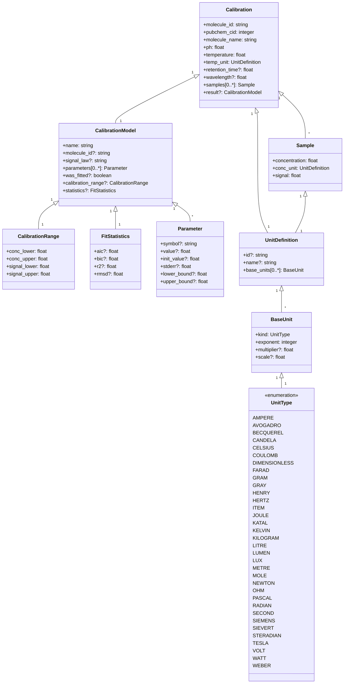

```mermaid
classDiagram
    %% Class definitions with attributes
    class Calibration {
        +molecule_id: string
        +pubchem_cid: integer
        +molecule_name: string
        +ph: float
        +temperature: float
        +temp_unit: UnitDefinition
        +retention_time?: float
        +wavelength?: float
        +samples[0..*]: Sample
        +result?: CalibrationModel
    }

    class Sample {
        +concentration: float
        +conc_unit: UnitDefinition
        +signal: float
    }

    class CalibrationModel {
        +name: string
        +molecule_id?: string
        +signal_law?: string
        +parameters[0..*]: Parameter
        +was_fitted?: boolean
        +calibration_range?: CalibrationRange
        +statistics?: FitStatistics
    }

    class CalibrationRange {
        +conc_lower: float
        +conc_upper: float
        +signal_lower: float
        +signal_upper: float
    }

    class FitStatistics {
        +aic?: float
        +bic?: float
        +r2?: float
        +rmsd?: float
    }

    class Parameter {
        +symbol?: string
        +value?: float
        +init_value?: float
        +stderr?: float
        +lower_bound?: float
        +upper_bound?: float
    }

    class UnitDefinition {
        +id?: string
        +name?: string
        +base_units[0..*]: BaseUnit
    }

    class BaseUnit {
        +kind: UnitType
        +exponent: integer
        +multiplier?: float
        +scale?: float
    }

    %% Enum definitions
    class UnitType {
        <<enumeration>>
        AMPERE
        AVOGADRO
        BECQUEREL
        CANDELA
        CELSIUS
        COULOMB
        DIMENSIONLESS
        FARAD
        GRAM
        GRAY
        HENRY
        HERTZ
        ITEM
        JOULE
        KATAL
        KELVIN
        KILOGRAM
        LITRE
        LUMEN
        LUX
        METRE
        MOLE
        NEWTON
        OHM
        PASCAL
        RADIAN
        SECOND
        SIEMENS
        SIEVERT
        STERADIAN
        TESLA
        VOLT
        WATT
        WEBER
    }

    %% Relationships
    Calibration "1" <|-- "1" UnitDefinition
    Calibration "1" <|-- "*" Sample
    Calibration "1" <|-- "1" CalibrationModel
    Sample "1" <|-- "1" UnitDefinition
    CalibrationModel "1" <|-- "*" Parameter
    CalibrationModel "1" <|-- "1" CalibrationRange
    CalibrationModel "1" <|-- "1" FitStatistics
    UnitDefinition "1" <|-- "*" BaseUnit
    BaseUnit "1" <|-- "1" UnitType
```