# Diagram Renderer

A comprehensive diagram rendering service supporting Mermaid, PlantUML, and Graphviz diagrams with an interactive web interface:

- **Streamlit Dashboard** - Interactive web interface for diagram rendering

## Features

- Automatic diagram type detection (Mermaid, PlantUML, Graphviz)
- **Self-contained rendering** - All JavaScript libraries hosted locally
- Static Mermaid.js assets (version controlled, 2.8MB)
- VizJS for Graphviz/DOT rendering (locally hosted, 1.9MB)
- PlantUML to DOT conversion and rendering
- Multiple themes for Mermaid diagrams
- Interactive Streamlit dashboard, FastAPI web app, and MCP server
- **No external CDN dependencies** - Works offline
- **AI Assistant Integration** - MCP server for Claude Desktop and other AI tools

## Installation

Install from PyPI:

```bash
# Using uv (recommended)
uv add diagram-renderer

# Using pip
pip install diagram-renderer
```

For development setup:
```bash
git clone https://github.com/djvolz/diagram-renderer.git
cd diagram-renderer
uv install
```

## Usage

### Examples

The `examples/` directory contains four demonstration applications:

**Streamlit Dashboard** - Interactive web interface:
```bash
uv sync --extra dashboard
# Run directly
uv run --extra dashboard python -m streamlit run examples/dashboard.py
# Or use the convenience script
uv run --extra dashboard ./examples/run-dashboard.py
```

**FastAPI Web App** - REST API and web interface:
```bash
uv sync --extra webapp
uv run --extra webapp python examples/cli.py webapp
# or directly: uv run --extra webapp python examples/webapp.py
```

**MCP Server** - AI assistant integration via Model Context Protocol:
```bash
uv sync --extra mcp
uv run --extra mcp python examples/cli.py mcp
# or directly: uv run --extra mcp python examples/mcp_server.py
```

**Command Line Interface** - Batch processing and automation:
```bash
# Render diagram from file
uv run python examples/cli.py render diagram.mmd

# Quick inline rendering
uv run python examples/cli.py quick "graph TD; A-->B"

# Serve a diagram with HTTP server
uv run python examples/cli.py serve diagram.mmd

# Show examples and help
uv run python examples/cli.py examples
uv run python examples/cli.py --help
```

## Supported Diagram Types

The visual-regression baselines cover the following diagram families:

### Mermaid
- Flowchart, Sequence, Class, State, and ER diagrams
- User Journey, Timeline, Requirement, and C4 Context diagrams
- Quadrant Charts, Pie Charts, and Gantt Charts
- Git Graphs plus beta features: XY Chart, Sankey, and Block diagrams

### PlantUML
- Sequence, Class, Use Case, Component, and State diagrams
- Deployment, Object, and Network diagrams

### Graphviz (DOT)
- Directed and Undirected graphs, Flowcharts, and Dependency graphs
- Organizational Charts, State Machines, Network Diagrams, and Cluster diagrams

## Visual Gallery

Interactive screenshots from our baseline suite are available below. Expand any section to preview the rendered output.

<details>
  <summary><strong>Mermaid Gallery</strong></summary>

  <p align="center">
    
    
    
    <br />
    
    
    
    <br />
    
    
    
    <br />
    
    
    
    <br />
    
    
    
    <br />
    
  </p>
</details>

<details>
  <summary><strong>PlantUML Gallery</strong></summary>

  <p align="center">
    
    
    
    <br />
    
    
    
    <br />
    
    
  </p>
</details>

<details>
  <summary><strong>Graphviz Gallery</strong></summary>

  <p align="center">
    
    
    
    <br />
    
    
    
    <br />
    
    
  </p>
</details>

## Configuration

### Mermaid Themes
- `default` - Default theme
- `base` - Base theme
- `dark` - Dark theme
- `forest` - Forest theme
- `neutral` - Neutral theme

## Development

The main components are:

- `diagram_renderer/` - Core diagram rendering logic and renderers
- `st_diagram.py` - Streamlit diagram component wrapper
- `examples/cli.py` - Command-line interface and app launcher
- `examples/dashboard.py` - Streamlit web interface
- `examples/webapp.py` - FastAPI REST API and web interface
- `examples/mcp_server.py` - MCP server for AI assistant integration
- `diagram_renderer/renderers/static/js/` - **Local JavaScript libraries**
  - `mermaid.min.js` (2.8MB) - Mermaid diagram rendering
  - `viz-full.js` (1.9MB) - Graphviz/DOT rendering
  - `viz-lite.js` (11KB) - Lightweight VizJS alternative

## Demo

**Input:**

```mermaid
flowchart LR
    A[diagram-renderer] --> B{Auto-detect}
    B -->|Mermaid| C[Mermaid.js]
    B -->|PlantUML| D[PlantUML → DOT]
    B -->|Graphviz| E[VizJS]
    C --> F[Interactive HTML]
    D --> F
    E --> F
    F --> G[📱 Responsive]
    F --> H[🖼 PNG Export]
    F --> I[🔍 Zoom/Pan]
```


**Output:** The generated HTML includes:
- 🔍 **Interactive zoom and pan controls**
- 📱 **Responsive design**
- 🖼 **PNG export functionality**
- 🎨 **Automatic diagram type detection**
- 🔒 **Self-contained** - All JS libraries included locally (no CDN dependencies)
- ⚡ **Two output modes** - Lightweight external JS (14KB) or fully embedded (4.7MB)

Try it yourself:
```bash
uv run python examples/cli.py quick "graph TD; A-->B-->C"
```

## Examples

### Mermaid Flowchart


### PlantUML Class Diagram


### Graphviz DOT Diagram

