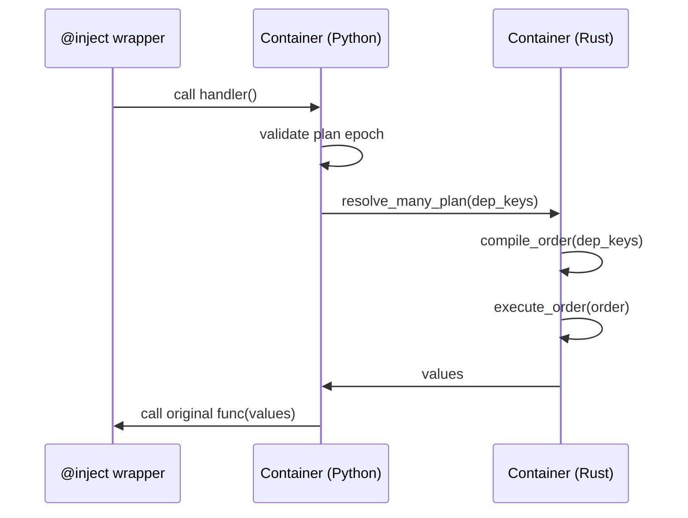
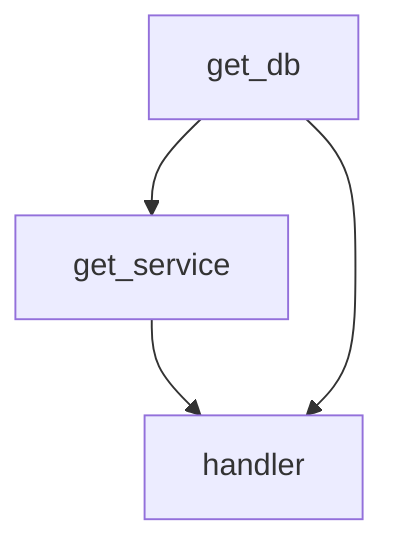
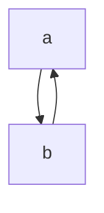
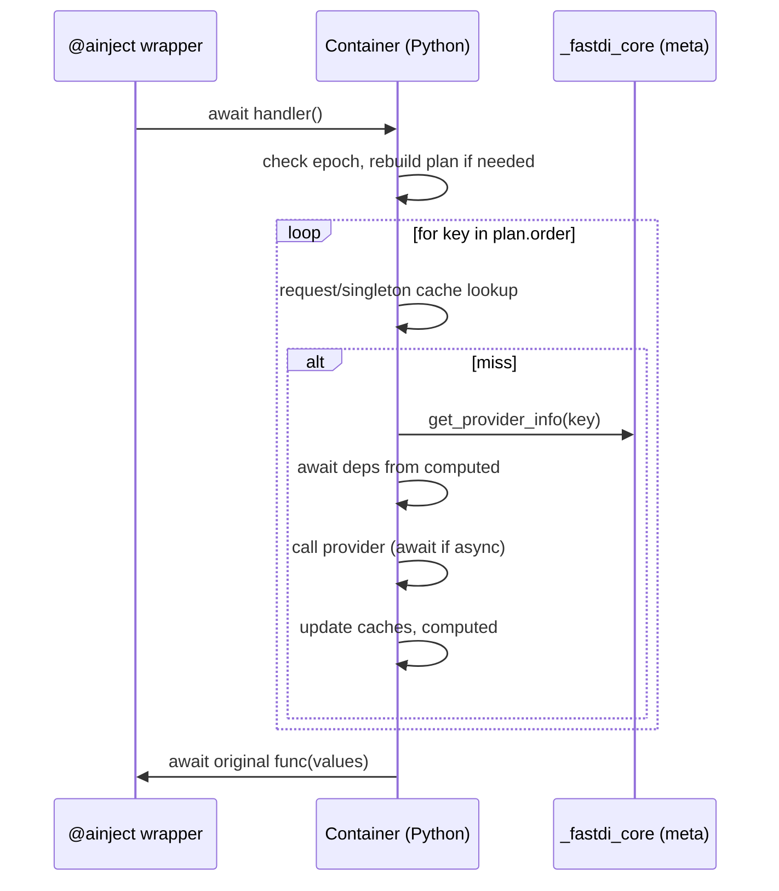
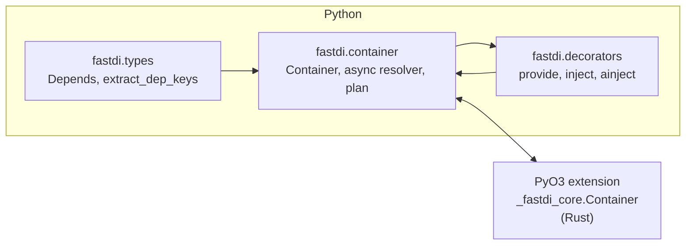
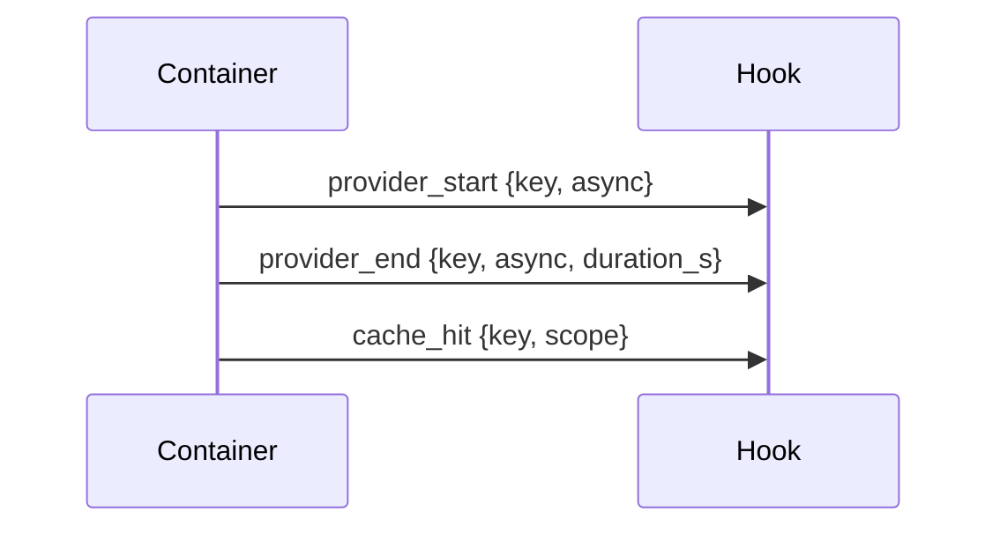

# Architecture

This document explains FastDI’s architecture: the Rust core, the Python API
layers, dependency planning, scopes, overrides, observability, and typing.

## Overview

- Core: Rust crate built with PyO3 provides a high‑performance provider store,
  resolution, overrides, and a synchronous plan executor.
- Python: thin, readable layers on top of the core provide ergonomics:
  - `fastdi.types`: type aliases, `Depends`, key utilities, dependency parsing (Annotated-only).
  - `fastdi.container`: `Container` with scopes, hooks, async resolver,
    topological planning, and epoch‑based plan invalidation.
  - `fastdi.decorators`: `provide`, `inject`, `ainject` decorators for easy use.
- Packaging: maturin builds a CPython extension; `_fastdi_core.pyi` and
  `fastdi/py.typed` ship editor/type checker hints.

## Rust Core

The Rust library (`src/lib.rs`) exposes a `Container` class to Python via PyO3.
It encapsulates two main data sets:

- `providers: HashMap<String, Provider>` — base registration table
- `overrides: Vec<HashMap<String, Provider>>` — layered overrides (stack)

Each `Provider` holds:

- `callable: Py<PyAny>` — the Python factory function
- `meta: ProviderMeta` — flags and static metadata
  - `singleton: bool` — whether to cache the produced value globally in Rust
  - `is_async: bool` — async providers are rejected by sync paths
  - `dep_keys: Vec<String>` — dependency keys
- `cache: Option<Py<PyAny>>` — singleton cache (if `singleton=True`)

### Resolution (sync)

- Recursive resolver: `resolve_key` walks dependencies with a DFS, detects
  cycles using a `seen` set, and calls providers, caching singletons when set.
- Batch resolve: `resolve_many` simply iterates over keys and calls the above.

### Plan executor (sync)

For faster sync paths without recursion:

- `compile_order(roots)`: builds a topological order via DFS, rejects async
  providers and cycles, and records dependencies per node.
- `execute_order(order)`: iteratively computes each node once, looking up
  already computed dependencies, reusing singleton caches, then returns the
  computed map.
- PyO3 API: `resolve_many_plan(keys)` compiles + executes and returns values in
  the order of input keys.

Sequence for sync injection:

## Overrides

Overrides use a stack of hash maps. Lookups search the latest override layer
first, then fall back to base providers. Singleton caches are kept with the
provider entry (override or base), ensuring isolation across layers.

## Dependency Graph Examples

Typical acyclic graph (valid):

Graph with a cycle (invalid):

FastDI detects cycles during planning (Python `_build_plan`) and at runtime in Rust’s recursive path, raising a clear error.

## Python Layers

### Types and helpers (`fastdi.types`)

- `Key`, `Scope`, `Hook`: public type aliases.
- `make_key(obj)`: stable string key for callables/strings/objects.
- `Depends(target)`: declarative dependency marker for function parameters.
- `extract_dep_keys(func)`: parses `Depends` markers from
  `typing.Annotated[..., Depends(...)]` (Annotated-only style).
- `CoreContainerProto`: Protocol describing the PyO3 `Container` interface to
  satisfy editors and type checkers.

### Container (`fastdi.container`)

Responsibilities:

- Registration: `register(key, func, *, singleton, scope, dep_keys=None)`
  - Detects coroutine functions (`is_async`) and passes metadata to the core.
  - Tracks Python‑side scopes: `transient`, `request`, or `singleton`.
- Overrides: `override(key_or_callable, replacement, *, singleton=False)`
  - Creates a top override layer, registers replacement, then pops the layer on
    exit. Bumps an internal epoch counter on entry and on exit.
- Scopes:
  - `singleton`: cached in Rust provider entries.
  - `request`: cached per async task in a `WeakKeyDictionary` with a ContextVar
    fallback for non‑task contexts.
  - `transient`: no caching.
- Hooks: `add_hook`, `remove_hook`, internal `_emit(event, payload)` with
  `provider_start`, `provider_end`, and `cache_hit` events.
- Async resolution: `_resolve_key_async` mirrors Rust logic, awaits async
  providers, applies request caching, and emits hook events.
- Planning:
  - `_build_plan(root_keys, allow_async)`: creates a topological order by
    querying the core for per‑key metadata; rejects cycles and async providers
    if `allow_async=False`.
  - `_run_plan_async(plan)`: iterative executor for async graphs in Python
    honoring request/singleton caches and emitting events.

Async execution sequence:

- Epoch invalidation:
  - `_epoch` counter increments on registration and on entering/exiting an
    `override` context. Decorators rebuild or revalidate plans if the epoch
    changed since the last run.

### Decorators (`fastdi.decorators`)

- `provide(container, *, singleton=False, key=None, scope=None)`
  - Registers the decorated function and returns it unchanged.
- `inject(container)` (sync)
  - Compiles/validates a plan at decoration, stores the container epoch, and on
    each call revalidates when the epoch changes. Executes via the Rust plan
    executor (`resolve_many_plan`) for performance.
- `ainject(container)` (async)
  - Compiles a plan at decoration, stores epoch, rebuilds when the epoch
    changes, executes iteratively in Python (`_run_plan_async`), and awaits the
    original function.

## Typing and Tooling

- `_fastdi_core.pyi`: PEP‑561 stub describing the PyO3 extension’s `Container`.
- `fastdi/py.typed`: marker so type checkers use inline hints.
- Protocol `CoreContainerProto` gives editors accurate method signatures.
- Decorators are typed to return zero‑arg wrappers with the original return
  type, matching the runtime injection semantics.
- High-level components:

## Observability

Hooks receive structured events:

- `provider_start`: `{key, async}`
- `provider_end`: `{key, async, duration_s}`
- `cache_hit`: `{key, scope}`

Payloads can be consumed by loggers or metrics collectors. Hook failures are
ignored to avoid disrupting resolution.

Example event flow (simplified):

## Error Handling

- Missing provider → `KeyError` (Rust `PyKeyError`).
- Cycles → `RuntimeError` (Rust `PyRuntimeError` and Python runtime errors).
- Async providers in sync paths → `RuntimeError` with a clear message.

## Packaging and Local Dev

- Built with maturin (`pyproject.toml`), exposed module: `_fastdi_core`.
- Local workflow with `uv`:
  - `uv venv .venv && . .venv/bin/activate`
  - `uv pip install maturin pytest pytest-asyncio`
  - `uv run maturin develop -q`
  - `python -m pytest -q -s`

## Documentation

- MkDocs config (`mkdocs.yml`) with Material theme and mkdocstrings.
- Reference pages pull docstrings directly from the modules.

## Roadmap

- Async executor in Rust (optional) or hybrid execution with `pyo3-asyncio`.
- FastAPI integration examples (routers/middleware glue).
- Metrics adapters (Prometheus/OpenTelemetry) using hooks.
- CI: wheel builds (Linux/macos/Windows) and docs publishing.
