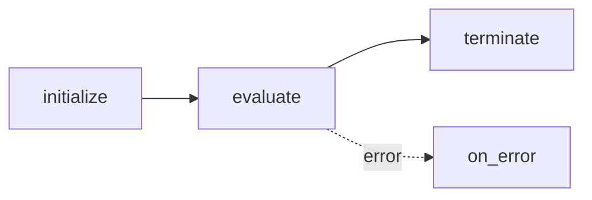

# Flock Agents 🐦

A **FlockAgent** is the fundamental unit of work in the framework.  Each agent is *declarative* – you specify **what** goes in, **what** should come out, and (optionally) some high-level behavioural hints.  Flock takes care of turning that declaration into concrete logic at runtime.

---

## 1. Anatomy of an Agent

```python
from flock.core import FlockAgent, FlockFactory

agent = FlockFactory.create_default_agent(
    name="movie_pitcher",
    description="Creates a fun movie idea for a given topic",
    input="topic: str | The central subject of the movie",
    output=(
        "title: str | CAPSLOCK title, "
        "runtime: int | Minutes, "
        "synopsis: str | Over-the-top summary"
    ),
)
```

### Key Fields

| Field | Type | Intent |
| ----- | ---- | ------ |
| `name` | `str` | Unique identifier; becomes the registry key. |
| `model` | `str | None` | Override the default model for this agent. |
| `description` | `str \| Callable` | High-level instructions; merged into the system prompt. |
| `input` | `SignatureType` | Contract for accepted data. |
| `output` | `SignatureType` | Contract for produced data. |
| `tools` | `list[Callable]` | Extra callables the evaluator may invoke. |
| `evaluator` | `FlockEvaluator` | Implementation of the agent's logic (defaults to DeclarativeEvaluator in `FlockFactory`). |
| `handoff_router` | `FlockRouter` | Optional router that chooses the next agent. |
| `modules` | `dict[str, FlockModule]` | Plug-in behaviours (metrics, memory, etc.). |

All these fields are **Pydantic-validated** and fully serialisable via `Serializable`.

---

## 2. Signatures: Input & Output

Signatures are written in a compact mini-DSL:

* `field` – just a name (type & description inferred by the LLM).
* `field: type` – adds a type hint.
* `field: type | description` – adds a natural-language description.
* Multiple fields are comma-separated.
* Lists/dicts follow normal Python typing: `list[dict[str, str]]`.

Alternatively, pass a **Pydantic model** for static typing:

```python
from pydantic import BaseModel

class SearchIn(BaseModel):
    query: str
    top_k: int = 5

class SearchOut(BaseModel):
    documents: list[str]

search_agent = FlockAgent(
    name="searcher",
    input=SearchIn,
    output=SearchOut,
    evaluator=CustomSearchEvaluator(...),
)
```

---

## 3. Lifecycle



1. **initialize** – prepare resources (DB connection, load embeddings, etc.).
2. **evaluate** – main logic executed by the evaluator.
3. **terminate** – clean-up, persist metrics.
4. **on_error** – triggered if any previous stage raises.

Modules can hook into each stage to extend behaviour.

---

## 4. Attaching Modules & Routers

```python
from flock.modules.output import OutputModule, OutputModuleConfig
from flock.routers.agent import AgentRouter, AgentRouterConfig

agent.add_module(OutputModule("output", OutputModuleConfig(render_table=True)))
agent.handoff_router = AgentRouter("router", AgentRouterConfig())
```

---

## 5. Best Practices

* Keep `description` concise; use the signature for fine-grained control.
* Prefer Pydantic models for complex schemas – you get validation for free.
* Separate concerns: evaluator handles *logic*, modules handle *cross-cutting* tasks.
* Register reusable tools with `@flock_tool` so any agent can adopt them.

---

**Next:**  Learn *why* this declarative approach works in [Declarative Programming](declarative.md).
