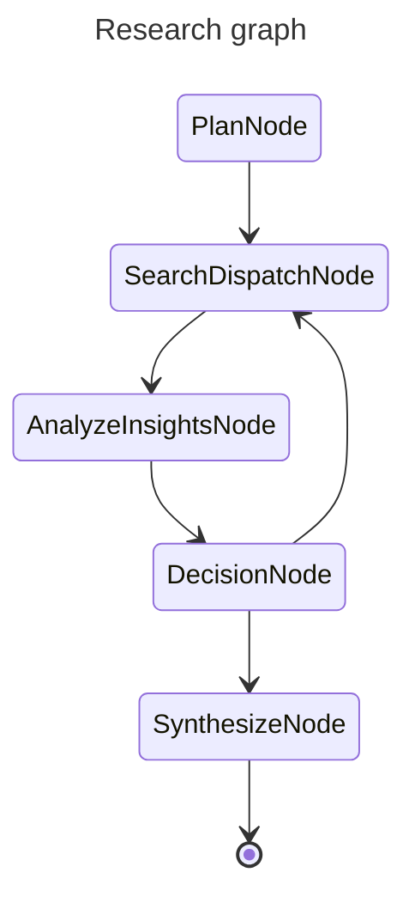

## Agents

Two agentic flows are provided by haiku.rag:

- Simple QA Agent — a focused question answering agent
- Research Multi‑Agent — a multi‑step, analyzable research workflow


### Simple QA Agent

The simple QA agent answers a single question using the knowledge base. It retrieves relevant chunks, optionally expands context around them, and asks the model to answer strictly based on that context.

Key points:

- Uses a single `search_documents` tool to fetch relevant chunks
- Can be run with or without inline citations in the prompt (citations prefer
  document titles when present, otherwise URIs)
- Returns a plain string answer

Python usage:

```python
from haiku.rag.client import HaikuRAG
from haiku.rag.qa.agent import QuestionAnswerAgent

client = HaikuRAG(path_to_db)

# Choose a provider and model (see Configuration for env defaults)
agent = QuestionAnswerAgent(
    client=client,
    provider="openai",  # or "ollama", "vllm", etc.
    model="gpt-4o-mini",
    use_citations=False,  # set True to bias prompt towards citing sources
)

answer = await agent.answer("What is climate change?")
print(answer)
```

### Research Graph

The research workflow is implemented as a typed pydantic‑graph. It plans, searches (in parallel batches), evaluates, and synthesizes into a final report — with clear stop conditions and shared state.



Key nodes:

- Plan: builds up to 3 standalone sub‑questions (uses an internal presearch tool)
- Search (batched): answers sub‑questions using the KB with minimal, verbatim context
- Analyze: aggregates fresh insights, updates gaps, and suggests new sub-questions
- Decision: checks sufficiency/confidence thresholds and chooses whether to iterate
- Synthesize: generates a final structured report

Primary models:

- `SearchAnswer` — one per sub‑question (query, answer, context, sources)
- `InsightRecord` / `GapRecord` — structured tracking of findings and open issues
- `InsightAnalysis` — output of the analysis stage (insights, gaps, commentary)
- `EvaluationResult` — insights, new questions, sufficiency, confidence
- `ResearchReport` — final report (title, executive summary, findings, conclusions, …)

CLI usage:

```bash
haiku-rag research "How does haiku.rag organize and query documents?" \
  --max-iterations 2 \
  --confidence-threshold 0.8 \
  --max-concurrency 3 \
  --verbose
```

Python usage (blocking result):

```python
from haiku.rag.client import HaikuRAG
from haiku.rag.research import (
    PlanNode,
    ResearchContext,
    ResearchDeps,
    ResearchState,
    build_research_graph,
)

async with HaikuRAG(path_to_db) as client:
    graph = build_research_graph()
    question = "What are the main drivers and trends of global temperature anomalies since 1990?"
    state = ResearchState(
        context=ResearchContext(original_question=question),
        max_iterations=2,
        confidence_threshold=0.8,
        max_concurrency=2,
    )
    deps = ResearchDeps(client=client)

    result = await graph.run(
        PlanNode(provider="openai", model="gpt-4o-mini"),
        state=state,
        deps=deps,
    )

    report = result.output
    print(report.title)
    print(report.executive_summary)
```

Python usage (streamed events):

```python
from haiku.rag.client import HaikuRAG
from haiku.rag.research import (
    PlanNode,
    ResearchContext,
    ResearchDeps,
    ResearchState,
    build_research_graph,
    stream_research_graph,
)

async with HaikuRAG(path_to_db) as client:
    graph = build_research_graph()
    question = "What are the main drivers and trends of global temperature anomalies since 1990?"
    state = ResearchState(
        context=ResearchContext(original_question=question),
        max_iterations=2,
        confidence_threshold=0.8,
        max_concurrency=2,
    )
    deps = ResearchDeps(client=client)

    async for event in stream_research_graph(
        graph,
        PlanNode(provider="openai", model="gpt-4o-mini"),
        state,
        deps,
    ):
        if event.type == "log":
            iteration = event.state.iterations if event.state else state.iterations
            print(f"[{iteration}] {event.message}")
        elif event.type == "report":
            print("\nResearch complete!\n")
            print(event.report.title)
            print(event.report.executive_summary)
```
