# STM32 Firmware Programming System - 모듈별 상세 다이어그램

## 📁 file_scanner.py 모듈

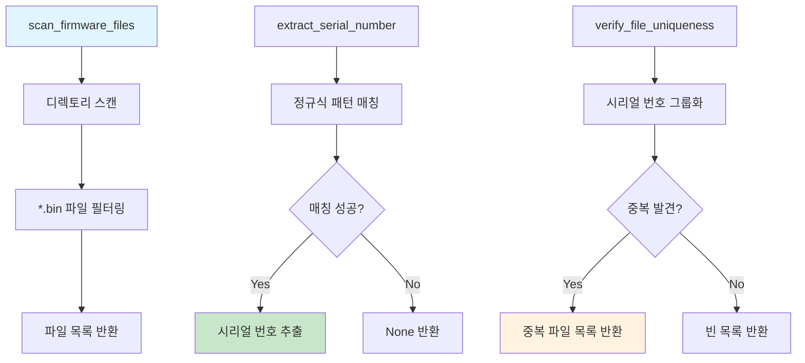

## 🔌 st_link_handler.py 모듈

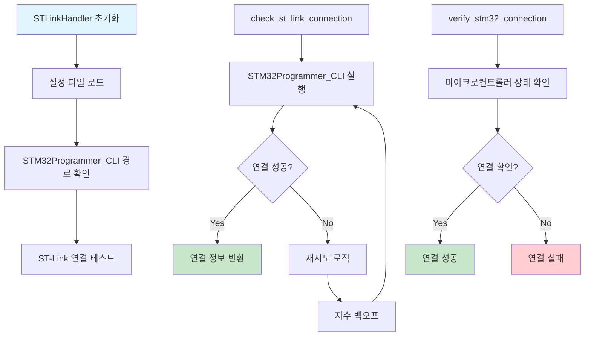

## 💾 firmware_programmer.py 모듈

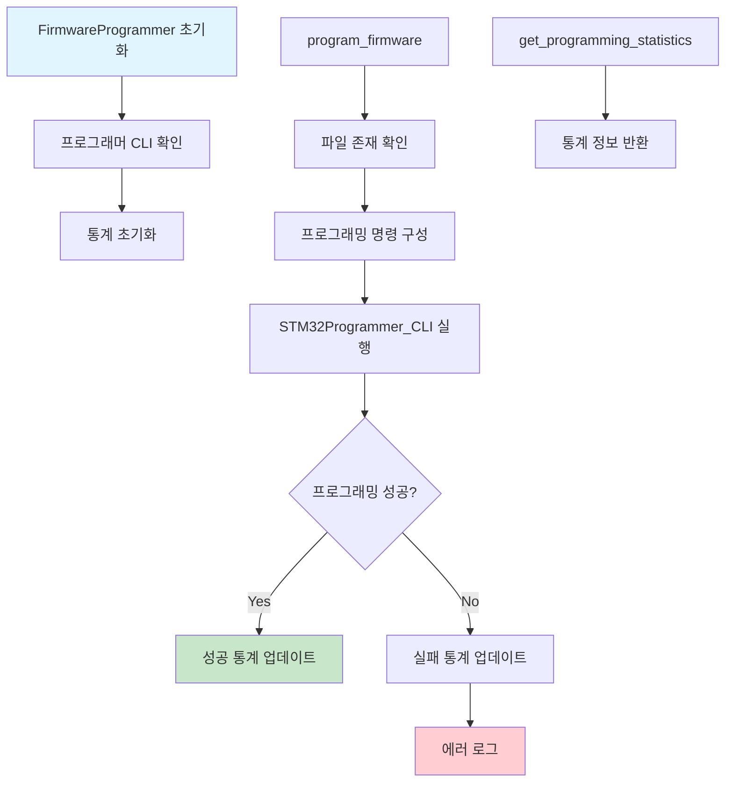

## 📡 serial_communicator.py 모듈

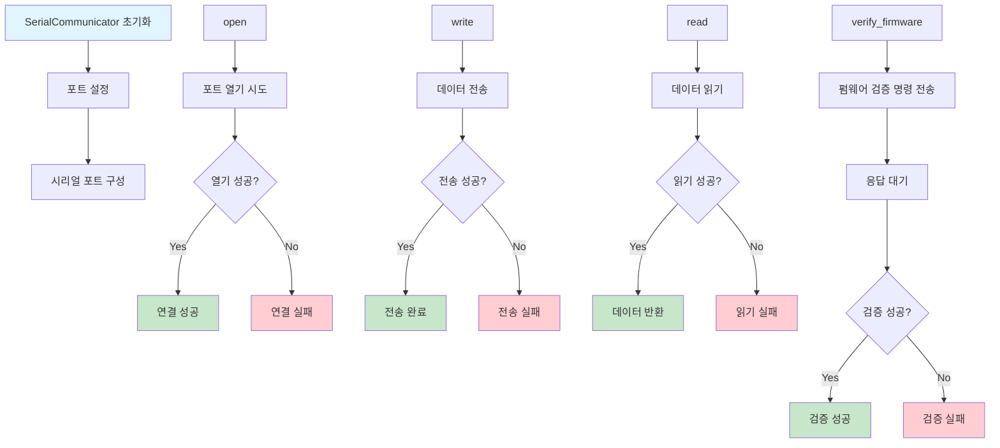

## 📝 file_handler.py 모듈

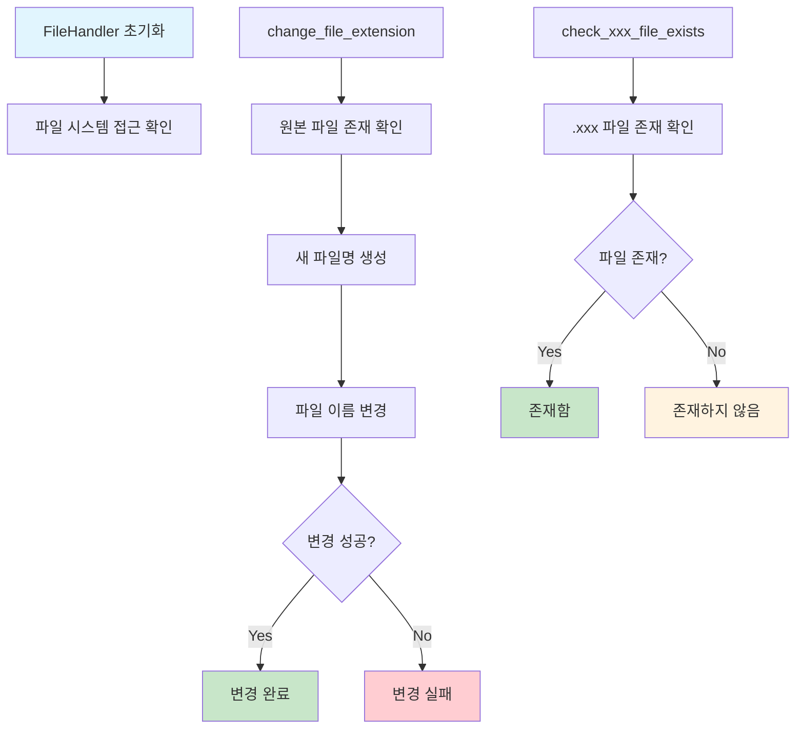

## 🔍 firmware_verifier.py 모듈

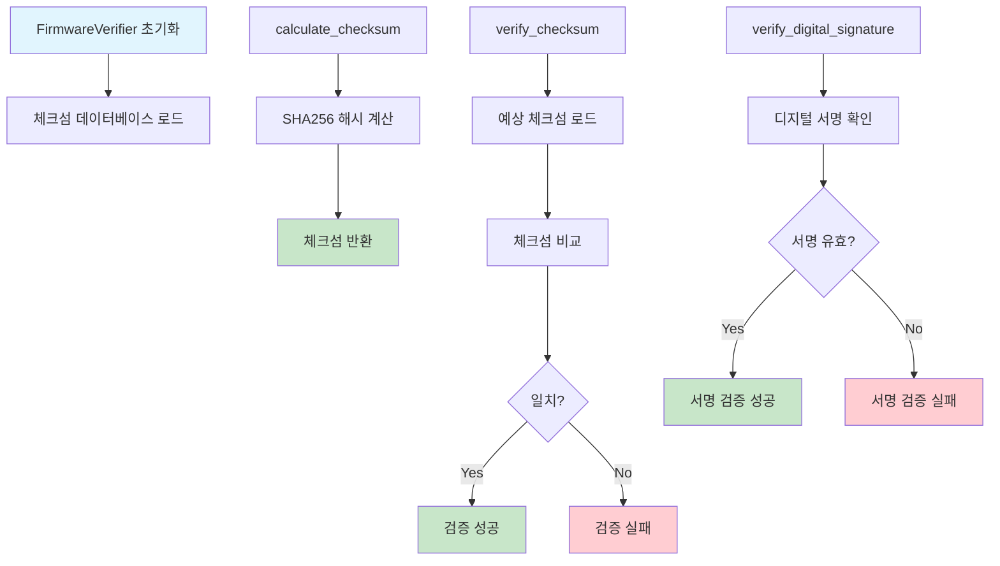

## ⚠️ error_handler.py 모듈

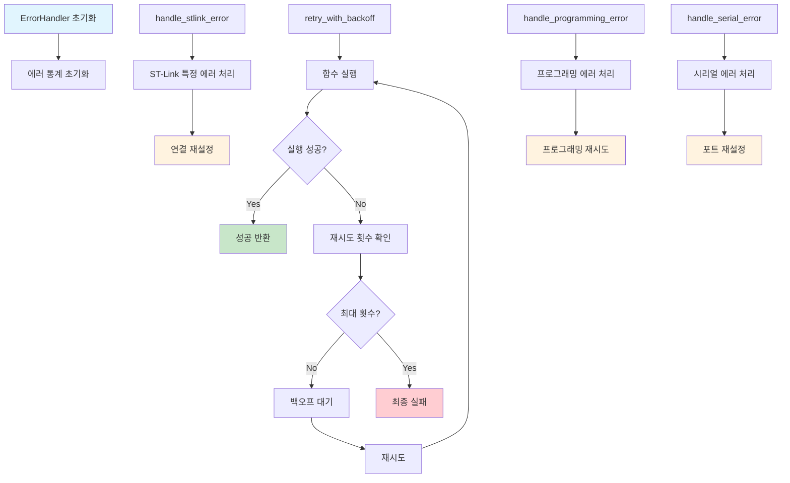

## 📊 logger.py 모듈

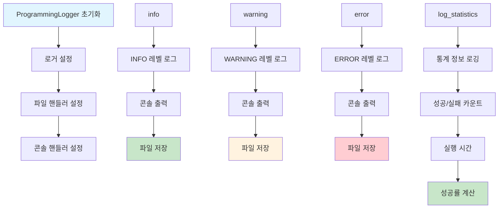

## ⚙️ config.py 모듈

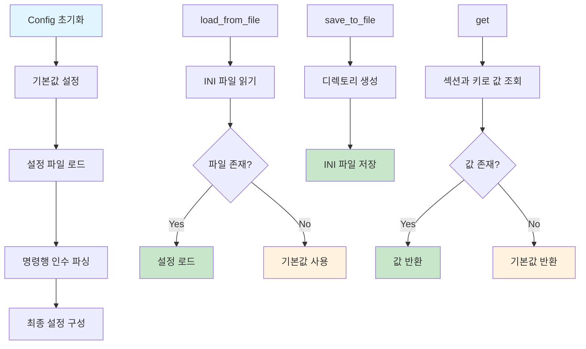

## 📈 performance_monitor.py 모듈

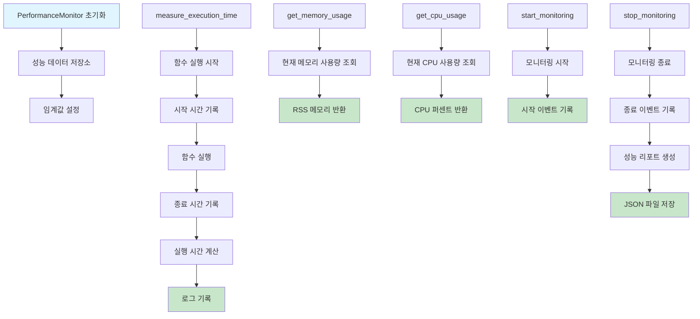

## 🔄 데이터 흐름 다이어그램

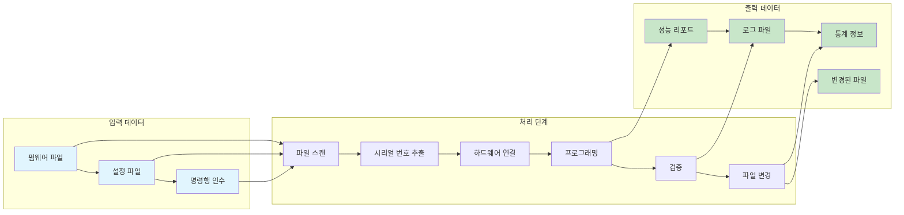

## 🔗 모듈 간 의존성

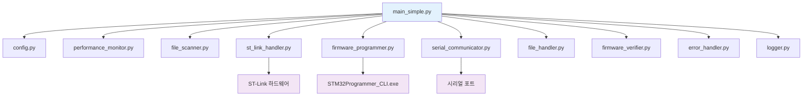

## 🎯 실행 시퀀스 다이어그램

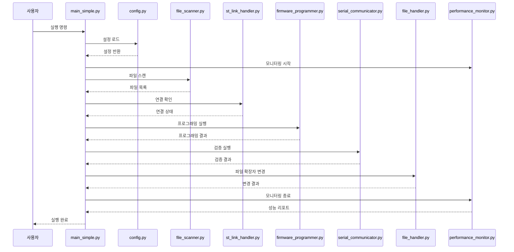

이 다이어그램들은 각 모듈의 내부 동작과 모듈 간의 상호작용을 상세하게 보여줍니다. 각 모듈의 역할과 책임이 명확하게 구분되어 있으며, 전체 시스템의 복잡성을 이해하는 데 도움이 됩니다.
