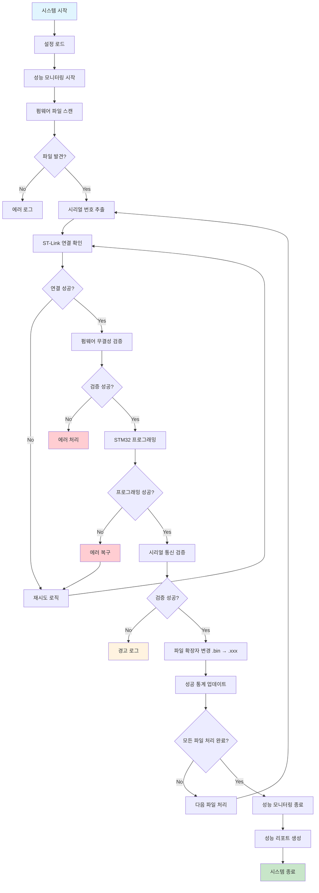
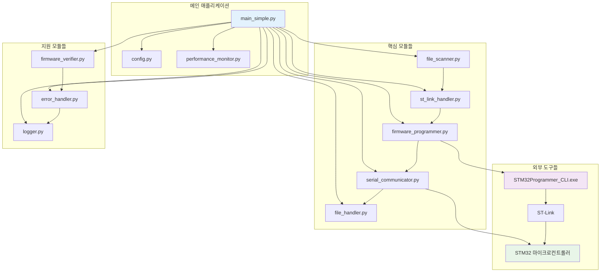
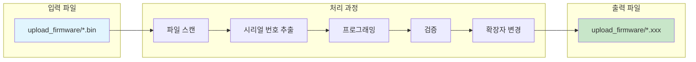
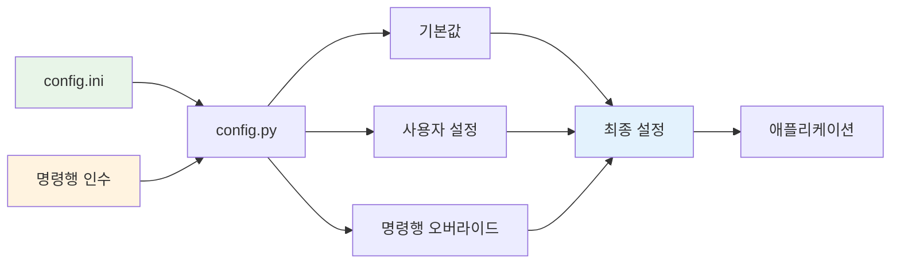
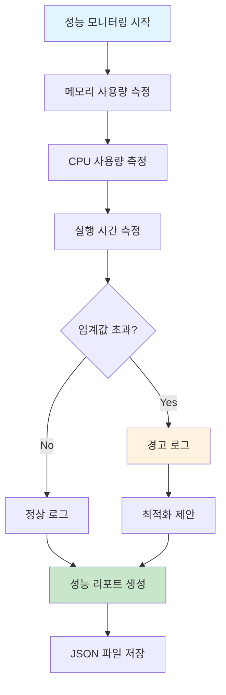
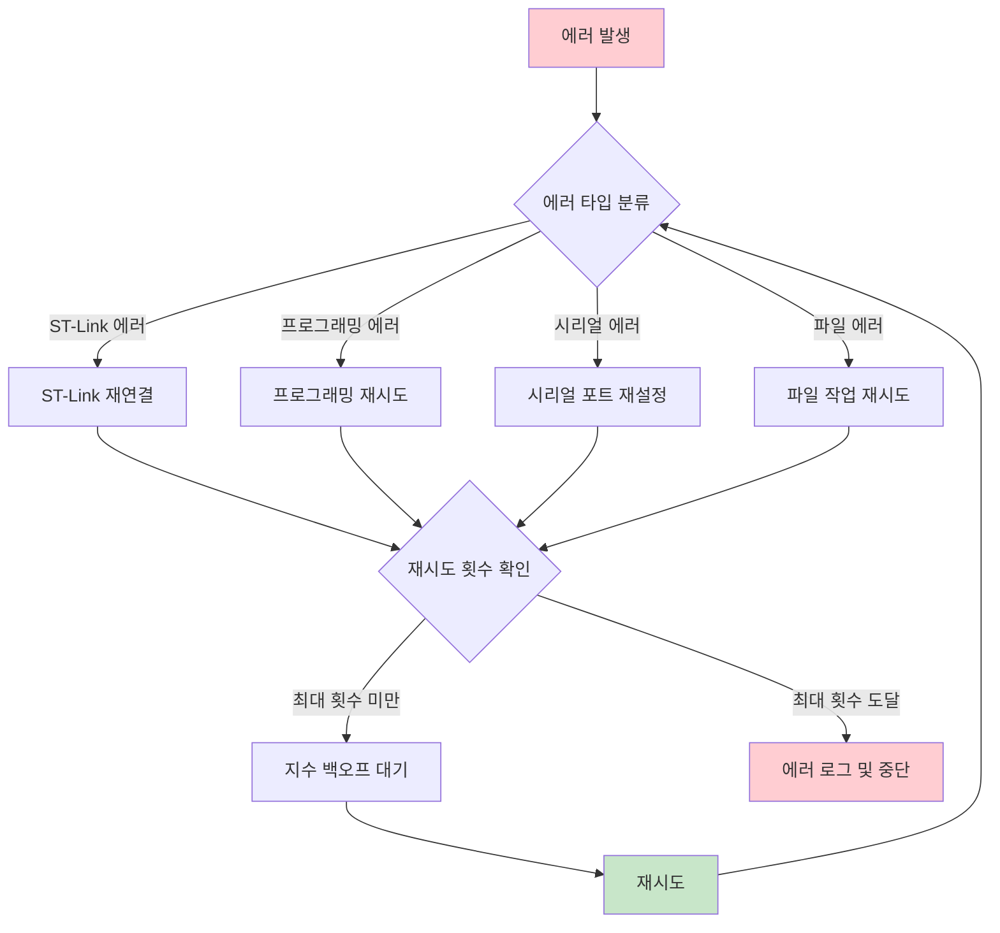
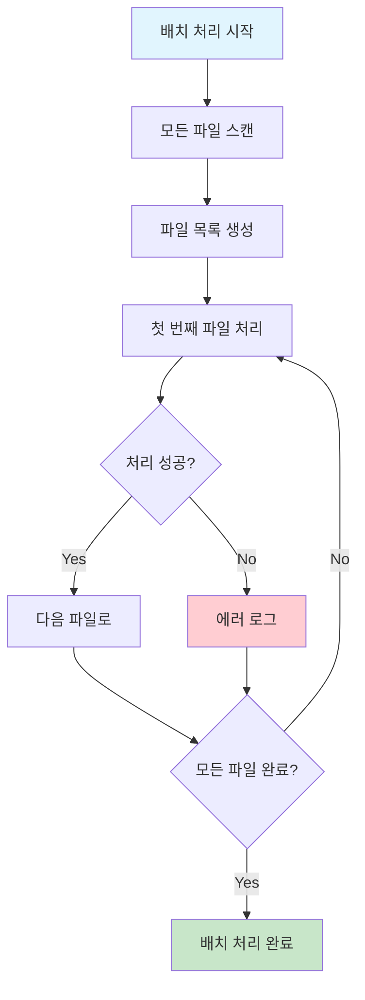
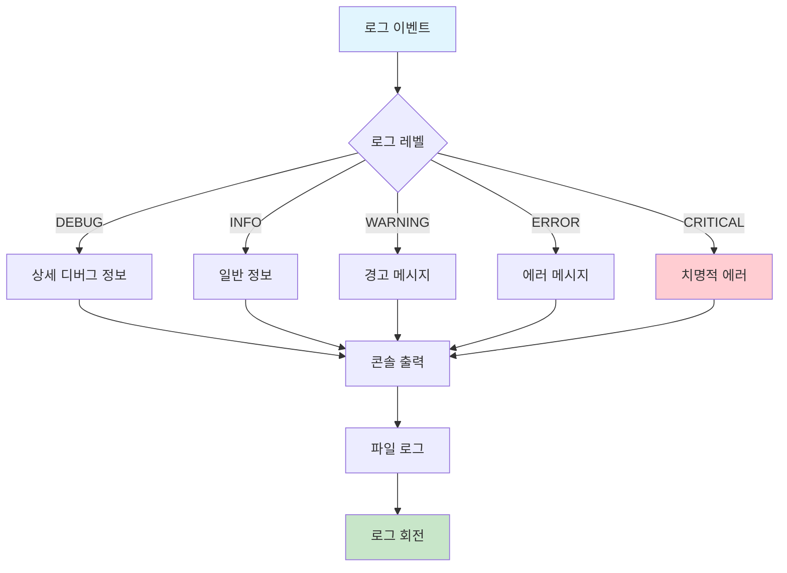
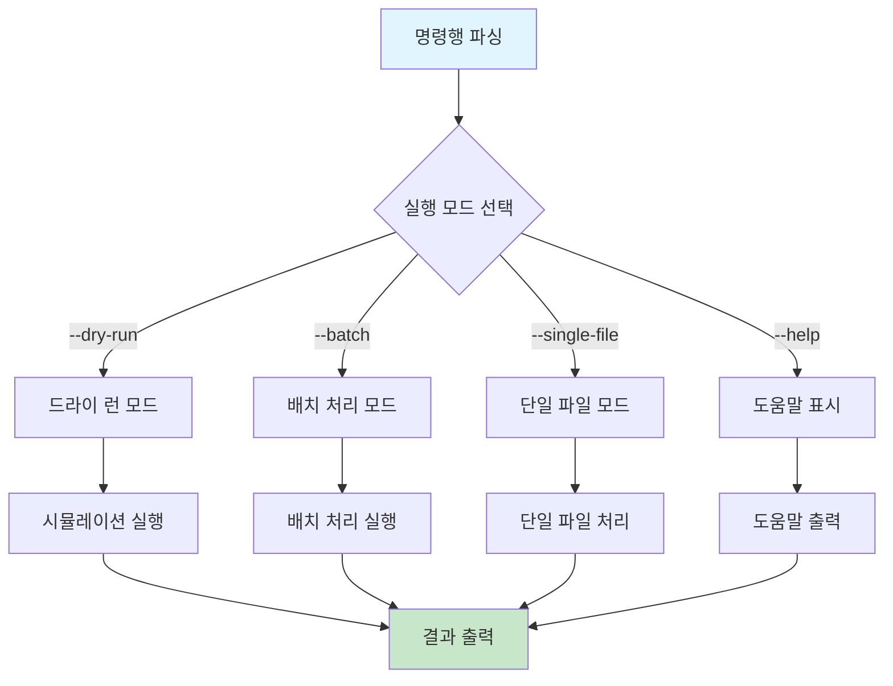
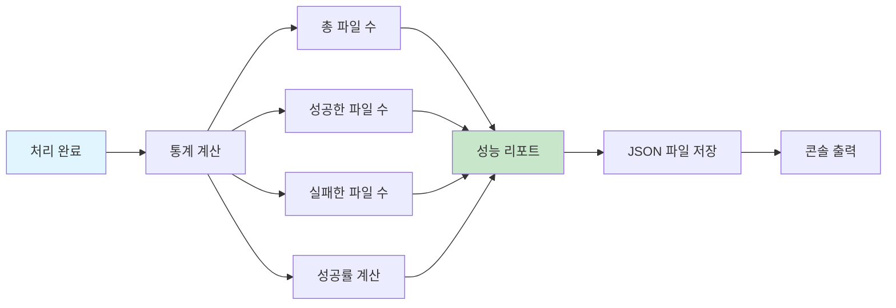

# STM32 Firmware Programming System - 전체 동작 과정

## 📋 시스템 개요

이 시스템은 STM32 마이크로컨트롤러에 펌웨어를 프로그래밍하는 자동화된 솔루션입니다. `upload_firmware` 폴더의 `.bin` 파일들을 스캔하여 고유한 시리얼 번호를 추출하고, STM32Programmer_CLI.exe를 사용하여 프로그래밍한 후, 성공적으로 완료된 파일의 확장자를 `.xxx`로 변경합니다.

## 🔄 전체 시스템 워크플로우



## 🏗️ 시스템 아키텍처



## 📁 파일 처리 과정



## 🔧 설정 관리 시스템



## ⚡ 성능 모니터링 시스템



## 🔄 에러 처리 및 복구 메커니즘



## 🎯 실행 모드별 워크플로우

### 드라이 런 모드


### 배치 처리 모드


### 단일 파일 처리 모드


## 📊 로깅 및 모니터링



## 🔧 명령행 인터페이스



## 📈 성공률 및 통계



## 🚀 실행 예시

### 기본 실행
```bash
# 드라이 런 (테스트)
python main_simple.py --dry-run --batch

# 실제 실행
python main_simple.py --config config.ini --batch --verify

# 단일 파일 처리
python main_simple.py --single-file "firmware.bin" --verify
```

### 고급 옵션
```bash
# 상세 로깅
python main_simple.py --log-level DEBUG --dry-run --batch

# 커스텀 설정
python main_simple.py \
  --firmware-dir custom_firmware \
  --programming-speed 8000 \
  --connect-mode underReset \
  --batch
```

## 📋 시스템 요구사항

- **Python 3.8+**
- **STM32Programmer_CLI.exe**
- **ST-Link 하드웨어**
- **STM32 마이크로컨트롤러**
- **시리얼 통신 포트**

## 🔍 모니터링 포인트

1. **파일 스캔**: 펌웨어 파일 발견 및 시리얼 번호 추출
2. **하드웨어 연결**: ST-Link 연결 상태 확인
3. **프로그래밍**: STM32 프로그래밍 진행 상황
4. **검증**: 시리얼 통신을 통한 펌웨어 검증
5. **파일 관리**: 확장자 변경 및 백업
6. **성능**: 메모리, CPU 사용량, 실행 시간
7. **에러 처리**: 재시도 및 복구 메커니즘

이 다이어그램들은 시스템의 전체적인 동작 과정을 시각적으로 보여주며, 각 단계에서 발생할 수 있는 상황과 처리 방법을 명확하게 설명합니다.
