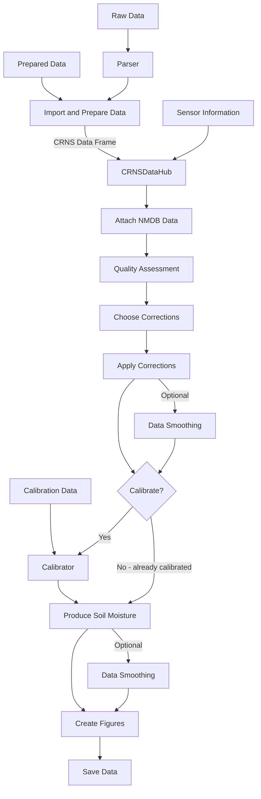

## An overview of neptoon workflow

So now we know a little about how these sensors work. Next we will outline the processing workflow in neptoon

!!! tip "Important"
    Re-calibration is needed if you change anything in the steps. For example, if you decide to test out a different method for incoming intensity correction or apply smoothing at a different point, the original N0 calibration term will be incorrect (it will be the N0 number when using your original methodology). It is always recommended to use the calibration step when changing things in the workflow. 


### Flow diagram



Above is a flow diagram representing the general workflow that is required for processing CRNS in neptoon. 

#### Data Collection and Formatting

First, we need some data :

: **Sensor Owners**: You have raw sensor files that need to be parsed and formatted into a data frame ready for processing.
: **Researchers, Students, and Citizen Scientists**: You may wish to collect publicly available data from the internet to try out some re-processing.

Routines have been developed which will help you import data of different types into neptoon.

Once you have collected the data, it needs to be prepared for use in neptoon. For example, the index of your data frame should be a datetime index (necessary for internal processes). We have written routines to streamline this process.

[More information on data collection and formatting](importing-data.md)

#### Sensor Information

Neptoon needs to know a little about your site to process the raw data. For example:

- What is the bulk density of the soil?
- What are the latitude and longitude of the site?

These values are crucial for accurate conversion of neutron counts to soil moisture estimates. Whilst some values can be calculated by neptoon, others must be supplied by the user. 

[More information on providing sensor information](key-site-information.md)

#### The CRNSDataHub

Linking all these steps together is the CRNSDataHub.

The CRNSDataHub is so-called because it acts as our hub from which to process the CRNS data from. Each of the processing steps has been designed to be as modular as possible. The hub, however, acts as a central location storing the information describing the site, time series data, flagging data for poor quality data, calibration data (if you need to calibrate), and outputs from each of the steps. You'll notice its usage in the example ipython notebooks in the [examples](neptoon-examples.md)

#### Attach Neutron Monitoring Database (NMDB.eu) data

One of the key correction steps in CRNS processing is account for changes in the overall intensity of incoming cosmic-rays. This has a direct influence on 

####  Quality Assurance

Data quality is important. There's no point processing data if the inputs are wrong. For quality assurance in neptoon we utilise the [SaQC](https://rdm-software.pages.ufz.de/saqc/index.html) python package. We have designed wrappers which means you can use it directly in neptoon.

[More information on quality assurance](data-quality-checks.md)

####  Choosing Corrections

A key aspect of CRNS processing is correcting out the additional influences on the neutron signal aside from the influence of soil moisture dynamics. Over the years our understanding has continued to evolve meaning that how we originally corrected for these impacts is no longer the same. 

We include old and new corrections in neptoon, and will expand the selection as new theories are presented.

- **Sensor Owners** - you likely want to process data with the most current understanding, and we provide a default option for this use case.
- **Students and Citizen Scientists** - perhaps you want to better understand the how different methods influence soil moisture estimates - we include all the theories ready for selection.
- **Researchers** - we also introduce a more advanced feature which allows you to build and test new theories of correction and add them to your processing pipeline (no need to re-write the base code!). This is considered an advanced feature and requires some knowledge of python - more on this [here](../advanced-users/write-your-own-corrections.md).

[More information on corrections](choosing-corrections.md)

####  OPTIONAL: Calibrate the Sensor

Sensor calibration ensures we can convert the neutron values into soil moisture estimates. This is done by undertaking a calibration campaign. Traditionally this means collecting soil samples within the radius of influence of the sensor, oven drying the samples to get accurate values of soil moisture, and then comparing this to the count rate during the calibration campaign (see [Schrön et al., 2017](https://doi.org/10.5194/hess-21-5009-2017) for more on this).

Ultimately this provides us with the so called *N0* term, which is the theoretical count rate under absolutely dry conditions. This term is essential in the conversion of neutrons into absolute soil moisture values (otherwise you will only be able to track relative changes in soil moisture over time). This term *could* be estimated, but it is always advised to use calibration data to get an accurate value.

Once calibrated, this *N0* term can be saved in a YAML file for future processing - or be directly provided with the [Site Information](key-site-information.md). This means calibration needs only be done once. 

[More information on calibration](sensor-calibration.md)

####  Produce Soil Moisture Estimates

Now that we have collected and formatted our data, supplied key information, undertaken quality assessment, calculated dynamic correction terms, *and* calibrated the sensor (phew), we are ready to see our soil moisture estimates.

This step takes all the information created from the previous steps and outputs our soil moisture values, as well as information on the depth and radius of the estimation. 

[More information on producing soil moisture estimates](soil-moisture-estimates.md)

#### Saving Data

Now that we've taken the time to process our data, its time to save it. There are a few options, and crucially it wont only save the time series data, but it will bundle quality assurance data, derived information (the Journalist/PDF, and DataAuditLog), as well as key site information.

[More information on data saving](saving-data.md)


#### Journalist/PDF

Making sense of all this data is a task in itself. That's why we also create an informative PDF file which gives an overview of the key information produced when creating data. 

It's important to differentiate the PDF and the DataAuditLog. The DataAuditLog is only interested in processing steps, which means the output should be agnostic to the site being described. 

The PDF provides information about the site itself, which can be useful to site owners and researchers alike:

- How many data points where removed in QA?
- What was the average SM across the seasons?
- Any interesting features a stakeholder should be aware of?

[More information on the output PDF](pdf-output.md)

## The CRNSDataHub

Linking all these steps together is the CRNSDataHub.

The CRNSDataHub is so-called because it acts as our hub from which to process the CRNS data. Each of the processing steps has been designed to be as modular as possible. The hub, however, acts as a central location storing the information describing the site, time series data, flagging data for poor quality data, calibration data (if you need to calibrate), and final outputs. We have designed it with numerous checks, validation steps, and quality of life improvements that should make processing CRNS a breeze!


```python
# lets presume you've got a formatted dataframe called df
data_hub = CRNSDataHub(data_frame = df)
```

[More information on the CRNSDataHub](CRNSDataHub.md)
