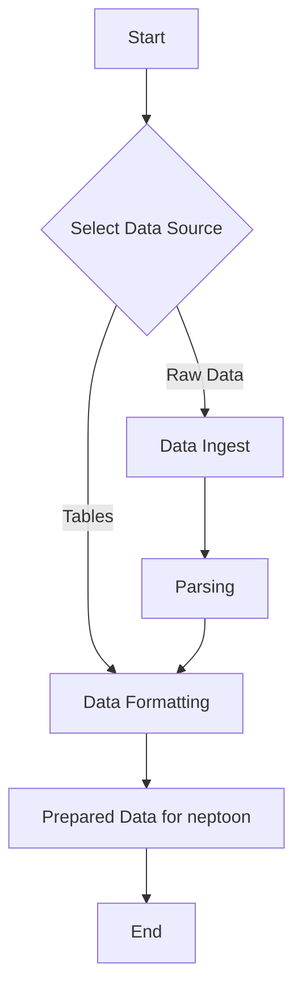

# Data Collection and Formatting

## Introduction

Data collection and formatting are crucial first steps in using neptoon. This section will explain the process of acquiring and preparing your data for use with neptoon, whether you're a sensor owner with raw data files or a researcher working with publicly available datasets.

## Why is this step important?

Proper data collection and formatting ensure that:
: 1. Your data is in a structure that neptoon can process efficiently.
2. Subsequent analysis and processing steps in neptoon will run smoothly.

Many different organisations are interested in using CRNS and this leads to numerous different data formats.
### Sensor Owners
If you own or operate a CRNS, you likely have raw sensor files that need to be parsed and formatted. neptoon provides tools to streamline this process, converting your raw data into a structured format ready for processing.
### Researchers, Students, and Citizen Scientists
For those working with CRNS data that has already been structured (e.g., it's in a `csv` format), neptoon offers methods to format such data ready for processing. We additionally provide methods which support efficiently formatting some of the publicly available datasets available through different organisations. 

## Process Flowchart

Depending on what kind of data your working with might change.



## Build CRNSDataHub from a config file

Like everything in neptoon, it is possible to use pre-configured configuration files which automatically supply the settings for neptoon, allowing replicable data processing. We recommend this method as it is much more reproduceable and saves you having to build out your pipelines every time. 

First you want to ensure you sensor configuration file is appropriately filled out (see [here](sensor-config.md) for more information on that). After this you run the following code:

```python
from neptoon.io.read import DataHubFromConfig

sensor_config_path = 'path/to/your/sensor.yaml'

hub_creator = DataHubFromConfig(path_to_sensor_config=sensor_config_path)
data_hub = hub_creator.create_data_hub()
```

As long as you have correctly filled out your sensor config file with the required information it will automatically import and prepare your CRNS data (either from raw sensor files or a csv/txt file, depending on your settings), it will create the SensorInformation object (see [here](key-site-information.md)) and attach these to a datahub, ready for further processing.

The quickest most reproduceable way to import your data will always be the config file method.

## Data Ingest

### Raw Data

When we talk about raw data in neptoon ingest functions, we are referring to the data files you would expect to have as directly given from a sensor. This means it could be a folder with 100s (or 1000s) of individual text files. This first stage is therefore about taking all these files, collecting the important ones with data we want in them, and converting them into a dataframe. This means we might have to do some filtering of files by name (to make sure we only include files with time series data).

In the sensor config file these are included under the `raw_data_parse_options` settings. If you do not have raw sensor data, for example you already have your data in a csv file, or downloaded publicly available data, the `parse_raw_data` setting should be set to `False`. Neptoon will then know to skip this step and move straight to the data formatting stage. 

## Data Formatting

Data formatting is the second stage (or first stage if you have a csv file with all your time series data). In this step we more directly format the data into a format ready for processing.

#### Neutron unit standardisation

Neutrons are given in counts per hour (cph) in neptoon. Some sensors provide data in absolute counts, which might be 15 min resolution, in counts per second, or in counts per hour. The user states what the provided units are and neptoon will convert them to counts per hour automatically.

#### Merge multiple columns of data type

It is good practice to have back ups, and many sensors will have backup sensors of important variables. This ensure if one sensor fails we can still record key data. For example, CRNS often have at least 2 (and sometimes more) pressure sensors recording. When we make calculations however, we only want a single value to use. 

This merge step provides options on how to take multiple columns and turn them into one value. 

We offer a priorty style (use sensor A, when A is missing use sensor B). For this to work you just list the columns under the appropriate data in order of preference.

```yaml
    pressure_columns:
      - P4_mb # first priority goes here
      - P3_mb
      - P1_mb
	pressure_merge_method: priority # or mean
```

We also offer a `mean` option, which takes an average of all available sensors and uses that as the actual value.

#### DateTime preparation

The DataFrame in neptoon must have a DateTime index. So there are options to let neptoon know what columns contain the DateTime data. If data is split into two columns (e.g., `Date` and `Time`) these can be provided in a list and neptoon will combine them.

The DateTime format should also be provided here to make sure datetime parsing doesn't introduce any errors.

We also expect data to be in UTC time which makes things much easier when integrating with external products (e.g., NMDB.eu). If data is given in local time this can be stated and neptoon will convert the data into UTC time. 
