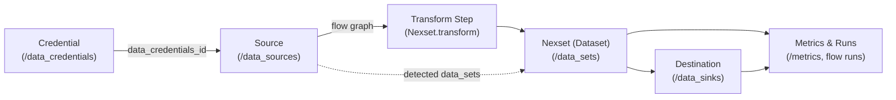

- Client: `NexlaClient` orchestrates authentication and request lifecycle; see `nexla_sdk/client.py`.
- Credentials: `CredentialsResource` provides reusable access to external systems and is referenced by sources and destinations.
- Resources: High-level managers for flows, sources, destinations, nexsets, lookups, users, organizations, teams, projects, notifications, and metrics (`nexla_sdk/resources/*`).
- Models: Pydantic request/response schemas (`nexla_sdk/models/*`) keep payloads type-safe and serializable.
- Errors: A rich hierarchy (`nexla_sdk/exceptions.py`) surfaces context such as operation, resource type, and retry hints.
- Telemetry & Pagination: Optional OpenTelemetry spans wrap HTTP calls, and every resource inherits consistent pagination helpers.

### Flow Topology

- **Credentials** secure connection details and can be probed for structure/sample data (`client.credentials.probe_*`).
- **Sources** ingest data using a connector `source_type`/`connector_type` and emit discovered nexsets; see `nexla_sdk/models/sources/responses.py`.
- **Transforms** live on nexsets via `NexsetCreate.transform` and define schema-mapping logic before data is published downstream.
- **Destinations** subscribe to nexsets and push data to sinks (`sink_type`).
- **Flows** stitch nodes (source → nexset(s) → destination) and expose run metrics via `client.flows.list(include_run_metrics=True)` and `client.metrics.*`.
