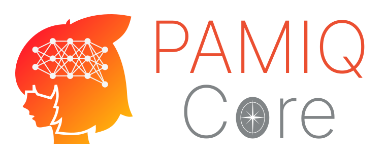

# pamiq-core

[](https://pypi.org/project/pamiq-core/)
[](https://www.python.org/downloads/)
[](LICENSE)
[](https://google.github.io/styleguide/pyguide.html#s3.8-comments-and-docstrings)
[](https://github.com/MLShukai/pamiq-core/actions/workflows/test.yml)
[](https://github.com/MLShukai/pamiq-core/actions/workflows/type-check.yml)
[](https://github.com/MLShukai/pamiq-core/actions/workflows/pre-commit.yml)

**pamiq-core** is a minimal machine learning framework for asynchronous execution of inference and training.

## 🎯 Design Philosophy

- **Simplicity** — Clean, intuitive APIs that just work
- **Lightweight** — Minimal dependencies, maximum performance
- **Complete Thread Abstraction** — Complex threading handled internally, simple interface externally

> When you set out to build a dynamic continuous learning system, PAMIQ Core will be your steadfast foundation.

[**📚 Documentation site is here.**](https://mlshukai.github.io/pamiq-core/)

## ✨ Features

- 🔄 **Parallel Architecture**: Simultaneous inference and training in separate threads
- ⚡ **Real-time Adaptation**: Continuously update models during interaction
- 🧵 **Thread-safe Design**: Robust synchronization mechanisms for parameter sharing and data transfers
- 🔌 **Modular Components**: Easy-to-extend agent, environment, and model interfaces
- 🛠️ **Comprehensive Tools**: Built-in state persistence, time control, and monitoring
- 🏋️ **Gymnasium Integration**: Seamless compatibility with [Gymnasium](https://gymnasium.farama.org/) environments
- 🌍 **Cross Platform**: Linux is the primary focus, but Windows and macOS are also supported. (However, some older macOS and Windows systems may have significantly less accurate time control.)

## 📋 Requirements

- Python 3.12+
- PyTorch (optional, for torch integration)

## 🚀 Quick Start

### Installation

```bash
# Install with pip
pip install pamiq-core

# Optional PyTorch integration
pip install pamiq-core[torch]

# Optional Gymnasium integration
pip install pamiq-core[gym]
```

### Basic Example

```python
from pamiq_core import launch, Interaction, LaunchConfig
from your_agent import YourAgent
from your_environment import YourEnvironment

# Create agent-environment interaction
interaction = Interaction(YourAgent(), YourEnvironment())

# Launch the system
launch(
    interaction=interaction,
    models=your_models,
    buffers=your_data_buffers,
    trainers=your_trainers,
    config=LaunchConfig(
        web_api_address=("localhost", 8391),
        max_uptime=300.0,  # 5 minutes
    ),
)
```

See the [samples](samples/) directory for complete examples.

### Remote CLI Control

Once the system is running, you can connect and control it remotely via the terminal using `pamiq-console`:

```bash
# Connect to local system
pamiq-console --host localhost --port 8391

# Connect to remote system
pamiq-console --host 192.168.1.100 --port 8391
```

## 🧩 Architecture


pamiq-core implements a unique architecture that enables autonomous intelligence:

1. **Concurrent Threads**: Separate threads for control, inference, and training
2. **Parameter Sharing**: Thread-safe model parameter synchronization
3. **Experience Collection**: Automatic buffering of data from environments, such as images and audio.
4. **Continuous Learning**: Training models while simultaneously using them for decision making
5. **State Persistence**: Saving and loading system state for resumable operation

## 🤝 Contributing

Contributions are welcome! Please see [CONTRIBUTING.md](CONTRIBUTING.md) for guidelines on how to contribute to pamiq-core.

## 📄 License

This project is licensed under the MIT License - see the [LICENSE](LICENSE) file for details.

## 🔗 Related Projects

- [pamiq-recorder](https://github.com/MLShukai/pamiq-recorder): Recording library for P-AMI\<Q>
- [pamiq-io](https://github.com/MLShukai/pamiq-io): I/O library for P-AMI\<Q>
