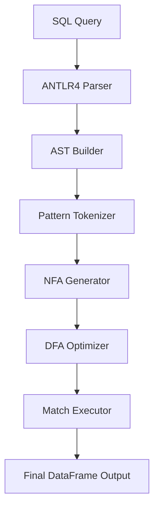

# SQL MATCH\_RECOGNIZE on Pandas

## Overview

This project brings SQL’s powerful `MATCH_RECOGNIZE` clause—used for pattern matching in sequences and event streams—directly to Pandas DataFrames. Our implementation allows users to run complex sequence detection logic in-memory within Python, removing the need for external databases like Trino, Oracle, or Flink.

It supports the SQL:2016 standard for `MATCH_RECOGNIZE`, including advanced features such as:

* `PARTITION BY`, `ORDER BY`
* Regex-style pattern syntax
* `DEFINE` conditions
* `AFTER MATCH SKIP` options
* Support for anchors, quantifiers, alternation, and `PERMUTE` patterns

---

## Motivation

Existing platforms like Oracle, Trino, and Flink offer robust implementations of `MATCH_RECOGNIZE` but come with significant complexity, licensing, or deployment overhead. Python's Pandas, despite its widespread use, lacks direct support for expressive pattern queries.

This project aims to close that gap by enabling SQL-native pattern detection in Pandas without sacrificing performance or expressiveness.

---

## Key Features

* 🧠 **SQL Query Parsing with ANTLR4**
  Fully customized SQL grammar extended from Trino to support all aspects of the `MATCH_RECOGNIZE` clause.

* 🌲 **AST Construction**
  SQL queries are parsed and transformed into abstract syntax trees for easier validation and execution.

* ⚙️ **Finite Automata Engine**

  * Patterns are tokenized and translated to NFAs using Thompson’s construction.
  * NFAs are converted to DFAs for efficient row-by-row evaluation.
  * DFA optimizations include state minimization and prioritization.

* 📊 **Execution on Pandas**

  * Data is partitioned and ordered per query.
  * Patterns are matched directly on DataFrames.
  * Results are formatted to resemble SQL query output.

* 🧪 **Safety and Expressiveness**

  * Custom error listener for precise SQL diagnostics.
  * SQL-to-Python conversion uses the `ast` module to safely evaluate expressions.

---

## Architecture



---

## Example SQL Query

```sql
SELECT customer_id, start_price, bottom_price, final_price, start_date, final_date
FROM orders
MATCH_RECOGNIZE (
    PARTITION BY customer_id
    ORDER BY order_date
    MEASURES
        START.price AS start_price,
        LAST(DOWN.price) AS bottom_price,
        LAST(UP.price) AS final_price,
        START.order_date AS start_date,
        LAST(UP.order_date) AS final_date
    ONE ROW PER MATCH
    AFTER MATCH SKIP PAST LAST ROW
    PATTERN (START DOWN+ UP+)
    DEFINE
        DOWN AS price < PREV(price),
        UP AS price > PREV(price)
);
```

---

## 🚀 Installation

### Prerequisites

* **Python 3.8+**
* **pandas** >= 1.0.0
* **numpy** >= 1.18.0
* **antlr4-python3-runtime** >= 4.9.0

### 📦 Install from Source (Development)

1. **Clone the repository:**
   ```bash
   git clone https://github.com/MonierAshraf/Row_match_recognize.git
   cd Row_match_recognize
   ```

2. **Install dependencies:**
   ```bash
   pip install -r requirements.txt
   ```

3. **Install the package in editable mode:**
   ```bash
   pip install -e .
   ```

### 📚 Install from PyPI (Production)

```bash
pip install pandas-match-recognize
```

### 🧪 Install from TestPyPI (Latest Development)

```bash
pip install -i https://test.pypi.org/simple/ pandas-match-recognize
```

### 📥 Install from Local Build

```bash
# Build the package yourself
python -m build
pip install dist/pandas_match_recognize-0.1.0-py3-none-any.whl
```

### 🔧 Verify Installation

```python
# Test the installation
# Note: Package is installed as 'pandas-match-recognize' but imported as 'match_recognize'
from match_recognize import match_recognize
print("✅ Installation successful!")
```

---

## 💡 Quick Start Usage

> **Note:** The package is installed as `pandas-match-recognize` (with hyphens) from PyPI, but imported as `match_recognize` (with underscores) in Python code. This is standard practice since Python module names cannot contain hyphens.

### Customer Order Pattern Analysis

```python
# Import the match_recognize function (installed from pandas-match-recognize package)
from match_recognize import match_recognize
import pandas as pd

# Customer order data
data = [
    ('cust_1', '2020-05-11', 100),
    ('cust_1', '2020-05-12', 200),
    ('cust_2', '2020-05-13',   8),
    ('cust_1', '2020-05-14', 100),
    ('cust_2', '2020-05-15',   4),
    ('cust_1', '2020-05-16',  50),
    ('cust_1', '2020-05-17', 100),
    ('cust_2', '2020-05-18',   6),
]

# Create DataFrame
df = pd.DataFrame(data, columns=['customer_id', 'order_date', 'price'])
df['order_date'] = pd.to_datetime(df['order_date'])

# Find V-shaped price patterns: START → DOWN+ → UP+
sql = """
SELECT customer_id, start_price, bottom_price, final_price, start_date, final_date
FROM orders
MATCH_RECOGNIZE (
    PARTITION BY customer_id
    ORDER BY order_date
    MEASURES
        START.price AS start_price,
        LAST(DOWN.price) AS bottom_price,
        LAST(UP.price) AS final_price,
        START.order_date AS start_date,
        LAST(UP.order_date) AS final_date
    ONE ROW PER MATCH
    AFTER MATCH SKIP PAST LAST ROW
    PATTERN (START DOWN+ UP+)
    DEFINE
        DOWN AS price < PREV(price),
        UP AS price > PREV(price)
);
"""

# Execute the query
result = match_recognize(sql, df)
print(result)
```

**Output:**
```
  customer_id  start_price  bottom_price  final_price start_date  final_date
0      cust_1          200            50          100 2020-05-12  2020-05-17
1      cust_2            8             4            6 2020-05-13  2020-05-18
```

---

## 🛠 Development Setup

### For Contributors

1. **Fork and clone:**
   ```bash
   git fork https://github.com/MonierAshraf/Row_match_recognize.git
   git clone https://github.com/YOUR_USERNAME/Row_match_recognize.git
   cd Row_match_recognize
   ```

2. **Create virtual environment:**
   ```bash
   python -m venv venv
   source venv/bin/activate  # On Windows: venv\Scripts\activate
   ```

3. **Install development dependencies:**
   ```bash
   pip install -e .
   pip install -r test_requirements.txt  # Testing dependencies
   ```

4. **Run tests:**
   ```bash

   python -m pytest tests/test_anchor_patterns.py tests/test_back_reference.py tests/test_case_sensitivity.py tests/test_complete_java_reference.py tests/test_empty_cycle.py tests/test_empty_matches.py tests/test_exponential_protection.py tests/test_fixed_failing_cases.py tests/test_in_predicate.py tests/test_match_recognize.py tests/test_missing_critical_cases.py tests/test_multiple_match_recognize.py tests/test_navigation_and_conditions.py tests/test_output_layout.py tests/test_pattern_cache.py tests/test_pattern_tokenizer.py tests/test_permute_patterns.py tests/test_production_aggregates.py tests/test_scalar_functions.py tests/test_sql2016_compliance.py tests/test_subqueries.py --tb=short 
   ```

---

## 🗑 Uninstallation

### 📚 Uninstall PyPI Installation:
```bash
pip uninstall pandas-match-recognize
```

### 🧪 Uninstall TestPyPI Installation:
```bash
pip uninstall pandas-match-recognize
```

### 📥 Uninstall Local Build Installation:
```bash
pip uninstall pandas-match-recognize
```

### 📦 Remove Editable/Development Installation:
```bash
# For editable installations from source
pip uninstall pandas-match-recognize row-match-recognize

# Remove local development files
rm -rf match_recognize/
rm -rf *.egg-info/
rm -rf build/
rm -rf dist/
```

### 🧹 Complete Cleanup:
```bash
# Clear pip cache
pip cache purge

# Remove any remaining configuration files
rm -rf ~/.cache/pip/wheels/match*
```

### Verify uninstallation:
```bash
# Test from different directory
cd /tmp
python -c "
try:
    from match_recognize import match_recognize
    print('❌ Package still installed')
except ImportError:
    print('✅ Package successfully uninstalled')
"
```

---

## 📋 Troubleshooting

### Common Issues

**Package vs Module Name Confusion:**
```python
# ❌ WRONG - This will fail
from pandas_match_recognize import match_recognize  # Package name has hyphens

# ✅ CORRECT - Use underscores for import
from match_recognize import match_recognize  # Python module name
```

**Import Error:**
```python
# If you get ModuleNotFoundError
import sys
import os
sys.path.append(os.path.join(os.getcwd(), 'src'))
from executor.match_recognize import match_recognize
```

**Performance Issues:**
- Limit dataset size to < 1000 rows for optimal performance
- Use specific `PARTITION BY` clauses to reduce processing overhead
- Avoid overly complex nested patterns with multiple quantifiers

**Memory Issues:**
```python
# Monitor memory usage for large patterns
import psutil
print(f"Memory usage: {psutil.virtual_memory().percent}%")
```


## Conclusion and Future Work

### Current Limitations

Despite the system's comprehensive capabilities, several limitations remain. First, **complex pattern and quantifier interactions**: although the system supports concatenation, alternation, grouping, and standard quantifiers (`*`, `+`, `?`, `{n,m}`), certain combinations—particularly multiple greedy quantifiers nested within groups (e.g., `(A+B*)+C?`)—can trigger exponential state-space growth during automata construction. This issue primarily arises with three or more levels of nesting combined with unbounded quantifiers; by contrast, simpler patterns and bounded quantifiers behave efficiently. Second, **limited support for aggregate functions**: while a wide range of built-in aggregates (including conditional and statistical functions) is supported, the current implementation offers only limited support for user-defined aggregate functions.

### Future Work

We plan to extend the engine through some updates:

**Performance on Large Datasets:** The system performs efficiently on moderate-sized datasets but may require additional optimizations for large datasets.

**Memory Usage for Large Patterns:** Patterns with many variables and complex quantifiers can generate large automata that increase memory consumption.

**Integration with Query Optimizers:** Because the pattern-matching engine currently operates independently of database query optimizers, it may miss plan-level optimization opportunities.

### Conclusion

We presented a SQL-in-`pandas` engine for executing `MATCH_RECOGNIZE` queries over DataFrames. This provides `SQL:2016 MATCH_RECOGNIZE` functionality for `pandas` DataFrames, bridging the gap between the expressiveness of relational queries and the flexibility of in-memory analytics, bringing SQL pattern matching capabilities to Python data science workflows. This opens the door to unified and portable pipelines that preserve both semantics and developer productivity.

`MATCH_RECOGNIZE` allows data scientists and analysts to use powerful pattern-matching semantics directly within their familiar Pandas environment, without the need for complex Python code or external SQL engine dependencies. This reduces development complexity and enhances productivity for sequential data analysis across domains, including financial analysis, log processing, and time series pattern detection.

By addressing the identified limitations and implementing the future enhancements, our goal is to develop a more adaptable and efficient solution that can handle complex pattern-matching scenarios across various data processing environments. Future work will focus on addressing current limitations through enhanced SQL clause support, distributed processing capabilities, and advanced analytics integration. This development roadmap outlined above provides a clear path for improving performance for the current implementation.


## 📚 References

- [Oracle MATCH_RECOGNIZE Docs](https://docs.oracle.com/cd/E29542_01/apirefs.1111/e12048/pattern_recog.htm#CQLLR1531)
- [Flink SQL MATCH_RECOGNIZE](https://nightlies.apache.org/flink/flink-docs-release-1.15/docs/dev/table/sql/queries/match_recognize/)
- [Trino Row Pattern Recognition](https://trino.io/docs/current/sql/match-recognize.html)

---

## 🤝 Contributing

Pull requests and feedback are welcome! Please ensure your code is tested and documented.

---

## 📝 License

This project is licensed under the MIT License.
