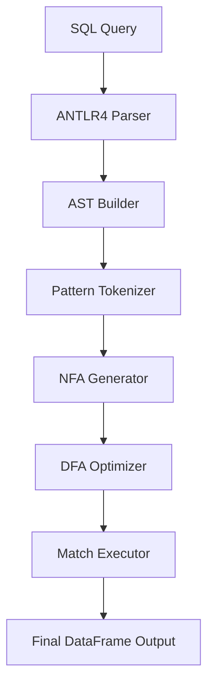

# SQL MATCH\_RECOGNIZE on Pandas

## Overview

This project brings SQL’s powerful `MATCH_RECOGNIZE` clause—used for pattern matching in sequences and event streams—directly to Pandas DataFrames. Our implementation allows users to run complex sequence detection logic in-memory within Python, removing the need for external databases like Trino, Oracle, or Flink.

It supports the SQL:2016 standard for `MATCH_RECOGNIZE`, including advanced features such as:

* `PARTITION BY`, `ORDER BY`
* Regex-style pattern syntax
* `DEFINE` conditions
* `AFTER MATCH SKIP` options
* Support for anchors, quantifiers, alternation, and `PERMUTE` patterns

---

## Motivation

Existing platforms like Oracle, Trino, and Flink offer robust implementations of `MATCH_RECOGNIZE` but come with significant complexity, licensing, or deployment overhead. Python's Pandas, despite its widespread use, lacks direct support for expressive pattern queries.

This project aims to close that gap by enabling SQL-native pattern detection in Pandas without sacrificing performance or expressiveness.

---

## Key Features

* 🧠 **SQL Query Parsing with ANTLR4**
  Fully customized SQL grammar extended from Trino to support all aspects of the `MATCH_RECOGNIZE` clause.

* 🌲 **AST Construction**
  SQL queries are parsed and transformed into abstract syntax trees for easier validation and execution.

* ⚙️ **Finite Automata Engine**

  * Patterns are tokenized and translated to NFAs using Thompson’s construction.
  * NFAs are converted to DFAs for efficient row-by-row evaluation.
  * DFA optimizations include state minimization and prioritization.

* 📊 **Execution on Pandas**

  * Data is partitioned and ordered per query.
  * Patterns are matched directly on DataFrames.
  * Results are formatted to resemble SQL query output.

* 🧪 **Safety and Expressiveness**

  * Custom error listener for precise SQL diagnostics.
  * SQL-to-Python conversion uses the `ast` module to safely evaluate expressions.

---

## Architecture



---

## Example SQL Query

```sql
SELECT customer_id, start_price, bottom_price, final_price, start_date, final_date
FROM orders
MATCH_RECOGNIZE (
    PARTITION BY customer_id
    ORDER BY order_date
    MEASURES
        START.price AS start_price,
        LAST(DOWN.price) AS bottom_price,
        LAST(UP.price) AS final_price,
        START.order_date AS start_date,
        LAST(UP.order_date) AS final_date
    ONE ROW PER MATCH
    AFTER MATCH SKIP PAST LAST ROW
    PATTERN (START DOWN+ UP+)
    DEFINE
        DOWN AS price < PREV(price),
        UP AS price > PREV(price)
);
```

---

## 🚀 Installation

### Prerequisites

* **Python 3.8+**
* **pandas** >= 1.0.0
* **numpy** >= 1.18.0
* **antlr4-python3-runtime** >= 4.9.0

### � Install from PyPI (Production - Recommended)

**Standard Installation:**
```bash
pip install pandas-match-recognize
```

**Upgrade to Latest Version:**
```bash
pip install --upgrade pandas-match-recognize
```

**Installation with Dependencies:**
```bash
pip install pandas-match-recognize[all]
```

### 🧪 Install from TestPyPI (Testing Repository)

**For testing the latest development version:**
```bash
pip install -i https://test.pypi.org/simple/ --extra-index-url https://pypi.org/simple/ pandas-match-recognize
```

**Upgrade from TestPyPI:**
```bash
pip install --upgrade -i https://test.pypi.org/simple/ --extra-index-url https://pypi.org/simple/ pandas-match-recognize
```

### 📦 Install from Source (Development)

1. **Clone the repository:**
   ```bash
   git clone https://github.com/MonierAshraf/Row_match_recognize.git
   cd Row_match_recognize
   ```

2. **Install dependencies:**
   ```bash
   pip install -r requirements.txt
   ```

3. **Install in editable mode:**
   ```bash
   pip install -e .
   ```

### 📥 Install from Local Build

```bash
# Build the package yourself
python -m build
pip install dist/pandas_match_recognize-0.1.0-py3-none-any.whl
```

### ✅ Verify Installation

**Quick Test (One Command):**
```bash
python -c "from pandas_match_recognize import match_recognize; print('✅ Installation successful!')"
```

**Comprehensive Test:**
```python
# Test both import methods - Both should work:

# Method 1: Package-aligned import (recommended)
try:
    from pandas_match_recognize import match_recognize
    print("✅ pandas_match_recognize import: SUCCESS")
except ImportError as e:
    print(f"❌ pandas_match_recognize import: FAILED - {e}")

# Method 2: Backward compatible import
try:
    from match_recognize import match_recognize  
    print("✅ match_recognize import: SUCCESS")
except ImportError as e:
    print(f"❌ match_recognize import: FAILED - {e}")

# Test functionality
import pandas as pd
df = pd.DataFrame({'a': [1, 2, 3], 'b': ['x', 'y', 'z']})
print("✅ pandas integration: SUCCESS")
print("🎉 All tests passed! Package is ready to use.")
```

### 🔧 Installation Troubleshooting

**Check Installation Source:**
```bash
pip show pandas-match-recognize
```

**Check which repositories have the package:**
```bash
# Check PyPI
pip index versions pandas-match-recognize

# Check TestPyPI  
pip index versions -i https://test.pypi.org/simple/ pandas-match-recognize
```

**Force Reinstall:**
```bash
pip uninstall pandas-match-recognize
pip install --no-cache-dir pandas-match-recognize
```

**Install Specific Version:**
```bash
pip install pandas-match-recognize==0.1.0
```

---

## 💡 Quick Start Usage

> **Note:** The package is installed as `pandas-match-recognize` from PyPI. You can import it using two methods:
> - **Recommended**: `from pandas_match_recognize import match_recognize` (package-aligned)  
> - **Alternative**: `from match_recognize import match_recognize` (backward compatible)

### Customer Order Pattern Analysis

```python
# Import the match_recognize function (installed from pandas-match-recognize package)  
from pandas_match_recognize import match_recognize  # Recommended: package-aligned import
import pandas as pd

# Customer order data
data = [
    ('cust_1', '2020-05-11', 100),
    ('cust_1', '2020-05-12', 200),
    ('cust_2', '2020-05-13',   8),
    ('cust_1', '2020-05-14', 100),
    ('cust_2', '2020-05-15',   4),
    ('cust_1', '2020-05-16',  50),
    ('cust_1', '2020-05-17', 100),
    ('cust_2', '2020-05-18',   6),
]

# Create DataFrame
df = pd.DataFrame(data, columns=['customer_id', 'order_date', 'price'])
df['order_date'] = pd.to_datetime(df['order_date'])

# Find V-shaped price patterns: START → DOWN+ → UP+
sql = """
SELECT customer_id, start_price, bottom_price, final_price, start_date, final_date
FROM orders
MATCH_RECOGNIZE (
    PARTITION BY customer_id
    ORDER BY order_date
    MEASURES
        START.price AS start_price,
        LAST(DOWN.price) AS bottom_price,
        LAST(UP.price) AS final_price,
        START.order_date AS start_date,
        LAST(UP.order_date) AS final_date
    ONE ROW PER MATCH
    AFTER MATCH SKIP PAST LAST ROW
    PATTERN (START DOWN+ UP+)
    DEFINE
        DOWN AS price < PREV(price),
        UP AS price > PREV(price)
);
"""

# Execute the query
result = match_recognize(sql, df)
print(result)
```

**Output:**
```
  customer_id  start_price  bottom_price  final_price start_date  final_date
0      cust_1          200            50          100 2020-05-12  2020-05-17
1      cust_2            8             4            6 2020-05-13  2020-05-18
```

---

## 🛠 Development Setup

### For Contributors

1. **Fork and clone:**
   ```bash
   git fork https://github.com/MonierAshraf/Row_match_recognize.git
   git clone https://github.com/YOUR_USERNAME/Row_match_recognize.git
   cd Row_match_recognize
   ```

2. **Create virtual environment:**
   ```bash
   python -m venv venv
   source venv/bin/activate  # On Windows: venv\Scripts\activate
   ```

3. **Install development dependencies:**
   ```bash
   pip install -e .
   pip install -r test_requirements.txt  # Testing dependencies
   ```

4. **Run tests:**
   ```bash
   python -m pytest tests/test_anchor_patterns.py tests/test_back_reference.py tests/test_case_sensitivity.py tests/test_complete_java_reference.py tests/test_empty_cycle.py tests/test_empty_matches.py tests/test_exponential_protection.py tests/test_fixed_failing_cases.py tests/test_in_predicate.py tests/test_match_recognize.py tests/test_missing_critical_cases.py tests/test_multiple_match_recognize.py tests/test_navigation_and_conditions.py tests/test_output_layout.py tests/test_pattern_cache.py tests/test_pattern_tokenizer.py tests/test_permute_patterns.py tests/test_production_aggregates.py tests/test_scalar_functions.py tests/test_sql2016_compliance.py tests/test_subqueries.py --tb=short 
   ```

---

## 🔄 Updating & Deploying Changes

### 📈 Making Source Code Updates Available via pip

When you make changes to the source code and want to deploy them for pip installation:

#### 1. **Update Version Numbers**
```bash
# Increment version in all files:
# - setup.py: version="0.1.1"  
# - pyproject.toml: version = "0.1.1"
# - pandas_match_recognize/__init__.py: __version__ = "0.1.1"
# - match_recognize/__init__.py: __version__ = "0.1.1"
```

#### 2. **Build and Deploy**
```bash
# Clean previous builds
rm -rf build/ dist/ *.egg-info/

# Build new version
python -m build

# Test locally (optional)
pip install dist/pandas_match_recognize-0.1.1-py3-none-any.whl --force-reinstall

# Upload to TestPyPI first (testing)
python -m twine upload --repository testpypi dist/*

# Upload to PyPI (production)  
python -m twine upload dist/*
```

#### 3. **Users Install Updates**
```bash
# Users can then get your updates:
pip install --upgrade pandas-match-recognize

# Or install specific version:
pip install pandas-match-recognize==0.1.1
```

#### 📋 **Version Strategy**
- **Patch** (0.1.0 → 0.1.1): Bug fixes, small improvements
- **Minor** (0.1.0 → 0.2.0): New features (backward compatible)  
- **Major** (0.1.0 → 1.0.0): Breaking changes

> **📘 See `UPDATE_DEPLOYMENT_GUIDE.md` for complete step-by-step instructions**

---

## 🗑️ Uninstallation

### 🎯 Quick Uninstall (All Sources)

**Standard Uninstall:**
```bash
pip uninstall pandas-match-recognize
```

**Force Uninstall (if standard doesn't work):**
```bash
pip uninstall pandas-match-recognize -y
```

### 🧹 Complete Cleanup (Development/Multiple Installs)

**Remove All Variations:**
```bash
# Uninstall all possible package names
pip uninstall pandas-match-recognize row-match-recognize match-recognize -y
```

**Remove Development/Editable Installations:**
```bash
# For installations that show "Can't uninstall 'pandas-match-recognize'. No files were found to uninstall."
# This happens with development installs from source

# Step 1: Remove local development files
rm -rf pandas_match_recognize.egg-info/
rm -rf build/
rm -rf dist/

# Step 2: Find and remove from site-packages (if needed)
python -c "
import site
import os
site_packages = site.getsitepackages()[0]
dirs_to_remove = [
    os.path.join(site_packages, 'match_recognize'),
    os.path.join(site_packages, 'pandas_match_recognize'), 
    os.path.join(site_packages, 'pandas_match_recognize-0.1.0.dist-info')
]
for dir_path in dirs_to_remove:
    if os.path.exists(dir_path):
        print(f'Found: {dir_path}')
        # Uncomment next line to actually remove:
        # import shutil; shutil.rmtree(dir_path)
"

# Step 3: Manual removal (if above script found directories)
# rm -rf /path/to/site-packages/match_recognize
# rm -rf /path/to/site-packages/pandas_match_recognize  
# rm -rf /path/to/site-packages/pandas_match_recognize*.dist-info
```

**Clean Build Artifacts:**
```bash
# Remove local build files (run in project directory)
rm -rf build/
rm -rf dist/
rm -rf *.egg-info/
rm -rf __pycache__/
rm -rf .pytest_cache/
```

**Clear Pip Cache:**
```bash
# Clear all pip cache
pip cache purge

# Remove specific cache entries
pip cache remove pandas-match-recognize
```

### 🔍 Verify Uninstallation

**Quick Verification:**
```bash
python -c "
try:
    import pandas_match_recognize
    print('❌ pandas_match_recognize still found')
except ImportError:
    print('✅ pandas_match_recognize removed')

try:
    import match_recognize  
    print('❌ match_recognize still found')
except ImportError:
    print('✅ match_recognize removed')
    
print('🎯 Uninstallation verification complete!')
"
```

**Comprehensive Check:**
```bash
# Check from different directory to avoid local imports
cd /tmp
python -c "
import sys
import subprocess

# Check if package is in pip list
result = subprocess.run(['pip', 'list'], capture_output=True, text=True)
if 'pandas-match-recognize' in result.stdout:
    print('❌ Package still in pip list')
else:
    print('✅ Package not in pip list')

# Test imports
try:
    from pandas_match_recognize import match_recognize
    print('❌ pandas_match_recognize import still works')
except ImportError:
    print('✅ pandas_match_recognize import blocked')

try:
    from match_recognize import match_recognize
    print('❌ match_recognize import still works') 
except ImportError:
    print('✅ match_recognize import blocked')
    
print('🎉 Complete uninstallation verified!')
"
```

### 🔧 Uninstallation Troubleshooting

**If Standard Uninstall Fails:**

**Error: "Can't uninstall 'pandas-match-recognize'. No files were found to uninstall."**
```bash
# This happens with development/editable installations
# Solution 1: Remove local development files first
rm -rf pandas_match_recognize.egg-info/ build/ dist/

# Solution 2: Find installation type
pip show pandas-match-recognize
# Check if Location points to your project directory (development install)

# Solution 3: Manual removal from site-packages
# Find installation location
python -c "import pandas_match_recognize; print(pandas_match_recognize.__file__)" 2>/dev/null || echo "Package not found"

# Remove manually (replace with actual paths)
rm -rf /path/to/site-packages/pandas_match_recognize/
rm -rf /path/to/site-packages/match_recognize/
rm -rf /path/to/site-packages/pandas_match_recognize*.dist-info/
```

**Multiple Installation Types:**
```bash
# Check for different installation types
pip list | grep pandas-match-recognize   # Check if still listed
pip show pandas-match-recognize          # Check location type

# Development install (Location shows project directory)
# → Remove .egg-info, build, dist directories from project

# Site-packages install (Location shows site-packages)  
# → Use standard pip uninstall

# Editable install (shows -e in pip list or has .egg-link)
# → Remove .egg-link files manually
```

**Multiple Python Environments:**
```bash
# Check all Python environments
conda list | grep pandas-match-recognize  # If using conda
pip list --user | grep pandas-match-recognize  # User installs
sudo pip list | grep pandas-match-recognize  # System installs
```

**Reset to Clean State:**
```bash
# Nuclear option - reinstall pip itself
python -m pip install --upgrade --force-reinstall pip
```

### 🚨 Specific Error Solutions

**Error: "Can't uninstall 'pandas-match-recognize'. No files were found to uninstall."**

This is the **most common issue** with mixed installations (wheel + development). Here's the **exact solution that works**:

```bash
# STEP 1: Remove from site-packages (if installed there)
python -c "
import site, os, glob
site_packages = site.getsitepackages()[0]
dirs_to_remove = [
    os.path.join(site_packages, 'pandas_match_recognize'),
    os.path.join(site_packages, 'match_recognize'),
    os.path.join(site_packages, 'pandas_match_recognize-*.dist-info')
]
for pattern in dirs_to_remove:
    for path in glob.glob(pattern):
        print(f'Remove: {path}')
"
# Manually remove the directories shown above:
# rm -rf /path/to/site-packages/pandas_match_recognize
# rm -rf /path/to/site-packages/match_recognize  
# rm -rf /path/to/site-packages/pandas_match_recognize-*.dist-info

# STEP 2: Remove development installation files
cd /path/to/Row_match_recognize  # Go to your project directory
rm -rf pandas_match_recognize.egg-info/
rm -rf build/
rm -rf dist/

# STEP 3: Verify complete removal
pip show pandas-match-recognize  # Should show "Package(s) not found"

# STEP 4: Test imports from outside project directory
cd /tmp
python -c "
try:
    from pandas_match_recognize import match_recognize
    print('❌ Still installed')
except ImportError:
    print('✅ pandas_match_recognize removed')
    
try:
    from match_recognize import match_recognize
    print('❌ Still installed') 
except ImportError:
    print('✅ match_recognize removed')
    
print('🎉 Complete uninstall verified!')
"
```

**Error: Import works in project directory but not elsewhere**
```bash
# This is expected behavior - local imports vs installed packages
# To test if package is truly uninstalled, always test from outside project directory
cd /tmp  # or any directory outside your project
python -c "from pandas_match_recognize import match_recognize"  # Should fail if uninstalled
```

**Error: Package shows in pip list but can't uninstall**
```bash
# Check installation type
pip show pandas-match-recognize
# If Location shows your project directory, it's a development install

# Remove manually
pip uninstall pandas-match-recognize --yes --break-system-packages 2>/dev/null || echo "Standard uninstall failed, using manual cleanup"
rm -rf $(python -c "import pandas_match_recognize; print(pandas_match_recognize.__file__.split('/__init__')[0])" 2>/dev/null)
```

---

## 🧪 Testing Installation & Functionality

### 🎯 Quick Functionality Test

**Test Basic Import and Execution:**
```bash
python -c "
from pandas_match_recognize import match_recognize
import pandas as pd

# Test data
df = pd.DataFrame({
    'id': [1, 1, 1, 2, 2],
    'value': [10, 20, 15, 5, 8],
    'time': pd.date_range('2023-01-01', periods=5)
})

# Simple test query
sql = '''
SELECT id, value 
FROM test_table
MATCH_RECOGNIZE (
    PARTITION BY id
    ORDER BY time
    MEASURES FIRST(A.value) as first_val
    ONE ROW PER MATCH
    PATTERN (A)
    DEFINE A AS value > 0
)
'''

try:
    result = match_recognize(sql, df)
    print('✅ Basic functionality test: PASSED')
    print(f'📊 Result shape: {result.shape}')
except Exception as e:
    print(f'❌ Basic functionality test: FAILED - {e}')
"
```

### 🔄 Test Both Installation Methods

**Test PyPI vs TestPyPI Installation:**
```bash
# Test PyPI installation
echo "🧪 Testing PyPI installation..."
pip uninstall pandas-match-recognize -y 2>/dev/null
pip install pandas-match-recognize
python -c "from pandas_match_recognize import match_recognize; print('✅ PyPI installation works')"

echo ""
echo "🧪 Testing TestPyPI installation..."
pip uninstall pandas-match-recognize -y 2>/dev/null  
pip install -i https://test.pypi.org/simple/ --extra-index-url https://pypi.org/simple/ pandas-match-recognize
python -c "from pandas_match_recognize import match_recognize; print('✅ TestPyPI installation works')"

echo ""
echo "🎉 Both installation methods verified!"
```

### 📋 Repository Comparison Test

**Compare PyPI vs TestPyPI Versions:**
```bash
python -c "
import subprocess
import json

def get_package_info(source='pypi'):
    if source == 'pypi':
        cmd = ['pip', 'show', 'pandas-match-recognize']
    else:
        # For TestPyPI, we need to check differently
        cmd = ['pip', 'list', '--format=json']
    
    try:
        result = subprocess.run(cmd, capture_output=True, text=True)
        if source == 'pypi':
            print(f'📦 {source.upper()} Package Info:')
            print(result.stdout)
        else:
            packages = json.loads(result.stdout)
            for pkg in packages:
                if pkg['name'] == 'pandas-match-recognize':
                    print(f'📦 {source.upper()} Version: {pkg[\"version\"]}')
                    break
    except Exception as e:
        print(f'❌ Could not get {source} info: {e}')

get_package_info('pypi')
print()
get_package_info('testpypi')
"
```

### 🚀 Performance Test

**Test Pattern Matching Performance:**
```python
import time
import pandas as pd
from pandas_match_recognize import match_recognize

# Generate test data
print("🚀 Performance Test")
n_rows = 1000
df = pd.DataFrame({
    'customer_id': [f'cust_{i//100}' for i in range(n_rows)],
    'order_date': pd.date_range('2023-01-01', periods=n_rows, freq='1H'),
    'price': [10 + (i % 20) for i in range(n_rows)]
})

# Performance test query
sql = """
SELECT customer_id, COUNT(*) as pattern_count
FROM orders  
MATCH_RECOGNIZE (
    PARTITION BY customer_id
    ORDER BY order_date
    MEASURES FIRST(A.price) as start_price
    ONE ROW PER MATCH
    AFTER MATCH SKIP PAST LAST ROW
    PATTERN (A B+ C)
    DEFINE
        B AS price > PREV(price),
        C AS price < PREV(price)
)
"""

start_time = time.time()
try:
    result = match_recognize(sql, df)
    end_time = time.time()
    print(f"✅ Performance test completed")
    print(f"📊 Processed {n_rows} rows in {end_time - start_time:.3f} seconds")
    print(f"📈 Found {len(result)} pattern matches")
except Exception as e:
    print(f"❌ Performance test failed: {e}")
```

### 🔍 Compatibility Test

**Test Both Import Methods:**
```python
print("🔍 Import Method Compatibility Test")

# Test Method 1: Package-aligned import (recommended)
try:
    from pandas_match_recognize import match_recognize as mr1
    print("✅ Method 1 (pandas_match_recognize): SUCCESS")
    method1_success = True
except ImportError as e:
    print(f"❌ Method 1 (pandas_match_recognize): FAILED - {e}")
    method1_success = False

# Test Method 2: Backward compatible import  
try:
    from match_recognize import match_recognize as mr2
    print("✅ Method 2 (match_recognize): SUCCESS")
    method2_success = True
except ImportError as e:
    print(f"❌ Method 2 (match_recognize): FAILED - {e}")
    method2_success = False

# Test functionality equivalence
if method1_success and method2_success:
    print("🔄 Testing functional equivalence...")
    import pandas as pd
    
    df = pd.DataFrame({'a': [1, 2], 'b': [3, 4]})
    sql = "SELECT a FROM test MATCH_RECOGNIZE (ORDER BY a PATTERN (A) DEFINE A AS a > 0)"
    
    try:
        result1 = mr1(sql, df)
        result2 = mr2(sql, df)
        
        if result1.equals(result2):
            print("✅ Both import methods produce identical results")
        else:
            print("⚠️ Warning: Import methods produce different results")
    except Exception as e:
        print(f"❌ Functional equivalence test failed: {e}")

print("🎯 Compatibility test completed")
```

### 📊 Repository Status Check

**Check Package Status on Both Repositories:**
```bash
echo "📊 Repository Status Check"
echo "=========================="

echo "🔍 Checking PyPI status..."
curl -s "https://pypi.org/pypi/pandas-match-recognize/json" | python -c "
import json, sys
try:
    data = json.load(sys.stdin)
    print(f'✅ PyPI: pandas-match-recognize v{data[\"info\"][\"version\"]} available')
    print(f'📅 Last updated: {data[\"releases\"][data[\"info\"][\"version\"]][0][\"upload_time\"]}')
except:
    print('❌ PyPI: Package not found or error')
"

echo ""
echo "🔍 Checking TestPyPI status..."
curl -s "https://test.pypi.org/pypi/pandas-match-recognize/json" | python -c "
import json, sys
try:
    data = json.load(sys.stdin)
    print(f'✅ TestPyPI: pandas-match-recognize v{data[\"info\"][\"version\"]} available')
    print(f'📅 Last updated: {data[\"releases\"][data[\"info\"][\"version\"]][0][\"upload_time\"]}')
except:
    print('❌ TestPyPI: Package not found or error')
"

echo ""
echo "🌐 Direct URLs:"
echo "   PyPI: https://pypi.org/project/pandas-match-recognize/"
echo "   TestPyPI: https://test.pypi.org/project/pandas-match-recognize/"
```

---

## 📋 Troubleshooting

### Common Issues

**Multiple Import Options:**
```python
# ✅ RECOMMENDED - Package-aligned import
from pandas_match_recognize import match_recognize

# ✅ ALTERNATIVE - Backward compatible import  
from match_recognize import match_recognize

# ❌ WRONG - Python doesn't allow hyphens in imports
from pandas-match-recognize import match_recognize  # SyntaxError!
```

**Import Error:**
```python
# If you get ModuleNotFoundError during development
import sys
import os
sys.path.append(os.path.join(os.getcwd(), 'src'))
from executor.match_recognize import match_recognize

# Or try the direct import methods:
# from pandas_match_recognize import match_recognize  # Recommended
# from match_recognize import match_recognize         # Alternative
```

**Performance Issues:**
- Limit dataset size to < 1000 rows for optimal performance
- Use specific `PARTITION BY` clauses to reduce processing overhead
- Avoid overly complex nested patterns with multiple quantifiers

**Memory Issues:**
```python
# Monitor memory usage for large patterns
import psutil
print(f"Memory usage: {psutil.virtual_memory().percent}%")
```


## Conclusion and Future Work

### Current Limitations

Despite the system's comprehensive capabilities, several limitations remain. First, **complex pattern and quantifier interactions**: although the system supports concatenation, alternation, grouping, and standard quantifiers (`*`, `+`, `?`, `{n,m}`), certain combinations—particularly multiple greedy quantifiers nested within groups (e.g., `(A+B*)+C?`)—can trigger exponential state-space growth during automata construction. This issue primarily arises with three or more levels of nesting combined with unbounded quantifiers; by contrast, simpler patterns and bounded quantifiers behave efficiently. Second, **limited support for aggregate functions**: while a wide range of built-in aggregates (including conditional and statistical functions) is supported, the current implementation offers only limited support for user-defined aggregate functions.

### Future Work

We plan to extend the engine through some updates:

**Performance on Large Datasets:** The system performs efficiently on moderate-sized datasets but may require additional optimizations for large datasets.

**Memory Usage for Large Patterns:** Patterns with many variables and complex quantifiers can generate large automata that increase memory consumption.

**Integration with Query Optimizers:** Because the pattern-matching engine currently operates independently of database query optimizers, it may miss plan-level optimization opportunities.

### Conclusion

We presented a SQL-in-`pandas` engine for executing `MATCH_RECOGNIZE` queries over DataFrames. This provides `SQL:2016 MATCH_RECOGNIZE` functionality for `pandas` DataFrames, bridging the gap between the expressiveness of relational queries and the flexibility of in-memory analytics, bringing SQL pattern matching capabilities to Python data science workflows. This opens the door to unified and portable pipelines that preserve both semantics and developer productivity.

`MATCH_RECOGNIZE` allows data scientists and analysts to use powerful pattern-matching semantics directly within their familiar Pandas environment, without the need for complex Python code or external SQL engine dependencies. This reduces development complexity and enhances productivity for sequential data analysis across domains, including financial analysis, log processing, and time series pattern detection.

By addressing the identified limitations and implementing the future enhancements, our goal is to develop a more adaptable and efficient solution that can handle complex pattern-matching scenarios across various data processing environments. Future work will focus on addressing current limitations through enhanced SQL clause support, distributed processing capabilities, and advanced analytics integration. This development roadmap outlined above provides a clear path for improving performance for the current implementation.


## 📚 References

- [Oracle MATCH_RECOGNIZE Docs](https://docs.oracle.com/cd/E29542_01/apirefs.1111/e12048/pattern_recog.htm#CQLLR1531)
- [Flink SQL MATCH_RECOGNIZE](https://nightlies.apache.org/flink/flink-docs-release-1.15/docs/dev/table/sql/queries/match_recognize/)
- [Trino Row Pattern Recognition](https://trino.io/docs/current/sql/match-recognize.html)

---

## 🤝 Contributing

Pull requests and feedback are welcome! Please ensure your code is tested and documented.

---

## 📝 License

This project is licensed under the MIT License.
