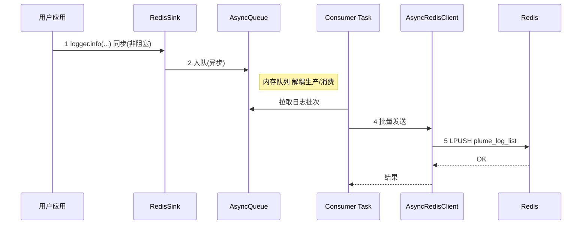
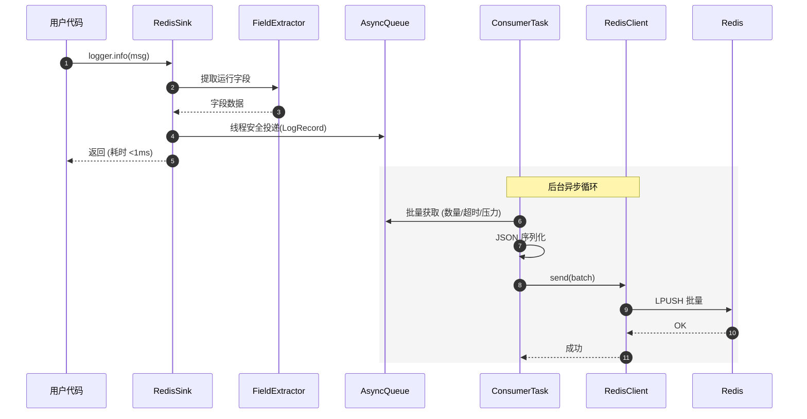
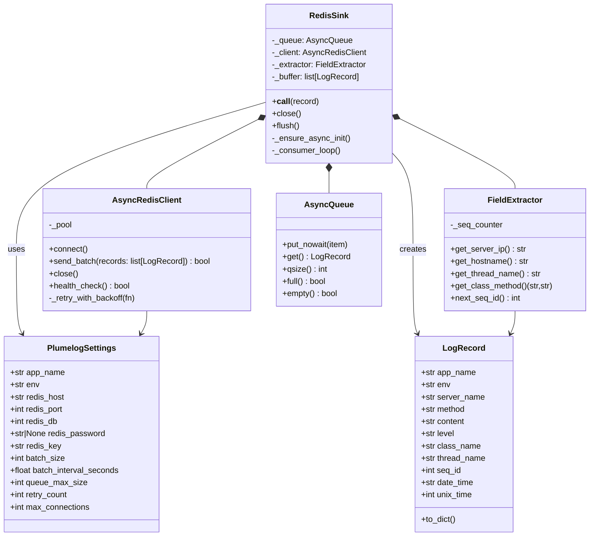

# Plumelog-Loguru

一个现代化的 Python 库，为 Loguru 提供与 Plumelog 系统的集成功能，支持异步 Redis 日志传输。

## ✨ 特性

- 🚀 **异步处理**: 基于 `asyncio` 的高性能异步日志传输，对业务代码无阻塞。
- 📦 **智能批量**: 聚合日志记录，按数量或时间间隔批量发送，大幅减少网络开销。
- 🔒 **类型安全**: 完整的 Python 3.10+ 类型提示，享受现代 IDE 的智能提示与静态检查。
- 🔄 **智能重试**: 内置指数退避重试机制，确保在网络抖动时日志不丢失。
- 🏊 **连接池**: 高效管理 Redis 连接，提升高并发场景下的性能和稳定性。
- ⚙️ **灵活配置**: 基于 Pydantic 的配置模型，支持环境变量，易于在不同环境中部署。
- 🧵 **线程安全**: 专为多线程环境设计，保证在复杂应用中安全运行。

## 📦 安装

使用 `uv` 安装（推荐）：

```bash
uv add plumelog-loguru
```

使用 `pip` 安装：

```bash
pip install plumelog-loguru
```

## 🚀 快速开始

### 基本使用

```python
from loguru import logger
from plumelog_loguru import create_redis_sink

# 使用默认配置添加 Redis sink
# 推荐添加 type: ignore 注释以兼容静态类型检查器
logger.add(create_redis_sink())  # type: ignore[arg-type]

# 开始记录日志，这些日志将被异步发送到 Redis
logger.info("Hello, Plumelog!")
logger.error("这是一个错误日志，包含堆栈信息。")
```

### 自定义配置

```python
from loguru import logger
from plumelog_loguru import create_redis_sink, PlumelogSettings

# 创建自定义配置实例
config = PlumelogSettings(
    app_name="my_awesome_app",
    env="production",
    redis_host="redis.example.com",
    redis_port=6379,
    redis_password="your_secret_password",
    batch_size=200,                # 提高批量大小
    batch_interval_seconds=1.0,    # 缩短发送间隔
)

# 使用自定义配置创建 sink
redis_sink = create_redis_sink(config)
logger.add(redis_sink)  # type: ignore[arg-type]

logger.info("日志已配置为生产环境。")
```

### 异步上下文使用

在 `asyncio` 应用中，可以使用异步上下文管理器来确保所有缓冲区的日志在程序退出前被完全发送。

```python
import asyncio
from loguru import logger
from plumelog_loguru import RedisSink, PlumelogSettings

async def main():
    config = PlumelogSettings(app_name="async_app")
    
    # 使用 async with 确保 sink 在退出时优雅关闭
    async with RedisSink(config) as sink:
        logger.add(sink)  # type: ignore[arg-type]
        logger.info("这是一条在异步环境中记录的日志。")
        # 在此期间，日志在后台发送
        await asyncio.sleep(0.5) 
        logger.warning("应用即将退出。")

    # 上下文结束时，RedisSink 会自动处理并发送所有剩余日志
    print("所有日志已刷新。")

asyncio.run(main())
```

## ⚙️ 配置选项

所有配置项均可通过 `PLUMELOG_` 前缀的环境变量进行设置。

| 配置项 | 环境变量 | 默认值 | 说明 |
|--------|----------|--------|------|
| `app_name` | `PLUMELOG_APP_NAME` | `"default"` | 应用名称，用于日志归属分类 |
| `env` | `PLUMELOG_ENV` | `"dev"` | 应用运行环境 (如: dev, test, prod) |
| `redis_host` | `PLUMELOG_REDIS_HOST` | `"localhost"` | Redis 主机地址 |
| `redis_port` | `PLUMELOG_REDIS_PORT` | `6379` | Redis 端口 |
| `redis_db` | `PLUMELOG_REDIS_DB` | `0` | Redis 数据库编号 |
| `redis_password` | `PLUMELOG_REDIS_PASSWORD` | `None` | Redis 密码 |
| `redis_key` | `PLUMELOG_REDIS_KEY` | `"plume_log_list"` | 日志存储的 Redis List 键名 |
| `batch_size` | `PLUMELOG_BATCH_SIZE` | `100` | 触发批量发送的日志数量阈值 |
| `batch_interval_seconds` | `PLUMELOG_BATCH_INTERVAL_SECONDS` | `2.0` | 触发批量发送的时间间隔（秒） |
| `queue_max_size` | `PLUMELOG_QUEUE_MAX_SIZE` | `10000` | 内存中转队列的最大容量 |
| `retry_count` | `PLUMELOG_RETRY_COUNT` | `3` | Redis 操作失败时的最大重试次数 |
| `max_connections` | `PLUMELOG_MAX_CONNECTIONS` | `10` | Redis 连接池的最大连接数 |

<br>

---

## 🏗️ 架构设计与异步机制详解

### 核心设计理念

本库遵循现代高性能应用的设计原则，旨在提供一个可靠且对业务无侵入的日志解决方案。

-   **生产者-消费者模型**: 用户应用代码（生产者）与日志发送任务（消费者）通过一个异步队列完全解耦。
-   **专用异步运行时**: `RedisSink` 启动独立守护线程托管 `asyncio` 事件循环，确保多线程环境也能安全入队。
-   **非阻塞 I/O**: 所有网络操作（Redis 通信）均基于 `asyncio`，不会阻塞主业务线程。
-   **批处理优化**: 聚合多条日志为单次网络请求，显著降低 I/O 压力和 Redis `OPS`。
-   **优雅降级**: 内置完善的重试、线程安全临时缓存与容错机制，在外部依赖（如 Redis）不稳时，最大程度保证系统稳定和数据不丢失。

### 系统整体架构

下图展示了从日志产生到最终存储的完整数据流和核心组件。



**处理流程解读**:
1.  **同步调用**: 你的业务代码调用 `logger.info()`。这是一个**几乎零成本**的操作，因为 `RedisSink` 仅需将日志记录放入内存队列。
2.  **异步入队**: 日志记录被线程安全地投递到专用事件循环中的 `asyncio.Queue`。提交过程使用 `asyncio.run_coroutine_threadsafe`，主线程几乎瞬时返回。
3.  **后台处理 (未在图中编号)**: 专用线程中的后台任务（Consumer Task）持续监控队列。
4.  **批量发送**: 当队列中的日志达到一定数量（`batch_size`）或经过一定时间（`batch_interval_seconds`），后台任务会将它们打包。
5.  **持久化存储**: 打包后的日志通过 `AsyncRedisClient` 使用连接池中的连接，以 `LPUSH` 命令高效地一次性写入 Redis。如果发生网络错误，将触发**智能重试**。

### 异步处理机制详解

下图深入剖析了同步区域和异步区域的交互细节。


### 专用事件循环线程

`RedisSink` 在实例化时会启动一个守护线程，在线程内初始化并运行独立的 `asyncio` 事件循环。所有日志转换、入队和 Redis 发送任务都会调度到该事件循环执行：

-   调用线程无需管理事件循环，适配同步、多线程和异步混合场景。
-   通过 `asyncio.run_coroutine_threadsafe` 完成线程间调度，确保提交动作具备跨线程的可见性和可靠性。
-   若事件循环初始化前产生日志，线程安全的 `deque` 临时缓存会接管，待 Loop 准备就绪后统一回放。

**关键优势**:
-   **主线程保护**: 专用事件循环线程承担全部异步工作，无论 Redis 的网络状况如何或日志量多大，`logger.info()` 的调用耗时始终稳定在微秒级别，**完全不影响业务响应速度**。
-   **资源效率**: 批量发送大大减少了网络往返次数和系统调用，降低了 CPU 和网络资源的消耗。连接池避免了频繁创建和销毁连接的开销。
-   **数据可靠性**: 内存队列配合线程安全的临时缓存 `deque` 作为双层缓冲，指数退避重试机制在网络抖动时通过逐渐增加等待时间来恢复，大大提高了日志发送的成功率。

### 核心类关系图



### 容错与系统影响

#### 资源消耗
-   **内存**: 主要由异步队列 (`queue_max_size`) 决定。默认 `10000` 条日志大约占用 10-20MB 内存，具体取决于日志大小。
-   **CPU**: 非常低。大部分时间处于 I/O 等待状态，仅在日志格式化和序列化时有少量计算。
-   **网络**: 连接池保持少量（`max_connections`）长连接，批量发送机制极大节省了网络带宽。

#### 故障应对策略
-   **Redis 连接中断**:
    1.  `AsyncRedisClient` 捕获连接错误。
    2.  启动**指数退避重试**机制（例如，等待 1s, 2s, 4s... 后重试）。
    3.  在此期间，新的日志继续进入内存队列进行缓冲。
    4.  如果 Redis 在重试期间恢复，积压的日志将被发送。
    5.  如果达到最大重试次数后依然失败，该批次日志将被丢弃，并记录一条错误日志到标准输出，防止无限重试耗尽资源。
-   **内存队列满**:
    -   如果日志生产速度持续高于消费速度（例如 Redis 长时间不可用），队列可能会满。
    -   `put_nowait()` 会抛出 `asyncio.QueueFull` 异常，`RedisSink` 会捕获它，静默丢弃当前日志并打印一条警告。这是一种**背压（Backpressure）**机制，用于保护应用内存，防止因日志问题导致主业务崩溃。

---

## 🔧 开发与贡献

### 环境准备

```bash
# 克隆项目
git clone <repository-url>
cd plumelog-loguru

# 使用 uv (推荐) 或 pip 安装开发依赖
uv sync --dev

# 运行测试
uv run pytest

# 代码格式化
uv run format

# 类型检查
uv run lint
```

### 项目结构

```text
src/plumelog_loguru/
├── __init__.py          # 主要 API 导出
├── config.py            # Pydantic 配置模型
├── models.py            # 日志数据模型
├── extractor.py         # 上下文信息提取器
├── redis_client.py      # 异步 Redis 客户端 (含连接池和重试)
└── redis_sink.py        # Loguru Sink 实现 (含队列和消费者任务)
```

## 📝 许可证

本项目基于 [Apache License 2.0](LICENSE) 许可。

## 🤝 贡献

欢迎通过提交 Issue 和 Pull Request 来为项目做出贡献！