# Personal Document Library Architecture

## System Overview

The Personal Document Library is a Model Context Protocol (MCP) server that provides Claude Desktop with access to a local document library through a RAG (Retrieval-Augmented Generation) system.

## Architecture Diagram

```mermaid
graph TB
    subgraph "Claude Desktop"
        CD[Claude Desktop Client]
    end

    subgraph "MCP Server Layer"
        MCP[MCP Complete Server<br/>17 Tools | 5 Prompts | 4 Resources]
        INIT[Lazy Initialization<br/>< 1s startup]
    end

    subgraph "Core RAG System"
        RAG[SharedRAG Engine]
        EMB[Embeddings<br/>all-mpnet-base-v2<br/>768 dimensions]
        VDB[(ChromaDB<br/>Vector Store)]
        IDX[Book Index<br/>MD5 hash tracking]
    end

    subgraph "Document Processing"
        LOAD[Document Loaders]
        PDF[PDF Processor<br/>+ OCR Support]
        WORD[Word/PPT<br/>LibreOffice]
        EPUB[EPUB<br/>Pandoc]
        MOBI[MOBI/AZW<br/>Calibre]
    end

    subgraph "Background Services"
        MON[Index Monitor<br/>File watching]
        WEB[Web Dashboard<br/>localhost:8888]
        LOCK[Lock Manager<br/>30min timeout]
    end

    subgraph "File System"
        BOOKS[Books Directory]
        LOGS[Logs Directory]
        CACHE[Failed PDFs Cache]
    end

    CD -->|MCP Protocol| MCP
    MCP --> INIT
    INIT --> RAG

    RAG --> EMB
    EMB --> VDB
    RAG --> IDX

    RAG --> LOAD
    LOAD --> PDF
    LOAD --> WORD
    LOAD --> EPUB
    LOAD --> MOBI

    MON --> BOOKS
    MON --> RAG
    MON --> LOCK

    WEB --> RAG
    WEB --> VDB

    BOOKS --> LOAD
    RAG --> LOGS
    RAG --> CACHE

    classDef mcp fill:#e1f5fe,stroke:#01579b,stroke-width:2px
    classDef rag fill:#f3e5f5,stroke:#4a148c,stroke-width:2px
    classDef proc fill:#fff3e0,stroke:#e65100,stroke-width:2px
    classDef service fill:#e8f5e9,stroke:#1b5e20,stroke-width:2px
    classDef storage fill:#fce4ec,stroke:#880e4f,stroke-width:2px

    class MCP,INIT mcp
    class RAG,EMB,VDB,IDX rag
    class LOAD,PDF,WORD,EPUB,MOBI proc
    class MON,WEB,LOCK service
    class BOOKS,LOGS,CACHE storage
```

## MCP Protocol Implementation

### Tools Workflow

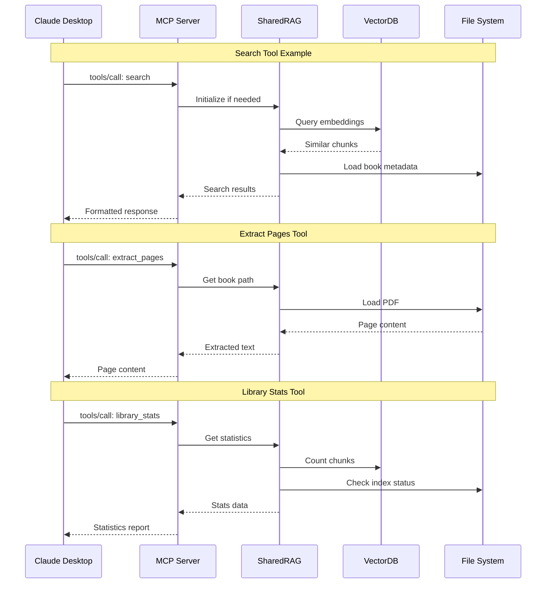

### Prompts Workflow

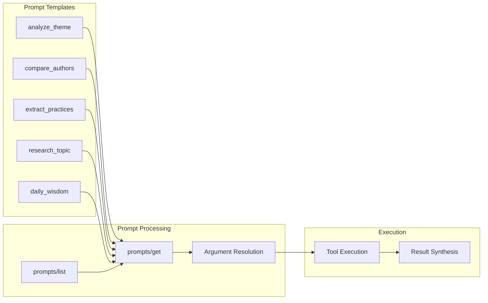

### Resources Workflow

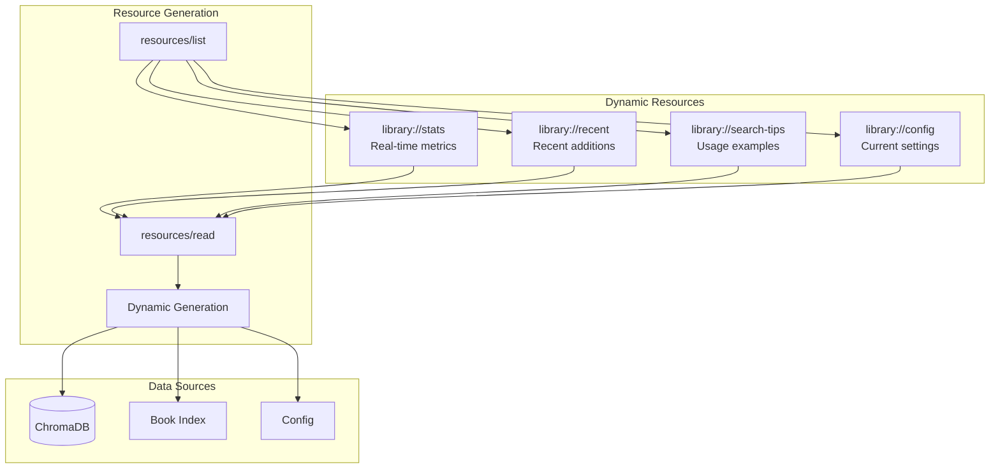

## Detailed Tool Implementation Flows

### Search & Discovery Tools

#### 1. `search` Tool Flow
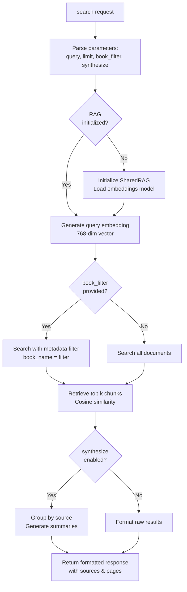

**Internal Implementation:**
- Uses `SharedRAG.search()` method
- Embedding generation via HuggingFace transformers
- ChromaDB similarity search with optional metadata filtering
- Results include chunk text, source book, page numbers

#### 2. `list_books` Tool Flow
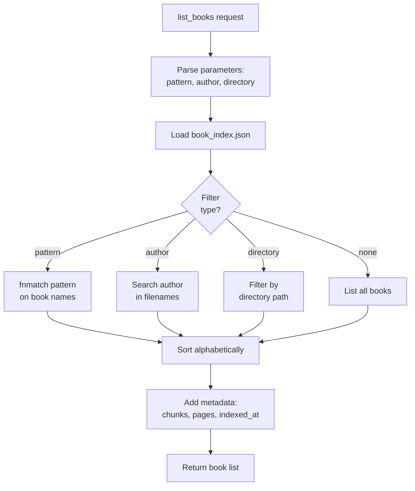

**Internal Implementation:**
- Reads from `chroma_db/book_index.json`
- Uses Python's `fnmatch` for pattern matching
- Returns book paths with indexing metadata

#### 3. `recent_books` Tool Flow
```mermaid
flowchart TD
    START[recent_books request] --> PARAMS[Parse parameters:<br/>hours or days]
    PARAMS --> CALC_TIME[Calculate cutoff time:<br/>now - timedelta]
    CALC_TIME --> LOAD_INDEX[Load book_index.json]
    LOAD_INDEX --> FILTER_TIME[Filter books where<br/>indexed_at > cutoff]
    FILTER_TIME --> SORT_TIME[Sort by indexed_at<br/>descending]
    SORT_TIME --> FORMAT[Format with relative time<br/>"2 hours ago"]
    FORMAT --> RESPONSE[Return recent books list]
```

**Internal Implementation:**
- Uses `datetime.fromisoformat()` for timestamp parsing
- Calculates relative time strings
- Groups by time periods (today, yesterday, this week)

#### 4. `find_practices` Tool Flow
```mermaid
flowchart TD
    START[find_practices request] --> PARAM[Parse practice_type]
    PARAM --> BUILD_QUERY[Build semantic query:<br/>"practical exercises {practice_type}"]
    BUILD_QUERY --> SEARCH_CAT[Search with category filter:<br/>category = 'practice']
    SEARCH_CAT --> EXTRACT[Extract practice descriptions<br/>from chunks]
    EXTRACT --> DEDUPE[Deduplicate similar practices]
    DEDUPE --> GROUP[Group by practice type]
    GROUP --> RESPONSE[Return practices with sources]
```

**Internal Implementation:**
- Leverages categorization from indexing
- Uses semantic search with practice-focused queries
- Groups results by technique type

### Content Extraction Tools

#### 5. `extract_pages` Tool Flow
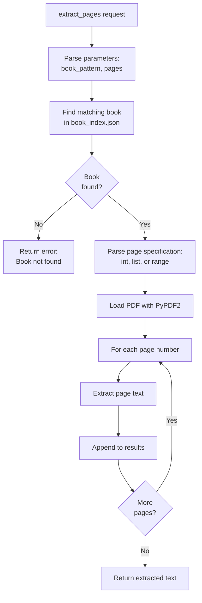

**Internal Implementation:**
- Uses `PyPDF2.PdfReader` for PDF access
- Supports page ranges like "1-5" or lists like [1,3,5]
- Handles out-of-range pages gracefully

#### 6. `extract_quotes` Tool Flow
```mermaid
flowchart TD
    START[extract_quotes request] --> PARAMS[Parse parameters:<br/>topic, max_quotes]
    PARAMS --> SEARCH_QUOTES[Search for:<br/>"quotes about {topic}"]
    SEARCH_QUOTES --> RETRIEVE[Retrieve relevant chunks]
    RETRIEVE --> QUOTE_DETECT[Detect quote patterns:<br/>quotation marks, attribution]
    QUOTE_DETECT --> SCORE[Score by relevance<br/>and quote quality]
    SCORE --> SELECT[Select top max_quotes]
    SELECT --> FORMAT[Format with context<br/>and attribution]
    FORMAT --> RESPONSE[Return quotes list]
```

**Internal Implementation:**
- Uses regex patterns for quote detection
- Scores based on punctuation patterns and attribution
- Preserves context around quotes

#### 7. `summarize_book` Tool Flow
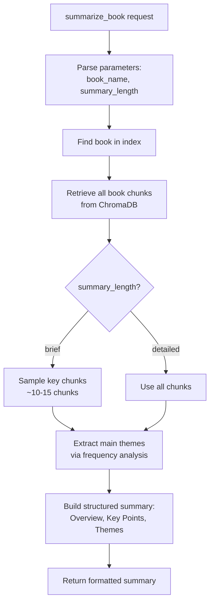

**Internal Implementation:**
- Retrieves chunks by metadata filter
- Uses TF-IDF for theme extraction
- Structures summary with sections

### Analysis & Synthesis Tools

#### 8. `compare_perspectives` Tool Flow
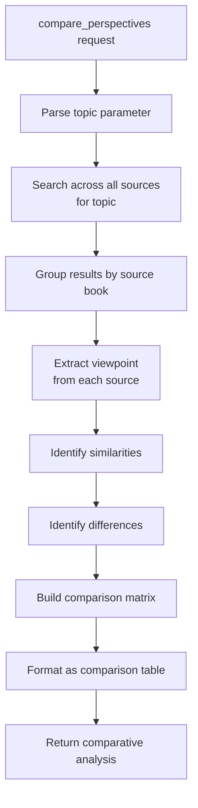

**Internal Implementation:**
- Groups search results by source metadata
- Extracts key points per source
- Creates structured comparison output

#### 9. `question_answer` Tool Flow
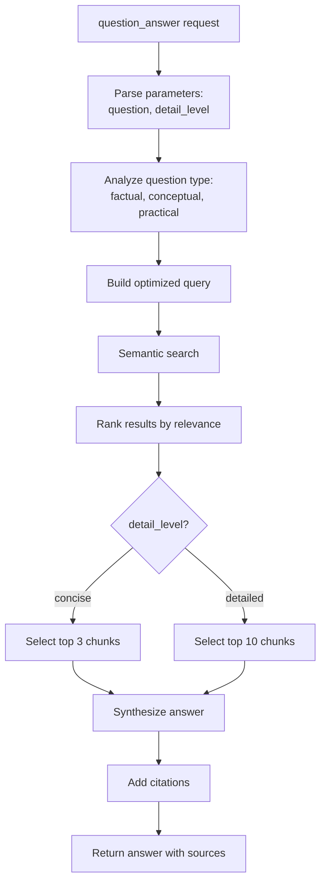

**Internal Implementation:**
- Question type detection for query optimization
- Relevance ranking using similarity scores
- Citation formatting with page numbers

#### 10. `daily_reading` Tool Flow
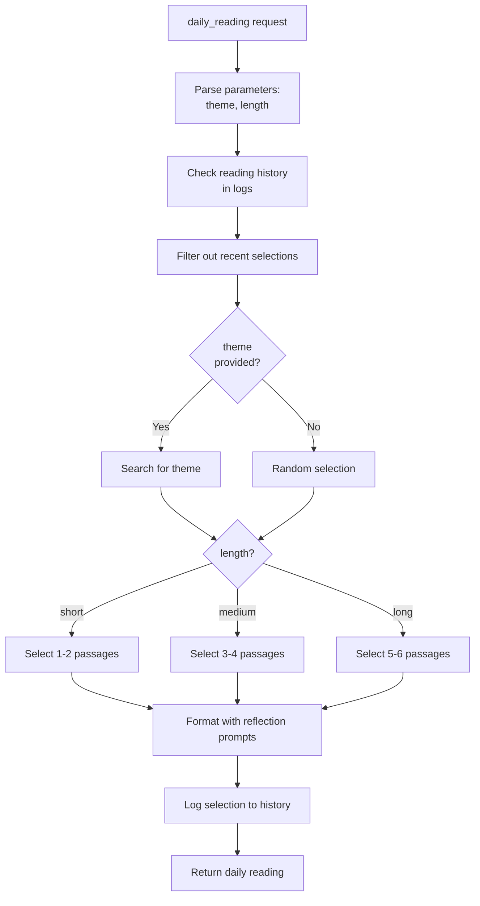

**Internal Implementation:**
- Maintains reading history in logs
- Weighted random selection
- Adds reflection questions

### System Management Tools

#### 11. `library_stats` Tool Flow
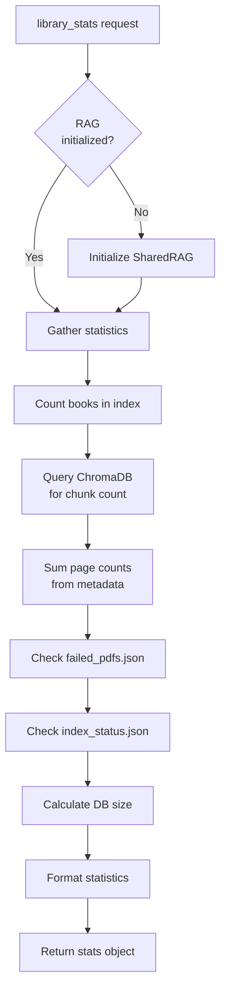

**Internal Implementation:**
- Aggregates data from multiple sources
- Calculates storage metrics
- Returns comprehensive statistics

#### 12. `index_status` Tool Flow
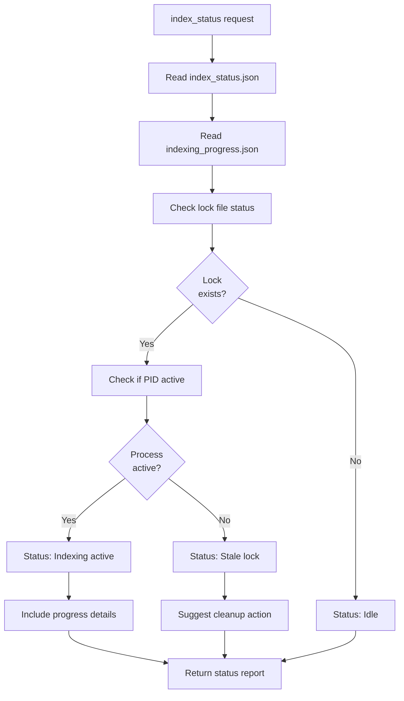

**Internal Implementation:**
- Reads multiple status files
- Process checking via PID
- Real-time progress calculation

#### 13. `refresh_cache` Tool Flow
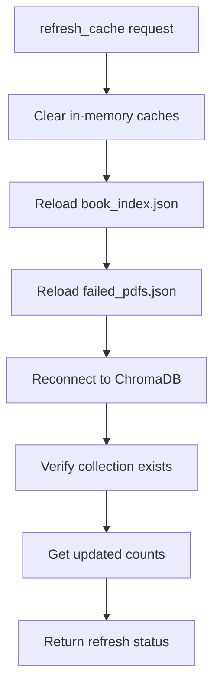

**Internal Implementation:**
- Clears `SharedRAG._instance`
- Forces reload of all cached data
- Verifies database connectivity

#### 14. `warmup` Tool Flow
```mermaid
flowchart TD
    START[warmup request] --> INIT_RAG[Initialize SharedRAG]
    INIT_RAG --> LOAD_MODEL[Load embedding model<br/>~4GB memory]
    LOAD_MODEL --> CONNECT_DB[Connect to ChromaDB]
    CONNECT_DB --> LOAD_INDEX[Load book index]
    LOAD_INDEX --> TEST_QUERY[Run test query<br/>"test warmup"]
    TEST_QUERY --> MEASURE[Measure load times]
    MEASURE --> RESPONSE[Return warmup stats]
```

**Internal Implementation:**
- Pre-loads heavy components
- Prevents timeout on first real query
- Returns performance metrics

#### 15. `find_unindexed` Tool Flow
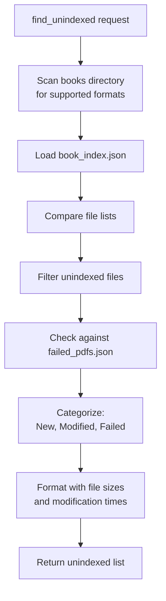

**Internal Implementation:**
- Uses `os.walk()` for directory scanning
- MD5 hash comparison for modifications
- Returns actionable file list

#### 16. `reindex_book` Tool Flow
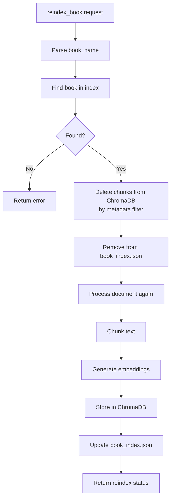

**Internal Implementation:**
- Full cleanup before reindexing
- Uses same pipeline as initial indexing
- Preserves document categorization

#### 17. `clear_failed` Tool Flow
```mermaid
flowchart TD
    START[clear_failed request] --> BACKUP[Backup failed_pdfs.json]
    BACKUP --> CLEAR[Clear failed list]
    CLEAR --> SAVE[Save empty failed_pdfs.json]
    SAVE --> COUNT[Count cleared entries]
    COUNT --> RESPONSE[Return clear status]
```

**Internal Implementation:**
- Creates timestamped backup
- Resets failed tracking
- Allows retry of previously failed documents

## Component Details

### MCP Complete Server
- **Location**: `src/personal_doc_library/servers/mcp_complete_server.py`
- **Purpose**: Main entry point for Claude Desktop integration
- **Features**:
  - Lazy initialization (< 1 second startup)
  - 17 tools for document interaction
  - 5 prompt templates for common workflows
  - 4 dynamic resources for real-time information
  - Capability advertisement in initialize response

### SharedRAG Engine
- **Location**: `src/personal_doc_library/core/shared_rag.py`
- **Purpose**: Core RAG functionality
- **Features**:
  - Document chunking (1200 chars, 150 overlap)
  - Semantic embedding generation
  - Vector similarity search
  - Book index management
  - Category-based filtering

### Document Processing Pipeline

```mermaid
flowchart LR
    DOC[Document]
    HASH[MD5 Hash]
    CHECK{Already<br/>Indexed?}
    LOAD[Load Document]
    CHUNK[Chunk Text<br/>1200 chars]
    CAT[Categorize]
    EMB[Generate<br/>Embeddings]
    STORE[Store in<br/>ChromaDB]
    INDEX[Update<br/>Book Index]

    DOC --> HASH
    HASH --> CHECK
    CHECK -->|No| LOAD
    CHECK -->|Yes| END[Skip]
    LOAD --> CHUNK
    CHUNK --> CAT
    CAT --> EMB
    EMB --> STORE
    STORE --> INDEX
```

### Index Monitor Service
- **Location**: `src/personal_doc_library/indexing/index_monitor.py`
- **Purpose**: Background document indexing
- **Features**:
  - File system event monitoring
  - Automatic new document detection
  - 30-minute stale lock cleanup
  - Failed document tracking
  - Progress status updates

### Web Dashboard
- **Location**: `src/personal_doc_library/monitoring/monitor_web_enhanced.py`
- **Purpose**: Real-time monitoring interface
- **URL**: http://localhost:8888
- **Features**:
  - Library statistics
  - Search interface with Enter key support
  - Document browsing
  - Failed document management
  - Lock status monitoring

## Data Flow

### Indexing Flow
```
Books Directory → File Watcher → Document Loader → Text Extraction
→ Chunking → Categorization → Embedding → Vector Storage → Index Update
```

### Search Flow
```
Query → Embedding Generation → Vector Similarity Search → Chunk Retrieval
→ Book Metadata Loading → Result Ranking → Response Formatting
```

### Tool Execution Flow
```
Claude Desktop → MCP Protocol → Tool Handler → RAG System
→ Data Processing → Response Generation → MCP Response → Claude Desktop
```

## Security Architecture

### Isolation Layers
1. **Process Isolation**: MCP server runs in separate process
2. **File System Boundaries**: Restricted to configured directories
3. **No Network Access**: All processing is local
4. **User Permissions**: Services run with user permissions only

### Data Protection
- No data leaves the local machine
- Vector database stored locally
- Logs stored locally with rotation
- No telemetry or analytics

## Performance Optimizations

### Lazy Loading
- RAG system initialized only when first tool is called
- Prevents MCP timeout during startup
- Sub-1 second initialization time

### Caching Strategy
- MD5 hash-based document tracking
- Book index for quick lookups
- Failed document cache to skip problematic files
- Search result caching

### Resource Management
- 15-minute timeout protection for long operations
- File lock management with 30-minute cleanup
- Batch processing for multiple documents
- Memory monitoring during indexing

## Error Handling

### Resilience Features
- Automatic PDF cleaning for corrupted files
- OCR fallback for scanned PDFs
- Timeout protection with graceful recovery
- Failed document tracking and retry logic
- Stale lock detection and cleanup

### Monitoring Points
- Service health checks
- Indexing progress tracking
- Error logging with categories
- Web dashboard for real-time status

## Scalability

### Current Limits
- Tested with libraries up to 10,000 documents
- ChromaDB handles millions of vectors
- 768-dimensional embeddings for accuracy
- Parallel processing for document indexing

### Growth Path
- Modular architecture allows component upgrades
- Database can be migrated to other vector stores
- Processing pipeline supports custom transformers
- MCP protocol allows tool additions without breaking changes