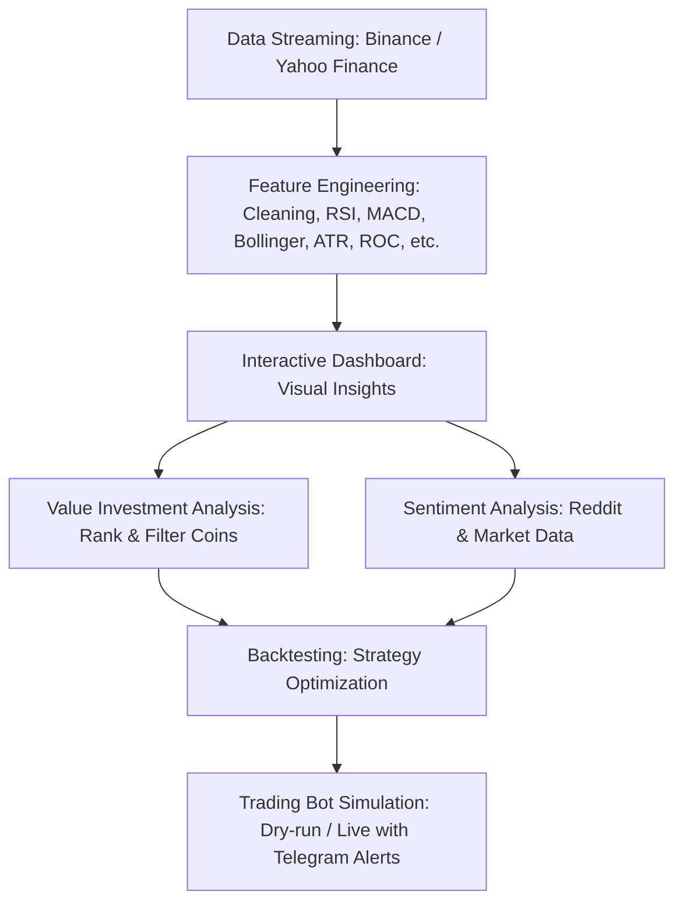

# SIRIFI

**Smart Insights & Research in Financial Intelligence**  


---

## 📋 Overview

**SIRIFI** is a Python package for quantitative analysis of cryptocurrency data. It allows users to extract, clean, and transform raw market data from sources like Yahoo Finance and Binance. The package provides advanced feature engineering, interactive visualizations, sentiment analysis, value investment insights, and trading strategy evaluation.

> ⚠️ SIRIFI provides information for research and analysis purposes **only** and does **not constitute financial advice**.

Key capabilities include:

- Backtesting & Strategy Evaluation: Test and optimize cryptocurrency trading strategies using historical data.
- Automated Trading Bot Simulation: Develop and simulate trading bots with popular technical indicators such as RSI and MACD.
- Data-Driven Research: Conduct quantitative analysis to inform and refine investment strategies.
- Future Expansion to Equities: Planned support for stock market data with the same analysis, backtesting, and automation features.

---

## 📝 Citation

If you use SIRIFI in your research, please cite:

Narwade, S., Desai, R. (2025), **SIRIFI: Smart Insights & Research for Investments in Financial Instruments**. *Journal of Open Source Software*.

---

## ⚠️ Advisory

- Python version: `>=3.10, <3.11`
- Recommended IDEs: Visual Studio, Jupyter Notebook, Google Colab
- Sample datasets: [SIRIFI Sample Notebook](https://github.com/CodeEagle22/SiriFi/blob/main/sample_test_notebook.ipynb)

---

## 💡 Features

- **Data Streaming & Historical Fetching** 💾 – Pull cryptocurrency data from Binance or Yahoo Finance.
- **Feature Engineering** 🏗️ – Compute technical indicators like RSI, MACD, Bollinger Bands, ATR, ROC, and more.
- **Interactive Dashboards & Visualization** 🔍 – Explore and compare assets with Plotly-based dashboards.
- **Value Investment Analysis** 💰 – Identify potentially valuable coins based on market metrics and custom scoring.
- **Sentiment Analysis** 🗨️ – Analyze social media (Reddit) and market sentiment for cryptocurrencies.
- **Backtesting & Strategy Optimization** 📊 – Test trading strategies using RSI, MACD, and custom parameters.
- **Trading Bot Simulation** 🤖 – Simulate automated trading with configurable strategies and Telegram notifications.

---
## ⚡ Quick Start Workflow



## 🛠 Installation

SIRIFI is optimized for **Python 3.11**. For best performance, create a fresh environment (e.g., Conda) with Python 3.11.0.


```bash
pip install sirifi
```

## 👩‍💻 Usage ([documentation])

### Import Libraries

```python
from sirifi import Sirifi_C_DataStreamer, Sirifi_C_FeatureEngineering, Sirifi_C_Dashboard, Sirifi_C_ValueInvest, Sirifi_C_SentimentAnalyzer, Sirifi_C_Backtester, Sirifi_C_TradingBot
```

### Streaming Raw Data

```python
# Run the streaming process to retrieve raw data based on the specified assets

# Binance → Profile → API Management → Create API → Verify → Copy Key & Secret → Enable “Spot & Margin Trading” (Futures optional, Withdrawals ❌) → (Optional) Restrict IP → Store keys safely.
API_KEY = "XXXXXXXX"
API_SECRET = "XXXXXXXX"

# ✅ Initialize the data fetcher with your Binance API credentials
# First, ensure you have securely loaded your API Key and Secret (e.g., from environment variables or .env file).
fetcher = Sirifi_C_DataStreamer(
    binance_api_key=API_KEY,       # Replace with your actual Binance API Key
    binance_api_secret=API_SECRET  # Replace with your actual Binance API Secret
)

# ✅ Define the list of base assets (cryptocurrencies) you want to fetch data for
# In this example, we are fetching data for Bitcoin (BTC), Ethereum (ETH), Cardano (ADA), Ripple (XRP), and Dogecoin (DOGE).
base_assets = ['BTC', 'ETH', 'ADA', 'XRP', 'DOGE']  

# ✅ Fetch historical OHLCV (Open, High, Low, Close, Volume) data from Binance
results = fetcher.fetch(
    base_assets=base_assets,       # List of coins for which you want to fetch data
    currency='USDC',               # Quote currency: USD stablecoins like USD, USDT, USDC, BUSD, EUR, GBP (can be changed as needed)
    interval='1d',                 # Timeframe for the data: '1m', '5m', '1h', '1d', '1w', etc. ('1d' means daily data)
    source='binance',              # Data source: 'yfinance' & 'binance' means we are pulling data directly from Binance
    start_date='2024-09-01',       # Start date for the data range (format: 'YYYY-MM-DD')
    end_date='2025-09-23'          # End date for the data range (format: 'YYYY-MM-DD')
)

# ✅ Example: Access and print the first few rows of data for BTC and ETH

results['BTC'].head()
results['ETH'].head()


```


### Feature Engineering on Raw Data

```python
# Run the feature engineering process to retrieve more data insights from raw data
# Add up indicators and features
for asset in base_assets:
    sfe = Sirifi_C_FeatureEngineering(results[asset])
    results[asset] = sfe.get_transformed_data()

results['ETH'].head()

''' Columns: 
'Date', 'Open', 'High', 'Low', 'Close', 'Volume', 'pct_return', 'ma_20',
'ma_50', 'ma_200', 'ema_12', 'ema_26', 'macd', 'macd_signal',
'macd_histogram', 'rsi', 'bollinger_middle', 'bollinger_upper',
'bollinger_lower', 'obv', 'roc', 'atr', 'candle_range', 'price_gap',
'return_std', 'signal_crossover', 'rsi_signal', 'macd_cross'
'''

```

### Feature Dash Board

```python

# Robust Plotly Dashboard
# Comparative Interactive Dashboard
dashboard = Sirifi_C_Dashboard(results, normalize=False) # Keep normalisation True for better comparison
dashboard.show()

```

### Feature Value Investment

```python


# Initialize the analyzer
analyzer = Sirifi_C_ValueInvest(
    api_key=API_KEY,
    api_secret=API_SECRET,
    quote_asset="USDC",        # Trading pairs to analyze (e.g., BTC/USDC, ETH/USDC)
    max_symbols=30,            # Maximum number of symbols (pairs) to fetch and analyze
    threads=10,                # Parallel threads for speed. 
                               # threads=1  → sequential (safest but slowest)
                               # threads=5  → balanced speed vs. API limits
                               # threads=20 → very fast but may risk Binance API ban
    history_days=360,          # Number of historical days to fetch for metrics (1 year lookback)
    min_marketcap=1_000_000_000,  # Filter: keep only coins with market cap > 1B
    min_agedays=1000           # Filter: keep only coins listed more than 1000 days ago
)

# Run the analysis
results = analyzer.analyze()

# Print results
if not results.empty:
    print("\nTop Ranked Coins:")
    print(results.head(10))   # Show top 10 ranked coins by custom value score
else:
    print("No results after filtering.")  # If all coins were filtered out

```

### Feature Sentiment Analysis

```python


cs = Sirifi_C_SentimentAnalyzer(
    # Binance API keys for market data access
    # Binance API credentials: used to access Binance account data and market information
    binance_key=API_KEY,
    binance_secret=API_SECRET,
    
    # Reddit credentials to pull social sentiment data
    # Reddit API credentials: used to fetch posts/comments for sentiment analysis
    reddit_id=REDDIT_CLIENT_ID,
    reddit_secret=REDDIT_CLIENT_SECRET,
    reddit_agent=REDDIT_USER_AGENT,
    
    #symbols=['ADA', 'XRP', 'BNB'],  # List of cryptocurrency symbols to analyze (base coins only, no quote currency)
    quote_asset="USDC", # Optional: You can set a quote asset, e.g., "USDC", default is "USDT"
    min_marketcap=10_000_000_000,  # Filter coins by market cap (or trading volume) to focus on significant coins
    interval="1d",  # Candlestick interval: "1d" means daily candles
    limit=1,  # Limit the number of candles to fetch; 1 here will fetch the most recent candle
    min_agedays=1000   # Filter: keep only coins listed more than 1000 days ago
)

# =======================
# Run analysis
# =======================
df = cs.run()  # Executes the sentiment analysis and returns a DataFrame with results

# Display the resulting DataFrame
df


```
### Feature Back Test Trading

```python

import pandas as pd

# Define the trading pairs (symbols) to backtest
symbols = ['LTCUSDC', 'TRXUSDC', 'ENAUSDC']

# Define the candlestick intervals to test strategies on
intervals = ['30m','1h','2h']

# Store best parameter results for each symbol
results = []

for symbol in symbols:
    print(f"\n🔍 Backtesting {symbol}")
    
    # Initialize the backtester for the given symbol
    backtester = Sirifi_C_Backtester(
        symbol=symbol,
        intervals=intervals,   # Multiple timeframes to test
        days=7,                # Lookback period (past 7 days)
        fee=0.001,             # Trading fee (0.1%)
        slippage_pct=0.0005,   # Slippage assumption (0.05%)
        use_rsi=False,         # Disable RSI indicator
        use_macd=True          # Enable MACD indicator
        # 👉 Custom parameter ranges could be added here (e.g. MACD fast/slow periods)
    )

    # Run optimization to find the best-performing parameters
    best_params, df = backtester._optimize()

    if best_params:
        # Save the best parameters for this symbol
        results.append(best_params)
        print(f"✅ Best Params for {symbol}:\n", best_params)
    else:
        # If no profitable strategy is found
        print(f"❌ No valid strategy found for {symbol}")

# Combine all results into a single DataFrame for comparison
results_df = pd.DataFrame(results)
results_df

```

### Feature Trading Bot

```python

import os

# Strategy parameters for the trading bot
params = {
    'macd_fast': 10,          # Fast EMA period for MACD indicator
    'macd_slow': 26,          # Slow EMA period for MACD indicator
    'macd_signal': 6,         # Signal line period for MACD indicator
    'rsi_period': 10,         # Lookback period for RSI calculation
    'rsi_oversold': 25,       # RSI threshold for oversold condition (potential buy)
    'rsi_overbought': 60,     # RSI threshold for overbought condition (potential sell)
    'stop_loss': 0.02,        # Maximum loss tolerance (2% below entry price)
    'take_profit': 0.05,      # Target profit level (5% above entry price)
    'use_rsi': False,         # Whether to use RSI indicator in strategy
    'use_macd': True          # Whether to use MACD indicator in strategy
}

# Initialize the trading bot with configuration
bot = Sirifi_C_TradingBot(
    symbol='ADAUSDC',                     # Trading pair (Cardano vs USDC)
    interval='2h',                        # Candle timeframe (2-hour intervals)
    params=params,                        # Strategy parameters defined above
    api_key=API_KEY,   # API key for exchange access
    api_secret=API_SECRET, # API secret for exchange access
    
    # Telegram integration for notifications
    enable_telegram=True,                 # Enable sending updates to Telegram
    telegram_token=BOT_TOKEN,   # Bot token from BotFather
    telegram_chat_id=BOT_CHAT_ID,        # Chat ID to send trading alerts
    
    dry_run=True,                         # Run in simulation mode (no real trades executed)
    max_budget=100,                       # Maximum budget allocated for trading (in USDC)
)

# Start the trading bot loop
# This will continuously fetch market data, apply the strategy,
# and (if not in dry_run mode) execute trades according to signals.
bot.run_loop()


```
## 📣 Community guidelines


We welcome contributions, feedback, and collaboration from the community. Here are ways you can get involved:

- **Bug Reports & Issues** 🐛 – Report any unexpected behavior, errors, or API issues you encounter.  
- **Feature Requests** ✨ – Suggest new features, improvements to technical indicators, or enhancements for trading strategies.  
- **Code Contributions** 💻 – Submit pull requests to improve functionality, optimize performance, or add support for new exchanges and data sources.  
- **Documentation & Examples** 📚 – Help improve tutorials, examples, and usage guides for beginners.  
- **Data Analysis & Visualization Enhancements** 📊 – Contribute new plotting techniques, dashboards, or interactive visualizations.  
- **Trading Strategy Development** 🤖 – Share new backtesting strategies, optimizations, or bot configurations.  

> Please ensure that contributions are respectful, clearly documented, and maintain the integrity of SIRIFI’s codebase. Discussions about trading strategies are for educational purposes only and should not be considered financial advice.


## 🖊️ Authors

- Sagar Narwade
- Rudra Desai


## 🙏 Acknowledgements

We thank the open-source community for providing tools and APIs that supported this project. In particular:

- **Binance API** – for cryptocurrency market data and trading functionalities.  
- **Yahoo Finance API** – for historical financial data.  
- **praw (Python Reddit API Wrapper)** – for fetching Reddit posts and comments for sentiment analysis.  
- **VADER (Valence Aware Dictionary and Sentiment Reasoner)** – for social media sentiment scoring.  

Their contributions have been essential for building SIRIFI’s data collection, analysis, and sentiment modules.

---

## 🎓 References

1. Binance API Documentation – [https://binance-docs.github.io](https://binance-docs.github.io)  
2. Yahoo Finance API – [https://pypi.org/project/yfinance/](https://pypi.org/project/yfinance/)  
3. praw – Python Reddit API Wrapper – [https://praw.readthedocs.io](https://praw.readthedocs.io)  
4. VADER Sentiment Analysis – [https://github.com/cjhutto/vaderSentiment](https://github.com/cjhutto/vaderSentiment)

## 📜 License

This project is licensed under the Creative Commons Attribution 4.0 International License (CC BY 4.0). See the [LICENSE](./LICENSE) file for details.


