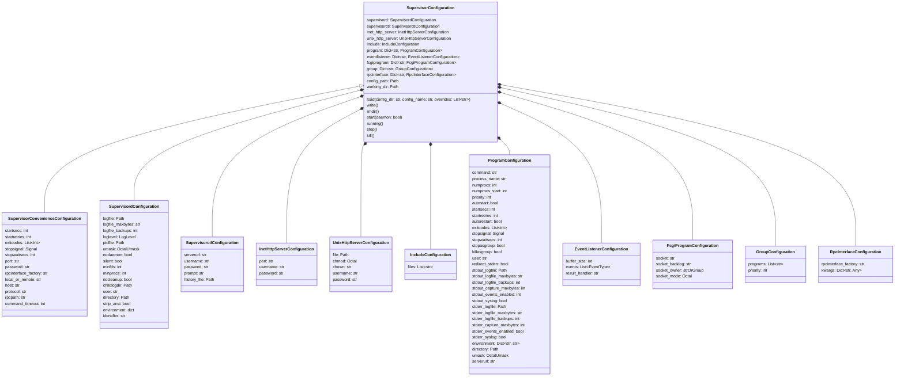

# supervisor-pydantic

[Pydantic](https://docs.pydantic.dev/latest/) models for [supervisor](https://supervisord.org)

## Overview

This library provides type-validated [Pydantic](https://docs.pydantic.dev/latest/) models of all configuration options for [supervisor](https://supervisord.org).

It provides:

- `SupervisorConfiguration`: top-level wrapper around all supervisor configuration options, with a utility method to generate a [`supervisord.conf`](https://supervisord.org/configuration.html)
- `SupervisorConvenienceConfiguration`: wrapper around `SupervisorConfiguration` to make a few things easier to configure, for integration with [airflow-supervisor](https://github.com/airflow-laminar/airflow-supervisor) and other external tools
- `SupervisordConfiguration`: wrapper around [`supervisord`](https://supervisord.org/configuration.html#supervisord-section-settings)
- `SupervisorctlConfiguration`: wrapper around [`supervisorctl`](https://supervisord.org/configuration.html#supervisorctl-section-settings)
- `ProgramConfiguration`: wrapper around [`program`](https://supervisord.org/configuration.html#program-x-section-settings)
- `EventListenerConfiguration`: wrapper around [`eventlistener`](https://supervisord.org/configuration.html#eventlistener-x-section-settings)
- `FcgiProgramConfiguration`: wrapper around [`fcgi-program`](https://supervisord.org/configuration.html#fcgi-program-x-section-settings)
- `GroupConfiguration`: wrapper around [`group`](https://supervisord.org/configuration.html#group-x-section-settings)
- `IncludeConfiguration`: wrapper around [`include`](https://supervisord.org/configuration.html#include-section-settings)
- `InetHttpServerConfiguration`: wrapper around [`init-http-server`](https://supervisord.org/configuration.html#inet-http-server-section-settings)
- `RpcInterfaceConfiguration`: wrapper around [`rpcinterface`](https://supervisord.org/configuration.html#rpcinterface-x-section-settings)
- `UnixHttpServerConfiguration`: wrapper around [`unix-http-server`](https://supervisord.org/configuration.html#unix-http-server-section-settings)

Additionally, this library provides a small convenience CLI (`_supervisor_convenience`) for remotely managing supervisor. It is a simple wrapper around the [`supervisord`](https://supervisord.org/running.html#running-supervisord) and [`supervisorctl`](https://supervisord.org/running.html#running-supervisorctl) CLIs in supervisor.

- `check-programs`: Check if programs are in a good state.
- `configure-supervisor`: Write a SupervisorConvenienceConfiguration JSON as a supervisor config file
- `force-kill`: Kill the supervisor instance with os.kill
- `restart-programs`: Restart all programs in the supervisor instance
- `start-programs`: Start all programs in the supervisor instance
- `start-supervisor`: Start a supervisor instance using supervisord in background
- `stop-programs`: Stop all programs in the supervisor instance
- `stop-supervisor`: Stop the supervisor instance
- `unconfigure-supervisor`: Remove the supervisor config file and working directory

> [!NOTE]
> This library was generated using [copier](https://copier.readthedocs.io/en/stable/) from the [Base Python Project Template repository](https://github.com/python-project-templates/base).
