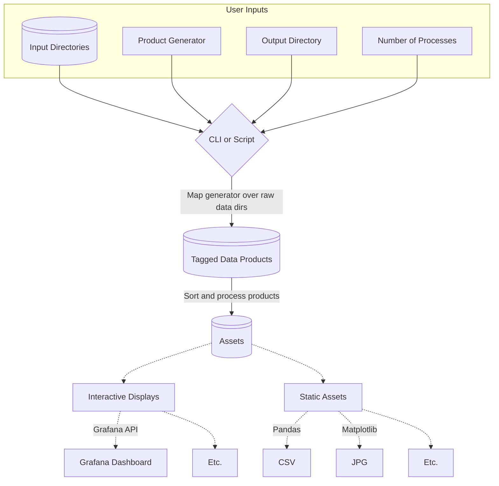

---
hide:
  - navigation
---

<figure markdown="1">
{ width="200" }
</figure>

# Welcome to Trendify


[](https://pypi.org/project/trendify/)
[](https://pypi.org/project/trendify/)
[](https://github.com/TalbotKnighton/trendify/blob/main/LICENSE)
[](https://github.com/TalbotKnighton/trendify)


### Description

The `trendify` package makes it easy to compare data from multiple runs of a batch process.  The core functionality is to generate CSV tables and JPEG images by mapping a user-provided processing function over a user-provided set of input data directories.  Parallelization and data serialization are used to speed up processing time and maintain low memory requirements.  `trendify` is run via a terminal [command line interface (CLI)][cli] one-liner method or via a Python application programming interface (API).

See the [Flow Chart][flow-chart] and [Vocabulary][vocabulary] sections below for a visual diagram of the program flow and vocabulary reference.

The [Motivation][motivation] section discusses the problem this package solves and why it is useful.

The [Recipe][recipe] section provides a template for users to follow.

The [Example][example] section provides a minimum working example.

Available python methods and command line syntax are described in the [API and CLI][api-and-cli] section.

Planned future work and features are shown in the [Planned Features][planned-features] section.

### Installation

Install from PyPI

```bash
pip install trendify
```

### Links

[View on PyPI](https://pypi.org/project/trendify/)

[View source code](https://github.com/TalbotKnighton/trendify?tab=readme-ov-file)

### Flow Chart

The following flow chart shows how `trendify` generates assets from user inputs.



### Vocabulary

The following is a table of important trendify objects / vocabulary sorted alphabetically:

| Term | Meaning |
| ---- | ------- |
| API | Application programming interface: Definition of valid objects for processing within `trendify` framework |
| Asset | An asset to be used in a report (such as static CSV or JPG files) or interacted with (such as a Grafana dashboard) |
| CLI | Command line interface: `trendify` script installed with package used to run the framework |
| [DataProduct][trendify.api.base.data_product.DataProduct] | Base class for [tagged][trendify.api.base.helpers.Tag] products to be sorted and displayed in static or interactive assets.|
| [DataProductGenerator][trendify.api.generator.data_product_generator.DataProductGenerator] | A [Callable][typing.Callable] to be mapped over raw data directories.  Given the [Path][pathlib.Path] to a working directory, the method returns a [ProductList][trendify.api.base.data_product.ProductList] (i.e. a list of instances of [DataProduct][trendify.api.base.data_product.DataProduct] instances): [`Trace2D`][trendify.api.plotting.trace.Trace2D], [`Point2D`][trendify.api.plotting.point.Point2D], [`TableEntry`][trendify.api.formats.table.TableEntry], [`HistogramEntry`][trendify.api.plotting.histogram.HistogramEntry], etc. |
| [HistogramEntry][trendify.api.plotting.histogram.HistogramEntry] | Tagged, labeled data point to be counted and histogrammed |
| [Point2D][trendify.api.plotting.point.Point2D] | Tagged, labeled [XYData][trendify.api.formats.format2d.XYData] defining a point to be scattered on xy graph |
| [Product List][trendify.api.base.data_product.ProductList] | List of [DataProduct][trendify.api.formats.table.TableEntry] instances |
| Raw Data | Data from some batch process or individual runs (with results from each run stored in separate subdirectories) |
| [TableEntry][trendify.api.formats.table.TableEntry] | Tagged data point to be collected into a table, pivoted, and statistically analyzed |
| [Tag][trendify.api.base.helpers.Tag] | Hashable tag used for sorting and collection of [DataProduct][trendify.api.base.data_product.DataProduct] instances |
| [Trace2D][trendify.api.plotting.trace.Trace2D] | Tagged, labeled [XYData][trendify.api.formats.format2d.XYData] defining a line to be plotted on xy graph |
| [XYData][trendify.api.formats.format2d.XYData] | Base class for products to be plotted on an xy graph |
