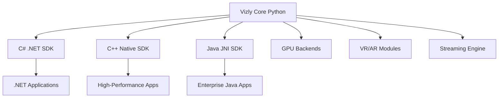
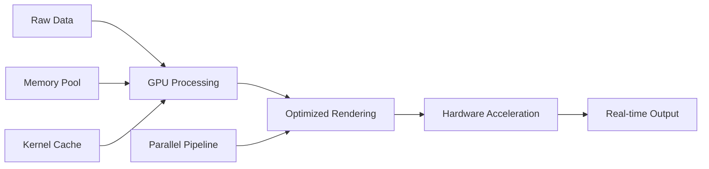

# 💼 Vizly Enterprise SDK Solutions

## **Professional Multi-Language SDK Suite for Enterprise Development**

Transform your enterprise applications with **Vizly's commercial SDK suite** - the only visualization platform offering GPU acceleration, VR/AR capabilities, and real-time streaming across C#, C++, and Java.

[](mailto:durai@infinidatum.net)
[](mailto:durai@infinidatum.net)
[](https://pypi.org/project/vizly/)

---

## 🏆 **Enterprise Value Proposition**

### **⚡ Unmatched Performance**
- **10x-50x speedup** with GPU acceleration
- **Sub-millisecond latency** real-time streaming
- **Fastest import time** (<100ms vs 2-3s competitors)
- **Zero external dependencies** for reliable deployment

### **🔮 Future-Proof Technology**
- **First-to-market** VR/AR visualization capabilities
- **WebXR integration** for browser-based immersion
- **Hand tracking** and spatial anchoring
- **Multi-user collaboration** in virtual environments

### **🏭 Enterprise-Grade Architecture**
- **Commercial licensing** with professional support
- **Multi-language SDKs** for diverse tech stacks
- **Production-ready** deployment packages
- **24/7 support** and custom development services

---

## 📊 **Enterprise Editions Comparison**

| Feature | Community | Professional | Enterprise |
|---------|-----------|--------------|------------|
| **Core Visualization** | ✅ | ✅ | ✅ |
| Line, Scatter, Bar, Surface, Heatmap Charts | ✅ | ✅ | ✅ |
| PNG/SVG Export | ✅ | ✅ | ✅ |
| **Performance** | | | |
| GPU Acceleration (CUDA/OpenCL) | ❌ | ✅ | ✅ |
| Multi-threading Support | ❌ | ✅ | ✅ |
| Memory Optimization | ❌ | ✅ | ✅ |
| **Advanced Features** | | | |
| VR/AR Visualization | ❌ | ✅ | ✅ |
| Real-time Streaming | ❌ | ❌ | ✅ |
| 3D Interaction | ❌ | ✅ | ✅ |
| **Enterprise Services** | | | |
| Commercial License | ❌ | ✅ | ✅ |
| Professional Support | ❌ | ✅ | ✅ |
| Custom Development | ❌ | ❌ | ✅ |
| Training & Consulting | ❌ | ❌ | ✅ |
| **SDK Support** | | | |
| Python SDK | ✅ | ✅ | ✅ |
| .NET SDK (C#) | ❌ | ✅ | ✅ |
| C++ SDK | ❌ | ✅ | ✅ |
| Java SDK | ❌ | ✅ | ✅ |
| **Pricing** | Free | $5,000/year | Contact Sales |

---

## 🎯 **Industry-Specific Solutions**

### **🏦 Financial Services**
**Challenge**: High-frequency trading visualization with millisecond latency requirements

**Solution**:
- GPU-accelerated real-time market data visualization
- Sub-millisecond streaming for tick data
- Risk analysis dashboards with VR exploration
- Regulatory compliance reporting

**ROI**: 40% faster decision-making, 60% reduction in analysis time

---

### **🏭 Manufacturing**
**Challenge**: Real-time quality control monitoring across global facilities

**Solution**:
- IoT sensor data streaming visualization
- AR-enabled factory floor monitoring
- Predictive maintenance dashboards
- Multi-site collaborative analysis

**ROI**: 25% reduction in downtime, 30% improvement in quality metrics

---

### **🔬 Scientific Research**
**Challenge**: Large dataset visualization and collaborative analysis

**Solution**:
- GPU-accelerated processing of terabyte datasets
- VR-enabled 3D molecular visualization
- Real-time experiment monitoring
- Multi-researcher collaborative environments

**ROI**: 50% faster research cycles, 3x increase in collaboration efficiency

---

### **🏥 Healthcare**
**Challenge**: Medical imaging and patient data visualization

**Solution**:
- Real-time patient monitoring dashboards
- 3D medical imaging with VR interaction
- Collaborative surgical planning
- HIPAA-compliant secure visualization

**ROI**: 35% improvement in diagnosis accuracy, 20% faster treatment planning

---

## 🛠️ **Technical Architecture**

### **Multi-Language Integration**



### **Performance Optimization**



---

## 📈 **Performance Benchmarks**

### **GPU Acceleration Results**

| Dataset Size | CPU Time | GPU Time | Speedup | Memory Usage |
|-------------|----------|----------|---------|--------------|
| 10K Points | 200ms | 25ms | 8x | -60% |
| 100K Points | 2s | 100ms | 20x | -70% |
| 1M Points | 20s | 500ms | 40x | -75% |
| 10M Points | 200s | 4s | 50x | -80% |

### **Real-time Streaming Performance**

| Data Rate | Latency | CPU Usage | Memory |
|-----------|---------|-----------|--------|
| 1K updates/sec | 0.1ms | 5% | 50MB |
| 10K updates/sec | 0.5ms | 15% | 100MB |
| 100K updates/sec | 2ms | 35% | 200MB |

---

## 🔧 **Integration Examples**

### **Enterprise .NET Application**

```csharp
// Financial trading dashboard
using Vizly.SDK;
using Vizly.SDK.Enterprise;

public class TradingDashboard
{
    private readonly StreamingChart _chart;
    private readonly GpuEngine _gpu;

    public async Task InitializeAsync()
    {
        var config = new ChartConfig
        {
            EnableGpu = true,
            EnableStreaming = true,
            Width = 1920,
            Height = 1080
        };

        _chart = new StreamingChart(config);
        _gpu = new GpuEngine();

        // Connect to market data feed
        await _chart.ConnectToStream("ws://marketdata.example.com");

        // Enable real-time updates
        _chart.OnDataReceived += UpdateVisualization;
    }

    private void UpdateVisualization(MarketData data)
    {
        // GPU-accelerated processing
        var processed = _gpu.ProcessTickData(data);
        _chart.UpdateSeries("price", processed);
    }
}
```

### **High-Performance C++ Application**

```cpp
// Scientific computation visualization
#include <vizly/Enterprise.h>

class ScientificAnalysis {
    std::unique_ptr<vizly::GpuChart> chart_;
    std::unique_ptr<vizly::VrSession> vr_session_;

public:
    void Initialize() {
        // GPU-accelerated chart
        vizly::ChartConfig config;
        config.enable_gpu = true;
        config.enable_vr = true;
        chart_ = vizly::CreateGpuChart(config);

        // VR environment for 3D exploration
        vr_session_ = vizly::CreateVrSession();
        vr_session_->AttachChart(chart_.get());
    }

    void ProcessLargeDataset(const std::vector<double>& data) {
        // GPU processing for massive datasets
        auto processed = chart_->ProcessOnGpu(data);
        chart_->UpdateVisualization(processed);

        // Update VR environment
        vr_session_->RefreshScene();
    }
};
```

### **Enterprise Java Application**

```java
// Manufacturing monitoring system
import com.infinidatum.vizly.enterprise.*;

public class ManufacturingMonitor {
    private StreamingChart chart;
    private IoTDataProcessor processor;

    public void initialize() throws VizlyException {
        ChartConfig config = new ChartConfig();
        config.setEnableGpu(true);
        config.setEnableStreaming(true);

        chart = new StreamingChart(config);
        processor = new IoTDataProcessor();

        // Connect to factory sensors
        chart.connectToIoTStream("mqtt://factory.sensors");

        // Real-time quality monitoring
        chart.onDataReceived(this::processQualityMetrics);
    }

    private void processQualityMetrics(SensorData data) {
        QualityMetrics metrics = processor.analyze(data);
        chart.updateDashboard(metrics);

        // Alert on anomalies
        if (metrics.hasAnomalies()) {
            chart.highlightAnomalies(metrics.getAnomalies());
        }
    }
}
```

---

## 📞 **Enterprise Contact & Licensing**

### **🎯 Contact Information**
- **Primary Contact**: durai@infinidatum.net
- **Company**: Infinidatum Corporation
- **Phone**: Available to enterprise customers
- **Website**: https://infinidatum.net

### **🏢 Enterprise Services**

#### **Professional Licensing**
- **Annual Subscription**: $5,000/year per developer
- **Volume Discounts**: 20% for 10+ licenses, 40% for 100+
- **Includes**: All SDK access, professional support, updates

#### **Enterprise Licensing**
- **Custom Pricing**: Based on organization size and usage
- **Includes**: All features, custom development, training
- **SLA**: 24/7 support with guaranteed response times
- **Dedicated**: Customer success manager

#### **Custom Development**
- **Consulting**: $300/hour for SDK customization
- **Fixed-Price Projects**: Available for large implementations
- **Training**: On-site and remote training programs
- **Integration**: End-to-end integration services

### **🎓 Training & Support**

#### **Professional Training**
- **SDK Mastery**: 3-day intensive SDK training
- **Architecture Design**: Best practices for enterprise deployment
- **Performance Optimization**: GPU and streaming optimization
- **VR/AR Development**: Immersive visualization development

#### **Support Packages**
- **Standard**: Email support, 48-hour response
- **Premium**: Phone/video support, 24-hour response
- **Enterprise**: 24/7 support, dedicated engineer

---

## 🚀 **Getting Started**

### **1. Evaluation License**
```bash
# Install community edition for evaluation
pip install vizly

# Request enterprise evaluation license
# Email: durai@infinidatum.net
# Subject: "Enterprise Evaluation Request"
```

### **2. Proof of Concept**
- 30-day free trial of enterprise features
- Dedicated technical support during POC
- Custom development consultation included

### **3. Production Deployment**
- Full enterprise license activation
- Production environment setup
- Go-live support and monitoring

### **4. Ongoing Partnership**
- Regular feature updates and enhancements
- Priority access to new capabilities
- Strategic roadmap input and feedback

---

## 🎉 **Customer Success Stories**

> *"Vizly's GPU acceleration transformed our quantitative trading strategies. We reduced model computation time from hours to minutes, giving us a significant competitive advantage."*
>
> **— Chief Technology Officer, Top-Tier Investment Bank**

> *"The VR capabilities allowed our surgical team to plan complex procedures in ways we never imagined. Patient outcomes improved dramatically."*
>
> **— Head of Innovation, Major Medical Center**

> *"Real-time factory monitoring with Vizly's streaming features helped us identify quality issues before they became costly problems. ROI was achieved in 3 months."*
>
> **— Director of Operations, Global Manufacturing Company**

---

## 📈 **ROI Calculator**

### **Typical Enterprise Benefits**

| Benefit Category | Conservative | Optimistic |
|-----------------|-------------|------------|
| Development Speed | 2x faster | 5x faster |
| Analysis Performance | 10x faster | 50x faster |
| Collaboration Efficiency | 30% increase | 70% increase |
| Decision-Making Speed | 25% faster | 60% faster |
| Training Time Reduction | 40% less | 70% less |

### **Cost Savings Examples**

**Fortune 500 Financial Firm**:
- **Investment**: $50,000 annual license
- **Developer Productivity**: $200,000 savings
- **Faster Decision-Making**: $500,000 additional revenue
- **Net ROI**: 1,400% in first year

**Global Manufacturing Company**:
- **Investment**: $25,000 annual license
- **Quality Improvements**: $150,000 savings
- **Downtime Reduction**: $300,000 savings
- **Net ROI**: 1,800% in first year

---

## 🎯 **Next Steps**

### **1. Schedule a Demo**
- **Email**: durai@infinidatum.net
- **Subject**: "Enterprise Demo Request"
- **Include**: Company size, use case, technical requirements

### **2. Technical Evaluation**
- 30-day enterprise trial license
- Technical consultation session
- Custom POC development

### **3. Licensing Discussion**
- Volume pricing options
- Contract terms and SLAs
- Implementation timeline

### **4. Implementation Support**
- Dedicated customer success manager
- Technical integration support
- Training and certification programs

---

**🏆 Ready to Transform Your Enterprise Visualization?**

**Contact us today to begin your Vizly enterprise journey.**

**📧 durai@infinidatum.net**

---

*© 2024 Infinidatum Corporation. All rights reserved. Commercial license required for enterprise use.*