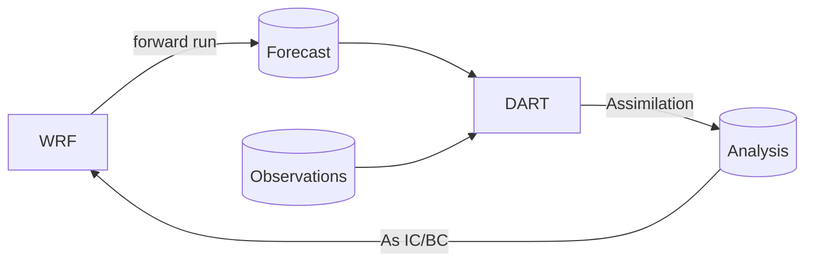
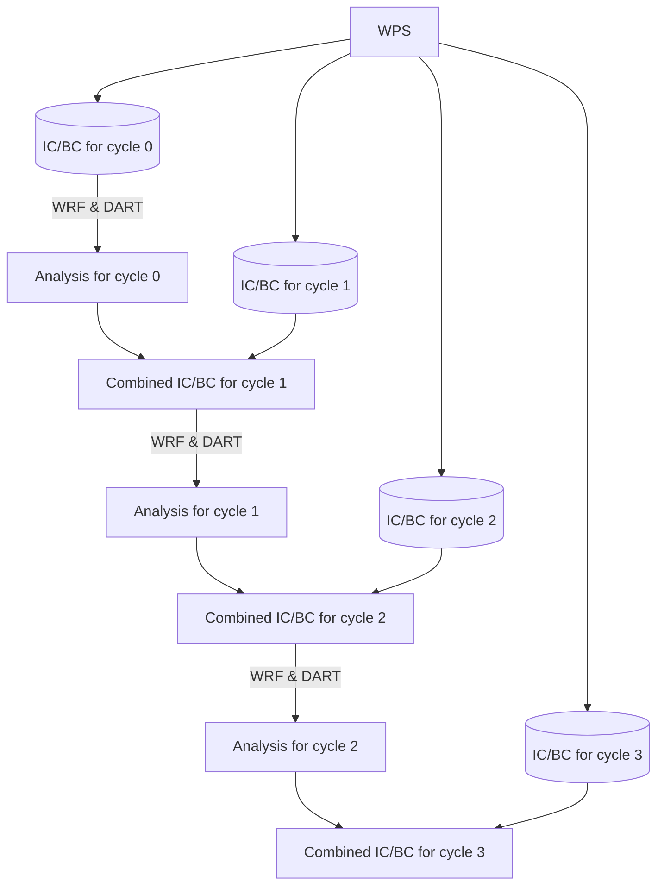
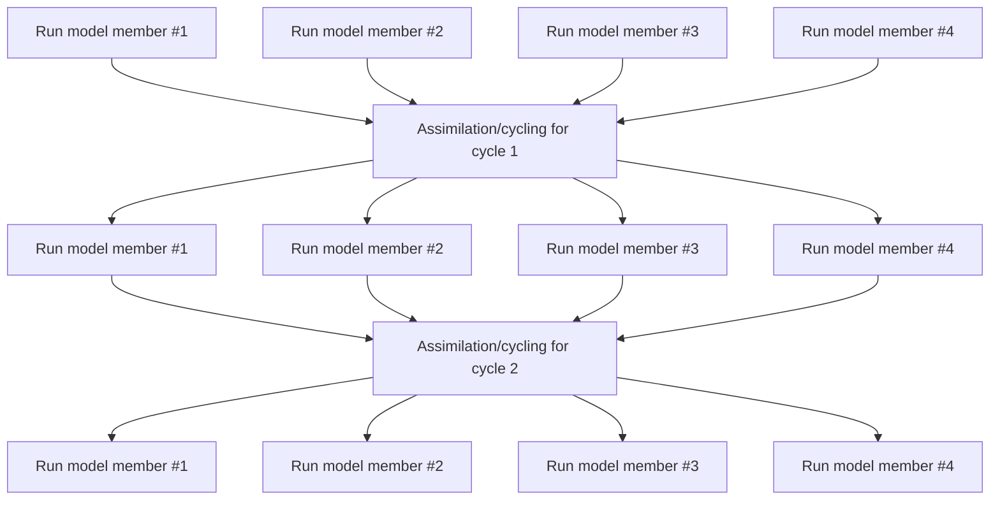

# Core Concepts

WRF ensembly is made available as a command line tool, which can be accessed with `wrf-ensembly` after installation. All activities are managed through **Experiments**, which are represented by a *directory* that holds all configuration, data and model binaries needed for one assimilation experiment. In general, all commands follow the pattern:

```bash
wrf-ensembly $EXPERIMENT_PATH group command
```

where `$EXPERIMENT_PATH` is the path to the experiment directory and `group`/`command` signals the action you want to execute.

Experiments follow the general 'Setup, Preprocessing, Assimilation, Postprocessing' steps. Each step is managed through a separate group of commands.


## Cycling

WRF Ensembly is a cycling assimilation system based on [NCAR DART](https://dart.ucar.edu). With *cycling*, we refer to the act of running a forward run of the NWP model and then using its output as input for the next forward run. One *cycle* of an *experiment* refers to one forward run and the subsequent assimilation.



Since the system is an **Ensemble** assimilation system, the forward run is actually a set of forward runs, one for each member of the ensemble. Then, DART is used to produce the analysis (for all members) and you can optionally use ensembly to get ensemble statistics (e.g. mean, spread).

Since the output of WRF does not include all variables to start the model (think SST, the model doesn't advance it but you need it to initialise), at the end of each cycle we combine the analysis with a set of initial conditions generated for that cycle's end time. Hopefully the figure below clarifies this:



So, the global model data are used to generate initial and boundary conditions at the time of all cycle's beginning. When a cycle ends, the WRF output (analysis) is combined with the initial conditions generated for the next cycle. Which variables are used from which dataset (analysis vs IC) can be configured.

Optionally, a cycle can use the forecast to move forward, in case the analysis doesn't exist. For example, when there aren't any data to assimilate.

## Experiment Directory Structure

The experiment directory is the main directory where all data and configuration files are stored. It is structured as follows:


  - `data/` - Input files & final output files
    - `analysis/`
    - `diagnostics/` - DART obs_seq.out files, IC/BC perturbations
    - `forecasts/` - Postprocessed wrfout files
    - `initial_boundary/` - wrfinput and wrfbdy files
  - `jobfiles/` - SLURM jobfiles
  - `logs/` - Log files, one subdirectory per executed command
    - `slurm/` - stdout of SLURM jobs
  - `obs/` - Observations (.toml and .obs_seq)
  - `scratch/` - Temporary files (but also raw wrfout)
    - `analysis/`
    - `dart/` - DART output files (netCDF only w/ state vars.)
    - `forecasts/` - raw wrfout files from model
    - `postprocess/` - Used during post-processing
  - `work/` - WRF/WPS executables and working directories
    - `ensemble/` - One subdirectory per ensemble, contains wrf.exe
    - `preprocessing/` - A copy of WRF and WPS used to generate the IC/BC
    - `WPS/` - The WPS build used for the experiment
    - `WRF/` - The WRF build used for the experiment
  - `config.toml` - Configuration file for the experiment
  - `status.toml` - Status file for the experiment

The `scratch/` directory can get pretty large in size because of the wrfout files. You can set move this directory outside of the experiment path, possibly on a different mountpoint. This is to accomodate HPC systems that provide a larger scratch mountpoint.


## Logging

Everytime a command is executed, a subdirectory is created inside the `logs/` directory, following this naming scheme:

```
YYYY-MM-DD_HHMMSS-COMMAND
```

For example, `2024-12-31_235959-experiment-create` would be created when running `experiment create` on 2024-12-31, at 23:59:59. Inside the subdirectory, there is always a file called `wrf_ensembly.log` that contains all output of ensembly. If any external commands were used (i.e. `ungrib.exe`), then the output of the command in stored in a second file (i.e. `ungrib.log`).

There is a special case for the `rsl.*` files created by WRF. Because you have 2 files per CPU core and you create new files every cycle, for each member, it can easily add up and hit file-count quotas on certain HPC systems. Thus, only the first rsl files are available in plain-text (`rsl.out.0000` and `rsl.error.0000`). The rest of the files are compressed and stored in the same directory.


## Observations

Observations are stored inside the `obs/` category per-experiment. DART requires observations to be in `obs_seq` format and provides a set of `obs_converters` to do this. Since you would need one `obs_seq` file per assimilation cycle, including all observations you need (possibly from different instruments), WRF-Ensembly tries to automate this process by having scripts to browse available observations and then convert only the required ones. This is a per-observation-type workflow and might need the user to write a custom script to find available observations.

The whole abstraction is entirely optional. WRF-Ensembly will use any `obs_seq.cycle_X` available inside the `obs/` directory. More information in the [Observations](./observations.md) section.


## Configuration

Experiments are configured through the `config.toml` file, in [TOML format](https://toml.io/en/). Currently, this includes all WRF-Ensembly settings and the WRF/WPS namelists. DART configuration is not handled. More information in the [Configuration](./configuration.md) section.


## Postprocessing

In the typical WRF-Ensembly workflow, we don't use the raw wrfout files. The following steps are followed before you get the output **forecast**/**analysis** files:

1. Use [xwrf](https://github.com/xarray-contrib/xwrf) to make the files a bit more convenient (shorter dimension names, some diagnostics computed, CF-compliant attributes added). Remove any uneeded variables to save space.
2. Optionally, apply any external processors on the files.
3. Concatenate all files into a single file, one per cycle and member.
4. Compute the ensemble statistics (mean and standard deviation), leaving you with two files per cycle.

During the final steps, the files are also compressed using a netCDF-compatible algorithm (zstd is recommended, but zlib is more widely available) and the variables are 'packed' to avoid storing too many insignificant digits. Both these processes are optional and configurable (see the `[postprocess]` section of the [Configuration](./configuration.md#Postprocess)). The user can select whether to store only the ensemble statistics or all member files, the first cutting down the output size significantly.

Because there are many tools that use raw wrfout files, the above is all optional. You can find the wrfout files inside the `scratch/` directory.

More information about postprocessing is available in the [Postprocessing](./postprocessing.md) section, including how the processing pipeline is setup.


## HPC intergration (SLURM)

For use in HPC environments, WRF-Ensembly heavily relies on SLURM for job scheduling. This is an optional convenience feature, as you can completely use WRF-Ensembly without a scheduling system.
Jobfiles can be generated for many time-intensive tasks (i.e. pre-processing with WPS or postprocessing with WRF-Ensembly) and for running the assimilation experiment. In this last scenario, WRF-ensembly uses dependencies to run the assimilation/cycle step after the model has advanced, which then queues the next cycle. The example below shows a flowchart for an experiment with 4 members. Each box represents a SLURM job.



This feature allows the user to run experiments fully parallelized, with each WRF execution taking place in a different node (as long as there are available resources), while only requiring N+2 queued jobs at any time, where N is the number of members. This is useful in systems where there are max-queued job limits.

If for any reason the experiment is interrupted, it can be resumed without re-running any completed steps.


## Experiment status tracking

The status of the experiment is tracked through a `status.db` file, which stores the current cycle, which members have been advanced (i.e. WRF successfully completed) and whether assimilation filter has been completed. It also stores some statistics about how long it took to advance each member to the next cycle. The file is an sqlite database which can be inspected with any sqlite client, but you also have a set of commands available (`wrf-ensembly status`). More info in the [Status](./status.md) section.


# What to read next

The [Installation](./installation.md) page details how to get WRF-Ensembly installed on your system, including dependencies or for development. The [Usage](./usage.md) page details all commands available in WRF-Ensembly and their usage, including on how to setup your first experiment. The [Configuration](./configuration.md) page details how to configure your experiment, including the WRF/WPS namelists. Information about observations is available in the [Observations](./observations.md) page.