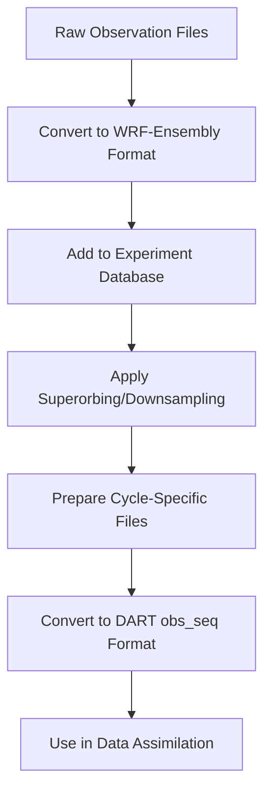

# Observations

WRF-Ensembly provides a comprehensive observation system for handling observational data in ensemble assimilation experiments. The system converts observations from various instruments into a standardized format, processes them spatially and temporally for your experiment domain, and integrates seamlessly with DART for data assimilation.

For a complete list of observation-related commands, see the [Usage](usage.md#observations) documentation. Configuration options are detailed in the [Configuration](configuration.md#observations) reference.

## Overview

The observation system consists of several key components:

- **Standardized Format** - A unified parquet-based observation format that all instruments are converted to
- **Converters** - Instrument-specific modules that transform raw observation data to the standard format
- **Database Management** - DuckDB-based storage and querying of observations within experiments
- **Spatial/Temporal Processing** - Tools for trimming observations to experiment domains and time windows
- **Superorbing** - Downsampling techniques to reduce observation density while preserving information
- **DART Integration** - Conversion to DART's obs_seq format for data assimilation

While DART already includes an observation management system that covers some of the above functionalities, WRF-Ensembly includes it's own to facilitate extra functionality, such as validation and plotting. Subjectively, it is also easier to write data converters in Python than in Fortran, given that even the most obscure observation data format is likely to have a Python library available for reading it.

Since observations in DART (and in DA in general) are tuples of location, time and value, we are using DataFrames to represent collections of observations. This allows us to leverage all the powerful data manipulation capabilities of pandas and DuckDB, keep file sizes low and enable easy inspection and plotting.

## Observation Data Format

The WRF-Ensembly observation format is a standardized schema stored as parquet files. Each observation record contains the following required columns:

| Field | Type | Description |
|-------|------|-------------|
| `instrument` | string | Name of the observing instrument (e.g., "radiosonde", "aeronet") |
| `quantity` | string | Physical quantity being observed (e.g., "temperature", "AOD_500nm") |
| `time` | timestamp | UTC time of the observation |
| `longitude` | float | Longitude in degrees (-180 to 180) |
| `latitude` | float | Latitude in degrees (-90 to 90) |
| `z` | float | Vertical coordinate value |
| `z_type` | string | Type of vertical coordinate (see below) |
| `value` | float | The observed value (can be NaN for missing data) |
| `value_uncertainty` | float | Observation uncertainty/error estimate |
| `qc_flag` | int | Quality control flag (0 = good, higher values indicate issues) |
| `orig_coords` | dict | Original coordinate information (indices, shape, names) |
| `orig_filename` | string | Name of the original data file |
| `metadata` | string | Additional metadata as JSON string |

### Vertical Coordinate Types

The `z_type` field specifies the type of vertical coordinate:

| Value | Description | Units |
|-------|-------------|-------|
| `surface` | Surface observations | N/A |
| `pressure` | Pressure levels | hPa |
| `height` | Height above surface | meters |
| `model_level` | Model vertical levels | level number |
| `columnar` | Column-integrated values | N/A |

### Array reconstruction

While DA requires our data to be in tabular format, with each row being independent, it is often useful to reconstruct the original array structure of the data (e.g. for plotting, imagine you want to plot a vertical profile over time). To facilitate this, the `orig_coords` field contains information about the original array structure, specifically:

- `indices`: The indices of the observation in the original array
- `shape`: The shape of the original array
- `names`: The names of the original dimensions

For example, imagine you convert a satellite image observation file, which is a 2D array of size (100x200). The `orig_coords` field for each observation would contain the indices of that observation in the 2D array, the overall shape (100, 200), and the names of the dimensions (e.g., "along_track", "across_track").

The function `wrf_ensembly.observations.utils.reconstruct_array()` can be used to reconstruct the original array structure as an xarray DataArray.

### Internal database fields

After observations are added to the experiment database, a few additional fields are added for internal use:

| Field | Type | Description |
|-------|------|-------------|
| `x`, `y` | float | Projected coordinates in the WRF grid coordinate system |
| `downsampling_info` | dict | Information about superorbing/downsampling (if applied) |

## Workflow Overview

The typical workflow for using observations in WRF-Ensembly follows these steps:

1. **Convert Raw Data** - Transform instrument-specific files to the standardized WRF-Ensembly format
2. **Add to Experiment** - Import observations into the experiment database with spatial/temporal trimming
3. **Apply Superorbing** - Optionally downsample dense observations using clustering techniques
4. **Prepare Cycles** - Extract observations for each assimilation cycle's time window
5. **Convert to DART** - Transform to DART's obs_seq format for data assimilation
6. **Assimilate** - Use in the ensemble data assimilation system



## Converting Observations

### Available Converters

The system includes converters for various observation types:

| Converter | Description | Input Format |
|-----------|-------------|--------------|
| `aeronet` | Aerosol Robotic Network sun photometer data | `.lev20` files |
| `remotap-spexone` | Satellite aerosol optical depth data | NetCDF files |
| `template` | Template for creating new converters | N/A |

### Using Converters

Converters are accessed through the `wrf-ensembly-obs-convert` command:

```bash
# Convert AERONET data
wrf-ensembly-obs convert aeronet input_files/*.lev20 output.parquet

# Convert REMOTAP data
wrf-ensembly-obs convert remotap-spexone input.nc output.parquet

# Get help for a specific converter
wrf-ensembly-obs convert aeronet --help
```

The `wrf-ensembly-obs` command is independent of `wrf-ensembly` because it can be used standalone, without an experiment context.

### Creating New Converters

To add support for a new instrument:

1. **Create the converter module** in `wrf_ensembly/observations/converters/your_instrument.py`
2. **Implement the conversion function** that returns a pandas DataFrame with the required schema
3. **Add a CLI command** using click decorators
4. **Register the converter** in `cli.py` and `__init__.py`

Use the template converter (`template.py`) as a starting point. Key requirements:

- All required columns must be present and correctly typed
- Use `obs_io.validate_schema()` to verify compliance
- Handle the `orig_coords` field to preserve array structure information
- Set appropriate `qc_flag` values based on data quality

## Experiment Integration

### Adding Observations to Experiments

Once observations are converted to the standard format, they can be added to experiments:

```bash
# Add individual files or directories
wrf-ensembly obs add /path/to/observations/*.parquet

# Use parallel processing for large datasets
wrf-ensembly obs add /path/to/observations/*.parquet --jobs 4
```

The `add` command performs several operations:

1. **Spatial Trimming**: Removes observations outside the experiment's WRF domain
2. **Temporal Trimming**: Filters observations to the experiment's time range
3. **Database Storage**: Adds trimmed observations to the experiment's DuckDB database

### Observation Database

Each experiment maintains a DuckDB database (`experiment_path/obs/observations.db`) that stores all observation data.
The `wrf-ensembly obs` command group allows interacting with this database for various operations:

```bash
# Show summary of available observations
wrf-ensembly obs show

# Get statistics for a specific cycle
wrf-ensembly obs cycle-stats 0

# Plot observation locations for a cycle
wrf-ensembly obs plot-cycle-locations 0

# Remove a file's observations from the database
wrf-ensembly obs delete 'original_file.nc'
```

## Superorbing (Downsampling)

Superorbing reduces observation density by spatiotemporally clustering nearby observations and combining them into "superobservations". This helps:

- Reduce computational cost of data assimilation
- Avoid over-representation of densely observed areas
- Maintain representative coverage

### Configuration

Superorbing is configured in the experiment's config file under `observations.superorbing`:

```toml
[observations.superorbing]

[observations.superorbing."aeronet.AOD_500nm"]
spatial_radius_x_meters = 50000.0
spatial_radius_y_meters = 50000.0
temporal_radius_seconds = 1800

[observations.superorbing."radiosonde.temperature"]
spatial_radius_x_meters = 100000.0
spatial_radius_y_meters = 100000.0
spatial_radius_z = 50.0  # 50 hPa for pressure levels, since the z_type is 'pressure'
temporal_radius_seconds = 3600
```

| Field | Type | Description |
|-------|------|-------------|
| `spatial_radius_x_meters` | float | **Required.** Spatial clustering radius in x direction (meters) |
| `spatial_radius_y_meters` | float | **Required.** Spatial clustering radius in y direction (meters) |
| `spatial_radius_z` | float | Spatial clustering radius in z direction (in units of z_type). Optional |
| `temporal_radius_seconds` | int | Temporal clustering radius (seconds). *Default: 60* |

### Algorithm

The system uses DBSCAN clustering to group observations that are:
- Within specified spatial distances (x, y, and optionally z directions)
- Within specified temporal distance
- From the same instrument and quantity

Superobservations are created by:
- Uncertainty-weighted averaging of observation values
- Combining uncertainties assuming independent errors
- Recording metadata about the number of original observations and their spread

### Applying Superorbing

```bash
# Apply configured superorbing to all observations
wrf-ensembly obs superorbing
```

## Cycle Preparation

Before data assimilation, observations must be prepared for each assimilation cycle:

```bash
# Prepare observations for all cycles
wrf-ensembly obs prepare-cycles

# Prepare for a specific cycle
wrf-ensembly obs prepare-cycles --cycle 0

# Skip DART conversion (for inspection)
wrf-ensembly obs prepare-cycles --skip-dart
```

This process:
1. Extracts observations within each cycle's assimilation window
2. Applies the configured half-window length (default 30 minutes before/after cycle end)
3. Saves cycle-specific parquet files for inspection
4. Converts to DART obs_seq format for assimilation

If `obs superorbing` has been run, the superobservations are used in cycle preparation, otherwise the original observations are used.

### Assimilation Window

The assimilation window is controlled by `assimilation.half_window_length_minutes` in the experiment configuration. See the [Configuration](configuration.md#assimilation) reference for details:

```toml
[assimilation]
half_window_length_minutes = 30  # ±30 minutes around cycle end time
```

## DART Integration

### Observation Types

The system maps WRF-Ensembly quantities to DART observation types:

```python
OBS_TYPE_TABLE = {
    "AOD_500nm": "AIRSENSE_AOD",
    "AOD_550nm": "AIRSENSE_AOD",
    # Add more mappings as needed
}
```

### Building the DART Converter

The system requires a custom DART converter located at:
```
$DART_ROOT/observations/obs_converters/wrf_ensembly/
```

This converter must be compiled before use:
```bash
cd $DART_ROOT/observations/obs_converters/wrf_ensembly/work
./quickbuild.sh
```

### obs_seq Format

The converted obs_seq files contain:
- Observation location (lat, lon, vertical coordinate)
- Observation time
- Observation value and error
- DART observation type
- Quality control information

## Configuration

The observation system is configured through the experiment's `config.toml` file in the `[observations]` section:

```toml
[observations]
instruments_to_assimilate = ["aeronet", "radiosonde"]
boundary_width = 0
boundary_error_factor = 2.5
boundary_error_width = 1.0

[observations.superorbing]
# Superorbing configurations per instrument.quantity
```

| Field | Type | Description |
|-------|------|-------------|
| `instruments_to_assimilate` | [string] | Which instruments to use in assimilation. If null, all available instruments are used |
| `boundary_width` | float | Grid points to exclude near domain boundaries. *Default: 0* |
| `boundary_error_factor` | float | Factor to inflate observation errors near boundaries. *Default: 2.5* |
| `boundary_error_width` | float | Width (in grid points) of boundary error inflation zone. *Default: 1.0* |
| `superorbing` | dict | Per-instrument superorbing configurations (see [Superorbing](#superorbing)) |

### Quality Control

The system respects QC flags during assimilation:

| QC Flag | Description | Usage |
|---------|-------------|-------|
| `0` | Good observations | Used in assimilation |
| `> 0` | Problematic observations | Typically excluded from assimilation |

Quality control statistics are reported in cycle summaries and can be viewed with the `cycle-stats` command.

## Command Reference

### Experiment-Level Commands

These commands operate on observations within an experiment context:

```bash
# Add observations to experiment database
wrf-ensembly EXPERIMENT_PATH obs add observations/*.parquet --jobs 4

# Show summary of available observations
wrf-ensembly EXPERIMENT_PATH obs show

# Apply superorbing/downsampling
wrf-ensembly EXPERIMENT_PATH obs superorbing

# Prepare observations for all cycles
wrf-ensembly EXPERIMENT_PATH obs prepare-cycles

# Prepare observations for specific cycle
wrf-ensembly EXPERIMENT_PATH obs prepare-cycles --cycle 0

# Get cycle statistics
wrf-ensembly EXPERIMENT_PATH obs cycle-stats 0

# Plot observation locations for a cycle
wrf-ensembly EXPERIMENT_PATH obs plot-cycle-locations 0

# Remove observations from specific file
wrf-ensembly EXPERIMENT_PATH obs delete filename.parquet
```

### Standalone File Operations

These commands work on observation files independently of experiments:

```bash
# Convert raw data to WRF-Ensembly format
wrf-ensembly-obs-convert aeronet input/*.lev20 output.parquet

# Join multiple observation files
wrf-ensembly-obs join file1.parquet file2.parquet output.parquet

# Get file information
wrf-ensembly-obs dump-info observations.parquet
wrf-ensembly-obs dump-info observations.parquet --as-json

# Filter observations spatially/temporally
wrf-ensembly-obs filter observations.parquet output.parquet \
  --start-time "2023-01-01T00:00:00" \
  --end-time "2023-01-02T00:00:00" \
  --bbox -180 -90 180 90
```

## Advanced Usage

### Array Reconstruction

For observations that originated from gridded data, you can reconstruct the original array structure:

```python
from wrf_ensembly.observations.utils import reconstruct_array

# Filter to single file and quantity
subset = obs_df[
    (obs_df['orig_filename'] == 'data.nc') &
    (obs_df['quantity'] == 'AOD_500nm')
]

# Reconstruct original array structure
xr_array = reconstruct_array(subset)
```

This creates an xarray DataArray with the original dimensions and coordinates, useful for visualization and analysis.

### Custom Database Queries

The observation database supports complex SQL queries for advanced filtering:

```python
# Get DuckDB connection
with experiment.obs._get_duckdb(read_only=True) as con:
    # Custom query for specific conditions
    query = """
    SELECT instrument, quantity, COUNT(*) as count,
           AVG(value) as mean_value,
           MIN(time) as start_time,
           MAX(time) as end_time
    FROM observations
    WHERE qc_flag = 0
      AND value > 0.1
      AND time BETWEEN '2023-01-01' AND '2023-01-31'
    GROUP BY instrument, quantity
    ORDER BY count DESC
    """
    results = con.execute(query).fetchdf()
```

### Visualization and Plotting

Create maps and plots of observation locations:

```python
from wrf_ensembly.observations.plotting import plot_observation_locations_on_map
import cartopy.crs as ccrs

# Plot observation locations on a map
fig = plot_observation_locations_on_map(
    observations=obs_df,
    proj=ccrs.PlateCarree(),
    domain_bounds=(lon_min, lon_max, lat_min, lat_max)
)
fig.savefig('observation_locations.png')
```

## Next Steps

Once you have prepared your observations, you can proceed with:

- [Running the ensemble](usage.md#ensemble-management) - Execute your data assimilation experiment
- [Postprocessing](postprocess.md) - Process model output and generate analysis products
- [Configuration](configuration.md) - Fine-tune observation settings and other experiment parameters