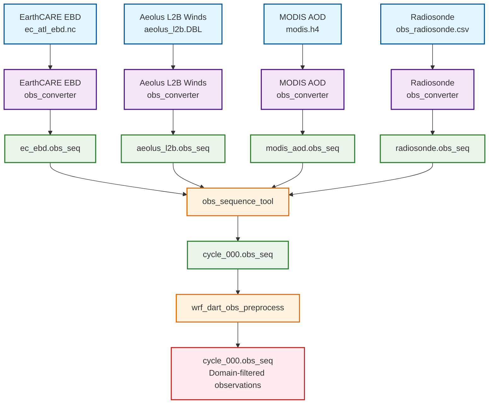
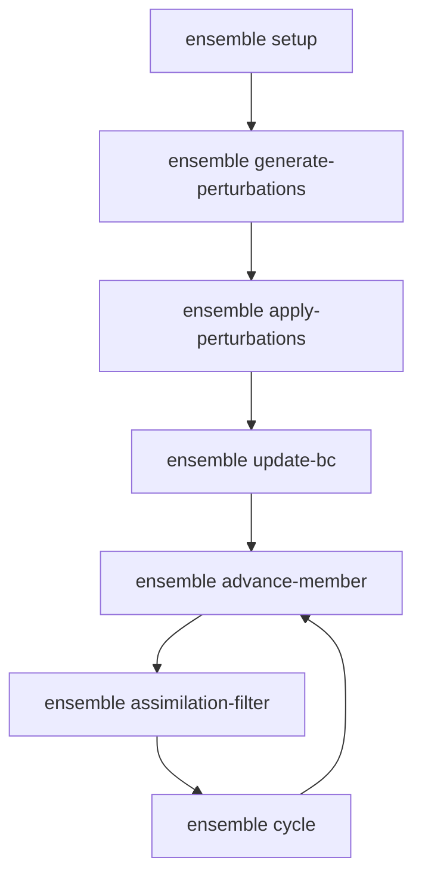

# Tutorial

This tutorial will walk you through a simple experiment using WRF-Ensembly. It will cover the basic steps of setting up an experiment, running it, and postprocessing the results.


## Prerequisites

You will need:
- A working installation of WRF-Ensembly. If you haven't installed it yet, follow the [Installation](./installation.md) guide.
- A working installation of WRF and WPS. You can find more information on how to install WRF [here](https://www2.mmm.ucar.edu/wrf/OnLineTutorial/compilation_tutorial.php). If you need it, you can use WRF-CHEM.
- A working installation of DART. You can find more information on how to install DART [here](https://dart.ucar.edu).

## Setting up the experiment

WRF-Ensembly keeps experiments inside a directory structure, which contains the model, any input and output files, and the configuration files. You can interact with experiments by putting the path as the first argument to the `wrf-ensembly` command.

```bash
wrf-ensembly /path/to/experiment group command [options]
```

All actions/commands are categorised into groups. You can read about all commands in [Usage](./usage.md). To begin, we will use the `experiment create` command to create a new experiment. This will create the directory structure and the configuration files needed to run the experiment.

```bash
wrf-ensembly /path/to/experiment experiment create iridium_chem_4.6.0
```

This will create a new experiment at `/path/to/experiment` using the config template `iridium_chem_4.6.0`. The templates are included in the [source code](https://github.com/NOA-ReACT/wrf_ensembly/tree/main/wrf_ensembly/config_templates).

Your first course of action should be to inspect and edit the `config.toml` file. This file contains all the configuration options for the experiment. You can find more information about the configuration options in the [Configuration](./configuration.md) section. The most important options to edit are:

- In the `[metadata]` section, set the experiment `name` and a small `description`.
- In the `[directories]` section, you must set the paths to `wrf_root`, `wps_root` and `dart_root`. For `wrf_root`, you should point to the directory that contains the `run/` directory of your WRF installation. For `wps_root`, you should point to the directory that contains the `geogrid.exe`, `ungrib.exe`, and `metgrid.exe` executables. For `dart_root`, you should point to the repository root (that contains `models/`, `obs/`, etc.)
- In the `[domain_control]` and `[time_control]` sections you can set up the relevant options from WRF. These options are passed to WRF and WPS when they are run.
- In the `[data]` section, you should set paths to `wps_geog`, `meteorology` (directory that contains the GRIB files), which `meteorology_vtable` you want to use (only filename, not a full path).
- In the `[assimilation]` section, set how many members your ensemble will have in `n_members`.

WRF-Chem users that want initial conditions w/ [interpolator-for-wrfchem](https://github.com/NOA-ReACT/interpolator_for_wrfchem) should also set the following variables in `[data]`:

```toml
manage_chem_ic = true
chemistry = { path = '/home/thgeorgiou/data/Modelling/AIRSENSE/CAMS_FC', model_name = 'cams_global_forecasts' }
```

Also read [WRF-CHEM](./wrf-chem.md) later for wrf-chem specific information.

After setting up your configuration, use the `experiment cycle-info` command to see the cycles of your experiment. This will show which cycles will run given your time control settings.

```bash
wrf-ensembly /path/to/experiment experiment cycle-info

# You can also use `--to-csv=` to save the table in a CSV file.
wrf-ensembly /path/to/experiment experiment cycle-info --to-csv=cycles
```

If everything looks good, you can use `experiment copy-model` to make a copy of WRF and WPS inside the experiment directory. This is required and is done to ensure you can run the experiment even if there are changes in the WRF or WPS installations.

```bash
wrf-ensembly /path/to/experiment experiment copy-model
```

## Preprocessing

At this stage, you should have a working experiment with the configuration set up. The next step is to preprocess the input data. This is done using the `preprocess` group of commands, which will run the necessary WPS steps to prepare the input data for WRF. The steps are:

```bash
# Prepare the preprocessing directory
wrf-ensembly /path/to/experiment preprocess setup

# Run the three main WPS steps
wrf-ensembly /path/to/experiment preprocess geogrid
wrf-ensembly /path/to/experiment preprocess ungrib
wrf-ensembly /path/to/experiment preprocess metgrid
```

The namelists for WPS are generated automatically based on the configuration file. All preprocessing takes place inside the `work/preprocess` subdirectory of the experiment.
The geogrid table is configurable in the `geogrid.table` configuration field, while the ungrib variable table is set in the `data.meteorology_vtable` configuration field.

At this point, you will be able to find the `met_em*` files inside the `work/preprocess/WPS` directory. To run real, you can use the `preprocess real <CYCLE>` command:

```bash
wrf-ensembly /path/to/experiment preprocess real 0 # run for cycle 0
```

The above command will take care to generate the namelist for `real.exe`, run `real.exe`, and copy the final `wrfinput_d01` and `wrfbdy_d01` files to the `data/initial_conditions` directory. You must run real for every cycle in your experiment.

To make this whole process easier, you can generate a SLURM jobfile for preprocessing using the `slurm preprocessing` command:

```bash
wrf-ensembly /path/to/experiment slurm preprocessing
sbatch /path/to/experiment/jobfiles/preprocessing.sh
```

You can setup which `#SBATCH` directives you want to include in the jobfile by editing the `[slurm]` section of the config file.

Successful execution of all preprocessing steps will result in the `data/initial_conditions` directory being populated with the `wrfinput_d01` and `wrfbdy_d01` files for each cycle. You can check the status of the preprocessing using the `status` command:

If you are using WRF-Chem and you want to use the interpolator-for-wrfchem to generate initial conditions, you can use the `preprocess interpolate-chem` command:

```bash
wrf-ensembly /path/to/experiment preprocess interpolate-chem
```

## Observations

Every data assimilation experiment needs observations to assimilate. DART stores observations in the `obs_seq` format and provides routines in FORTRAN to read/write them. WRF-Ensembly mainly contains a bunch of helper commands to make it easier to work with observations.

At the end of each cycle, we can assimilate ONE `obs_seq` file. The workflow to generate this file is shown in the diagram below, for cycle 000. We assume there is one input file per observation type:



In wrf-ensembly, we have the concept of the "observation group" file, which is a TOML file that contains the paths to a set of observation files, as well as their start and end dates. For example:

```toml
kind = "LIDAR_EXTINCTION"
converter = "/dart/observations/obs_converters/earthcare/work/convert_ec_atl_ebd"
cwd = "/dart/observations/obs_converters/earthcare/work/"

[[files]]
path = "/data/ECA_EXAE_ATL_EBD_2A_20250401T000437Z_20250401T180155Z_04777G.ds.h5"
start_date = "20250401T000430"
end_date = "20250401T001558"

[[files]]
path = "/data/ECA_EXAE_ATL_EBD_2A_20250401T001544Z_20250401T180206Z_04777H.ds.h5"
start_date = "20250401T001537"
end_date = "20250401T002749"

[[files]]
path = "/data/ECA_EXAE_ATL_EBD_2A_20250401T002733Z_20250401T180115Z_04778A.ds.h5"
start_date = "20250401T002726"
end_date = "20250401T003922"

[[files]]
path = "/data/ECA_EXAE_ATL_EBD_2A_20250401T003908Z_20250401T194300Z_04778B.ds.h5"
start_date = "20250401T003901"
end_date = "20250401T005109"

[[files]]
path = "/data/ECA_EXAE_ATL_EBD_2A_20250401T005055Z_20250401T194301Z_04778C.ds.h5"
start_date = "20250401T005048"
end_date = "20250401T010212"

[[files]]
path = "/data/ECA_EXAE_ATL_EBD_2A_20250401T010159Z_20250401T194207Z_04778D.ds.h5"
start_date = "20250401T010152"
end_date = "20250401T011400"

[[files]]
path = "/data/ECA_EXAE_ATL_EBD_2A_20250401T011345Z_20250401T194206Z_04778E.ds.h5"
start_date = "20250401T011338"
end_date = "20250401T012534"
```

This way, wrf-ensembly can filter out which files have data during an assimilation window and only convert them.
These files are created using some helper scripts we provide in the repository, under the [obs_scripts](https://github.com/NOA-ReACT/wrf_ensembly/tree/main/obs_scripts) directory. Since they are specific to one set of observations, you are expected to write your own scripts to generate these files. The scripts should output the TOML file in the `obs_group` format, as shown above.

Assuming you have your `.toml` files inside the `obs/` subdirectory of your experiment, you can use the `observations convert-obs` command to convert the observation files to the `obs_seq` format and the `observations combine-obs:

```bash
# Use --jobs to convert many files in parallel. Watch out for memory usage!
wrf-ensembly /path/to/experiment observations convert-obs --jobs 32
# Combine all obs_seq files into one per cycle
wrf-ensembly /path/to/experiment observations combine-obs --jobs 32
```

Finally, you can (optionally) filter the observations to the domain of the WRF simulation using the `observations preprocess-for-wrf` command using the `wrf_dart_obs_preprocess` tool (read [here](https://docs.dart.ucar.edu/en/latest/models/wrf/WRF_DART_utilities/wrf_dart_obs_preprocess.html)):

```bash
wrf-ensembly /path/to/experiment observations preprocess-for-wrf
```

Following these steps above will result in the `obs/` directory having a bunch of `cycle_ABC.obs_seq` files, one for each cycle. These files are ready to be assimilated in the next step. If a cycle doesn't have a file, your observations did not cover the assimilation window of that cycle, so no observations will be assimilated for that cycle.


## Preparing the ensemble

Now that you have the initial conditions and the observations ready, you can run the ensemble. This is done using the `ensemble` group of commands, which handle preparing the ensemble, advancing the members, running the assimilation filter and finally cycling. The commands are shown visually in the diagram below:



We begin with the `ensemble setup` command, which prepares the ensemble by copying the initial conditions and setting up the directories for each member. This command should be run only once at the beginning of the experiment.

```bash
wrf-ensembly /path/to/experiment ensemble setup
```

Now is the time to handle perturbations, if you are using them. Perturbations are used to generate an ensemble of members that are slightly different from each other from one set of initial conditions. First, you must add the appropriate perturbation configuration in the `config.toml` file, under the `[perturbations]` section. You can read more about perturbations in the [Configuration](./configuration.md) section. For example, if we want to perturb the U and V fields:

```toml
[perturbations.variables.V]
operation = 'add'
mean = 0
sd = 8
rounds = 8
boundary = 10

[perturbations.variables.U]
operation = 'add'
mean = 0
sd = 8
rounds = 8
boundary = 10
```

After setting up the perturbations, you can generate them using the `ensemble generate-perturbations` command:

```bash
wrf-ensembly /path/to/experiment ensemble generate-perturbations --jobs 8
```

This will generate the perturbation files inside `data/diagnostics/perturbations/`. You can inspect the files to see how the perturbations look like. If you want to apply the perturbations to the initial conditions, you can use the `ensemble apply-perturbations` command:

```bash
wrf-ensembly /path/to/experiment ensemble apply-perturbations --jobs 8
```

You can repeat the `setup` -> perturbations process as many times as you want to tune your perturbations. The `setup` command will always copy the original `wrfinput_d01` and `wrfbdy_d01` files from the `data/initial_conditions/` directory, so you can always start fresh.

The `update-bc` step is crucial after applying perturbations or cycling. When you modify the initial conditions field, you might introduce inconsistencies with the boundary conditions if there are changes near the boundary. These inconsistencies can lead to unexpected behavior in the model. The `ensemble update-bc` will ensure that the edges of the domain are consistent with the boundary conditions using the `update-wrf-bc` tool from DART. You should run this command after applying perturbations or cycling the ensemble:

```bash
wrf-ensembly /path/to/experiment ensemble update-bc
```


## Running WRF

It is finally time to advance the model, which is done using the `ensemble advance-member` command:

```bash
# Advance member 2 to the next cycle using 24 cores
wrf-ensembly /path/to/experiment ensemble advance-member --member 2 --cores 24
```

The forecasts are stored inside `scratch/forecasts/cycle_ABC`. Of course, you must advance all members to the next cycle before continuing. There is a SLURM helper for this we will cover later.


## Running the assimilation filter, generating the analysis

Running the assimilation filter involves placing the model state files in the correct place and running `filter.exe` from the DART WRF directory. Currently, WRF-Ensembly does not handle the DART namelist, so you might have to make some changes to `input.nml` in the `models/wrf/work` directory. Namely, you should set the correct number of ensemble members in `filter_nml::ens_size` and the correct observation types in `obs_kind_nml::assimilate_these_obs_types`. The state variables in `model_nml::wrf_state_variables` must also match `config.yml` and what you expect.

After adjusting `input.nml`, you can run the assimilation filter using the `ensemble filter` command:

```bash
wrf-ensembly /path/to/experiment ensemble filter
```

The DART output files are stored in `scratch/dart/cycle_ABC`. After filter is executed, this command will automatically move the `obs_seq.final` file to `data/diagnostics/cycle_ABC.obs_seq.final` so you can check how the assimilation went later.

At this point, you can generate the analysis files, which are the final forecast `wrfout` files but with the fields corrected by the assimilation. This is done using the `ensemble analysis` command:

```bash
wrf-ensembly /path/to/experiment ensemble analysis
```

The analysis files are stored in `scratch/analysis/cycle_ABC`.


## Cycling the experiment

Finally, you can cycle the experiment using the `ensemble cycle` command. This will prepare the members for the next cycle by copying the new initial and boundary condition files, and adding the new analysis fields to them. After `cycle`, you should run `update-bc` and then the members are ready to be advanced to the next cycle. You can run the `cycle` command as follows:

```bash
wrf-ensembly /path/to/experiment ensemble cycle
wrf-ensembly /path/to/experiment ensemble update-bc
```

## Automating all this with SLURM

Running all the above steps is very tedious if you have more than a toy amount of cycles and members. WRF-ensembly provides a command to queue the whole experiment with SLURM, so you can run it in the background and forget about it. The command is `slurm run-experiment`, which will generate a set of jobs to run your experiment.

```bash
wrf-ensembly /path/to/experiment slurm run-experiment
```

Specifically, you will get N+1 jobs, where N is the number of members. There is one job per member to advance and there is a final job that runs the assimilation filter and cycles the experiment. The jobs are automatically submitted to SLURM and the final one uses dependencies to ensure that it runs only after all members have been advanced. A side-effect for this is that you must have permission to submit N+1 jobs to the SLURM queue, potentially limiting your ensemble size.